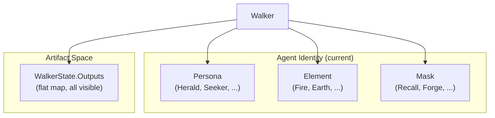
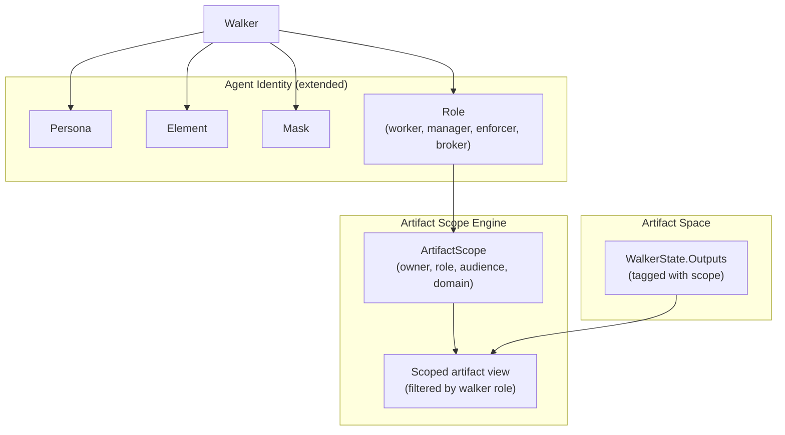

# Contract — agent-roles

**Status:** draft  
**Goal:** Role (worker, manager, enforcer, broker) is a first-class type orthogonal to Persona. Artifact scope filtering restricts what each Walker can see based on its role. Roles are the semantic layer that gives the agentic hierarchy meaning.  
**Serves:** Containerized Runtime (vision)

## Contract rules

- **Orthogonal to Persona.** Role and Persona are independent axes. A Sentinel persona can be an Enforcer (cautious auditor) or a Worker (writes defensive code). Role determines information scope and communication patterns. Persona determines reasoning style.
- **Progressive disclosure.** Role is optional on `AgentIdentity` and `WalkerDef`. Existing circuits without roles continue to work unchanged — all walkers default to an empty role with full artifact visibility.
- **Scope is additive restriction.** The default is "see everything." Scope filters only remove visibility; they never grant access to artifacts that wouldn't otherwise be available. This prevents privilege escalation.
- Global rules apply.

## Context

Brainstorming session: [Agentic hierarchy and Operator API](65013565-a183-40d2-ae82-707267f65454) — identified that current agent primitives (Persona, Mask, Element) define *identity* and *capability* but not *organizational role*. The hierarchy (Broker > Manager > Worker, Enforcer lateral) requires role-aware information scoping: Workers see only their assigned files, Managers see their Workers' outputs, Enforcers see audit-domain artifacts, the Broker sees everything.

- `identity.go` — `AgentIdentity` struct: persona, element, position, alignment, step affinity, cost profile. No role field.
- `dsl.go` — `WalkerDef`: name, approach, persona, preamble, step affinity. No role field.
- `dsl.go` — `ContextFilterDef`: pass/block lists for context keys. Nearest analog to scope filtering, but operates on context keys, not artifacts.
- `walker.go` — `WalkerState.Outputs`: flat `map[string]Artifact`. No visibility filtering.
- `ouroboros/persona_sheet.go` — `PersonaSheet` maps model profiles to persona assignments. No role dimension.

### Current architecture

All walkers see all artifacts. No organizational role. No information hiding.

### Desired architecture

Each artifact is tagged with an `ArtifactScope`. Each walker's `NodeContext` is filtered to show only artifacts whose audience includes the walker's role.

## FSC artifacts

| Artifact | Target | Compartment |
|----------|--------|-------------|
| Role type design reference | `docs/agentic-hierarchy-design.md` | domain |
| `Role`, `ArtifactScope` glossary terms | `glossary/` | domain |

## Execution strategy

Six phases. Role type first (minimal, backward-compatible), then DSL wiring, then scope engine, then Ouroboros integration.

### Phase 1 — Role type

Add `Role` as a string type with four constants. Add `Role` field to `AgentIdentity`. Backward-compatible: zero value means "no role assigned."

### Phase 2 — DSL extension

Add `role:` field to `WalkerDef`. Wire into walker construction so YAML-declared roles are set on `AgentIdentity`.

### Phase 3 — ArtifactScope type

Define `ArtifactScope` with owner, role, audience, and domain fields. Add scope tagging to artifact production — when a node produces an artifact, it's tagged with the producing walker's role.

### Phase 4 — Scope filtering

Filter `NodeContext` artifact visibility based on the walker's role and the artifact's audience. Extend `ContextFilterDef` or introduce a parallel `ArtifactFilterDef` on zones.

### Phase 5 — Ouroboros role affinity

Extend `PersonaSheet` to include role affinity scores. When Ouroboros profiles a model, it can suggest not just which persona but which *role* the model is best suited for.

### Phase 6 — Validate and tune

Green-yellow-blue cycle.

## Coverage matrix

| Layer | Applies | Rationale |
|-------|---------|-----------|
| **Unit** | yes | Role type constants, ArtifactScope construction, scope filtering logic |
| **Integration** | yes | WalkTeam with mixed-role walkers, verify artifact visibility differs by role |
| **Contract** | yes | ArtifactScope schema, Role constants, WalkerDef YAML schema |
| **E2E** | yes | YAML circuit with `role:` on walkers, walk end-to-end with scope filtering |
| **Concurrency** | yes | Concurrent walkers with different roles accessing shared artifact space |
| **Security** | yes | Scope filtering is an information-hiding boundary — verify no role can see artifacts outside its audience |

## Tasks

### Phase 1 — Role type

- [ ] P1.1: Define `Role` type (string) in `identity.go` with constants: `RoleWorker`, `RoleManager`, `RoleEnforcer`, `RoleBroker`. Empty string means "no role."
- [ ] P1.2: Add `Role Role` field to `AgentIdentity` struct with JSON/YAML tags.
- [ ] P1.3: Add `IsRole(r Role) bool` and `HasRole() bool` methods on `AgentIdentity`.
- [ ] P1.4: Unit tests: role constants, methods on AgentIdentity, zero-value backward compatibility.
- [ ] P1.5: Validate — `go test -race ./...` green. No existing tests break.

### Phase 2 — DSL extension

- [ ] P2.1: Add `Role string` field to `WalkerDef` in `dsl.go` with YAML tag `yaml:"role,omitempty"`.
- [ ] P2.2: Wire `WalkerDef.Role` into walker construction in `BuildGraph()` — set `AgentIdentity.Role` from the YAML field.
- [ ] P2.3: Lint rule: if `role:` is set, it must be one of `worker`, `manager`, `enforcer`, `broker`. Warning severity.
- [ ] P2.4: Unit test: parse YAML with `role: worker` on a walker, verify `AgentIdentity.Role == RoleWorker`.
- [ ] P2.5: Validate — `go test -race ./...` green.

### Phase 3 — ArtifactScope type

- [ ] P3.1: Define `ArtifactScope` struct in `scope.go` (framework root): `Owner string`, `Role Role`, `Audience []Role`, `Domain string`.
- [ ] P3.2: Define `ScopedArtifact` interface extending `Artifact` with `Scope() ArtifactScope`.
- [ ] P3.3: When a node produces an artifact during `Walk()`, wrap it with scope metadata: owner = walker ID, role = walker's role, audience = all roles (default, unrestricted), domain = node's zone domain.
- [ ] P3.4: Add `WithAudience(roles ...Role)` option for nodes to restrict artifact visibility at production time.
- [ ] P3.5: Unit tests: ScopedArtifact construction, default audience (all roles), restricted audience.
- [ ] P3.6: Validate — `go test -race ./...` green.

### Phase 4 — Scope filtering

- [ ] P4.1: In `NodeContext` construction, filter `WalkerState.Outputs` to include only artifacts whose `ArtifactScope.Audience` contains the current walker's role. Non-scoped artifacts (legacy) remain visible to all.
- [ ] P4.2: Add `ArtifactFilterDef` to `ZoneDef` in `dsl.go`: `artifact_filter:` with `pass_roles:` and `block_roles:` lists. Extends the existing `context_filter:` pattern to artifacts.
- [ ] P4.3: Integration test: `WalkTeam` with 2 walkers (worker, manager). Worker produces an artifact with `audience: [manager]`. Verify: the manager walker sees it, the worker walker does not see artifacts tagged for manager-only.
- [ ] P4.4: Integration test: backward compatibility — circuit without any roles, verify all artifacts visible to all walkers (same behavior as today).
- [ ] P4.5: Validate — `go test -race ./...` green.

### Phase 5 — Ouroboros role affinity

- [ ] P5.1: Add `RoleAffinity map[Role]float64` field to `ModelProfile` in `ouroboros/types.go`.
- [ ] P5.2: Extend `SuggestPersona` to also return a `SuggestedRole Role` based on dimension scores. High `persistence` + `convergence_threshold` → enforcer. High `speed` + `breadth` → worker. High planning-related dimensions → manager.
- [ ] P5.3: Extend `PersonaSheet` to include role affinity alongside persona affinity.
- [ ] P5.4: Unit tests: role affinity computation from dimension scores, PersonaSheet role suggestions.
- [ ] P5.5: Validate — `go test -race ./...` green.

### Phase 6 — Validate and tune

- [ ] P6.1: Validate (green) — all tests pass, acceptance criteria met.
- [ ] P6.2: Tune (blue) — review API surface, ensure scope filtering is efficient (no O(n*m) scans for large artifact sets). No behavior changes.
- [ ] P6.3: Validate (green) — all tests still pass after tuning.

## Acceptance criteria

**Given** a circuit YAML with `role: worker` on a walker definition,  
**When** parsed and built,  
**Then** the walker's `AgentIdentity.Role` is `RoleWorker`.

**Given** a `WalkTeam` with a worker and a manager walker,  
**When** the worker produces an artifact with `audience: [manager]`,  
**Then** the manager's `NodeContext` includes the artifact. The worker's `NodeContext` at subsequent nodes does not.

**Given** an existing circuit with no `role:` fields,  
**When** walked with the updated framework,  
**Then** behavior is identical to before — all artifacts visible to all walkers. Zero breaking changes.

**Given** Ouroboros model profiling,  
**When** a `PersonaSheet` is generated,  
**Then** it includes `RoleAffinity` scores alongside persona assignments. The suggested role reflects the model's behavioral profile.

**Given** a zone with `artifact_filter: {pass_roles: [enforcer]}`,  
**When** a worker walker enters the zone,  
**Then** the worker cannot see artifacts produced within that zone. An enforcer walker can.

## Security assessment

| OWASP | Finding | Mitigation |
|-------|---------|------------|
| A01 Broken Access Control | Artifact scope filtering introduces an information-hiding boundary. Incorrect filtering could leak artifacts to unauthorized roles. | Scope filtering is additive restriction only — default is full visibility. Unit tests verify that restricted artifacts are invisible to non-audience roles. Integration tests with mixed-role WalkTeam. |

## Notes

2026-03-05 — Contract drafted from agentic hierarchy brainstorming session. Role is the semantic layer that makes the hierarchy meaningful — without it, all agents are equivalent. The key design decision is orthogonality: Role x Persona gives 4x8 = 32 combinations. A Herald Worker and a Herald Manager have the same reasoning style but different organizational responsibilities. Depends on `delegate-node` for full hierarchy expression (Managers delegate to Worker circuits), but Role alone is useful even without delegation (scope filtering on flat circuits).
