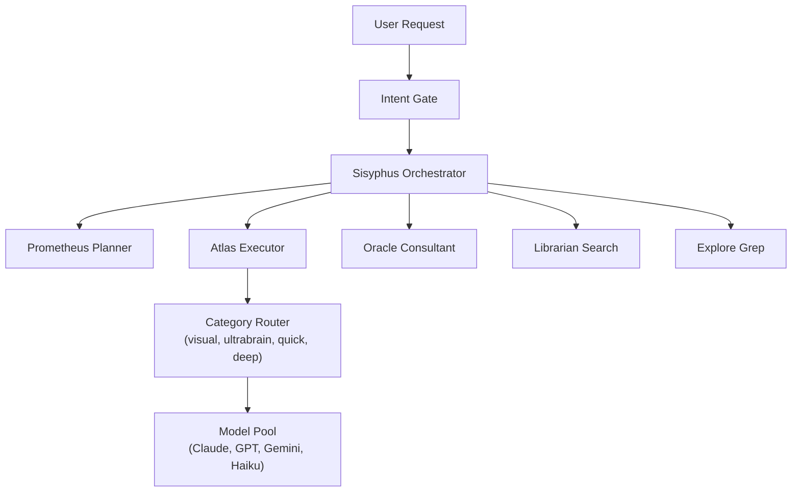
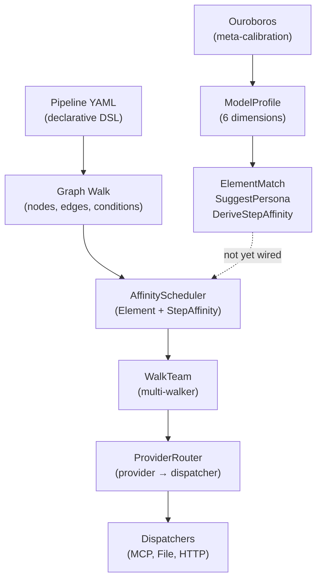

# Contract — Case Study: OmO Agentic Arms Race

**Status:** draft  
**Goal:** Analyze Oh My OpenCode's multi-model agent orchestration, map their concepts to Origami primitives, identify competitive gaps, and close the three highest-leverage gaps in the framework.  
**Serves:** Polishing & Presentation (nice)

## Contract rules

- The case study document is the primary deliverable. Code changes are secondary.
- Competitive analysis must be evidence-based — cite specific OmO source files and Origami equivalents.
- Actionable tasks must not duplicate work in existing contracts (`ouroboros-seed-pipeline`, `consumer-ergonomics`). Cross-reference explicitly.
- No blind feature copying. Every proposed improvement must justify why Origami's existing architecture is the better foundation.

## Context

- **Oh My OpenCode (OmO):** Multi-model agent orchestration harness for OpenCode/Cursor. Named agents (Sisyphus, Prometheus, Atlas, Oracle, Metis, Momus) with category-based model routing, parallel execution, provider fallback chains, and discipline enforcement. Source: `github.com/code-yeongyu/oh-my-opencode`.
- **Agentic Arms Race:** The competitive landscape for AI agent orchestration is accelerating. OmO represents the "prompt engineering + glue code" approach. Origami represents the "formal graph-based framework" approach. Understanding the tradeoffs sharpens both the product and the pitch.
- **Existing Origami contracts with overlap:**
  - `ouroboros-seed-pipeline` — Phase 7 (Persona Sheet) is the output that would feed auto-routing
  - `consumer-ergonomics` — API polish that improves the developer experience OmO competes on
  - `kami-live-debugger` — observability advantage OmO completely lacks

### OmO architecture

Imperative delegation chain. Named agents are prompt templates with routing rules. Categories abstract model selection. Provider fallback chains add resilience. No formal pipeline, no calibration, no observability.

### Origami architecture (relevant subset)

Formal graph-based framework. Quantified behavioral dimensions. Empirical profiling. But the Ouroboros → Scheduler → ProviderRouter feedback loop is not closed.

## FSC artifacts

| Artifact | Target | Compartment |
|----------|--------|-------------|
| OmO case study (competitive analysis) | `docs/case-studies/omo-agentic-arms-race.md` | domain |
| Entry classifier pattern (YAML example) | `testdata/patterns/intent-classifier.yaml` | domain |
| Glossary: "auto-routing", "provider fallback", "intent gate" | `glossary/` | domain |

## Execution strategy

Part 1 writes the case study document (analysis + concept mapping). Part 2 implements three actionable improvements extracted from the analysis. Part 3 validates.

## Coverage matrix

| Layer | Applies | Rationale |
|-------|---------|-----------|
| **Unit** | yes | ProviderRouter fallback logic, EventProviderFallback signal |
| **Integration** | no | No cross-boundary changes; ProviderRouter is in-process |
| **Contract** | yes | ProviderRouter API addition must be backward-compatible |
| **E2E** | no | Pattern documentation, not pipeline behavior change |
| **Concurrency** | no | Fallback is synchronous per-dispatch |
| **Security** | no | No trust boundaries affected |

## Tasks

### Part 1 — Case study document

- [ ] **CS1** Create `docs/case-studies/` directory and `docs/case-studies/index.mdc`
- [ ] **CS2** Write `docs/case-studies/omo-agentic-arms-race.md` with sections: Overview, Concept Mapping Table (OmO → Origami, 10 rows), Competitive Advantages (8 items Origami has, OmO lacks), Competitive Gaps (3 items OmO has, Origami should learn), Architectural Class Analysis, Actionable Takeaways
- [ ] **CS3** Update `docs/index.mdc` to reference `case-studies/` directory

### Part 2 — Actionable improvements

#### Gap 1: Auto-routing (close Ouroboros → ProviderRouter loop)

- [ ] **AR1** Define `AutoRouteOption` — a `RunOption` that accepts a `PersonaSheet` and configures the `AffinityScheduler` + `ProviderRouter` from it at walk start
- [ ] **AR2** `PersonaSheet.ProviderHints() map[string]string` — maps step names to preferred provider names (derived from element affinity + known provider-element mapping)
- [ ] **AR3** Wire into `ProviderRouter`: when `DispatchContext.Provider` is empty, check `PersonaSheet.ProviderHints[step]` before falling through to default
- [ ] **AR4** Unit test: walk with `AutoRouteOption` + PersonaSheet routes step "investigate" to provider "anthropic" based on Water affinity
- [ ] **AR5** Cross-reference: depends on `ouroboros-seed-pipeline` Phase 7 (PersonaSheet struct). Can stub PersonaSheet for testing.

#### Gap 2: Provider fallback chains

- [ ] **PF1** Add `Fallbacks map[string][]string` to `ProviderRouter` — maps primary provider to ordered fallback list
- [ ] **PF2** On `Dispatch` failure (non-nil error from primary), iterate fallbacks in order until one succeeds or all fail
- [ ] **PF3** Emit `EventProviderFallback` via `WalkObserver` when a fallback is used (includes: primary provider, fallback provider, error from primary)
- [ ] **PF4** `WithFallbacks(fallbacks map[string][]string) ProviderRouterOption` — constructor option
- [ ] **PF5** Unit tests: primary fails → fallback succeeds, all fail → error aggregated, no fallbacks configured → original behavior unchanged

#### Gap 3: Entry classifier pattern

- [ ] **EC1** Create `testdata/patterns/intent-classifier.yaml` — example pipeline where the first node classifies input type and sets `vars.intent`, downstream edges use `when: vars.intent == "investigation"` etc.
- [ ] **EC2** Document the pattern in the case study's "Actionable Takeaways" section: how to build an Intent Gate as a standard Origami pipeline node
- [ ] **EC3** Verify the YAML parses and the graph builds with `BuildGraphWith`

### Part 3 — Validate and tune

- [ ] **V1** Validate (green) — `go build ./...`, `go test ./...` all pass. Case study document is complete. Fallback chains work. Auto-route option compiles (PersonaSheet can be stubbed).
- [ ] **V2** Tune (blue) — Review case study for tone (evidence-based, not dismissive). Polish YAML example. Refine glossary entries.
- [ ] **V3** Validate (green) — all tests still pass after tuning.

## Acceptance criteria

**Given** the case study document at `docs/case-studies/omo-agentic-arms-race.md`,  
**When** a reader unfamiliar with OmO reads it,  
**Then** they understand: what OmO does, how each OmO concept maps to an Origami primitive, where Origami is ahead, where Origami has gaps, and what three improvements close those gaps.

**Given** a `ProviderRouter` configured with `WithFallbacks({"anthropic": ["openai", "cursor"]})`,  
**When** the "anthropic" provider returns an error,  
**Then** the router tries "openai", then "cursor", returning the first success. An `EventProviderFallback` is emitted.

**Given** a `PersonaSheet` with `ProviderHints{"investigate": "anthropic", "triage": "openai"}`,  
**When** `AutoRouteOption` is used in a `Run()` call,  
**Then** the "investigate" step dispatches to the "anthropic" provider and "triage" dispatches to "openai" without explicit `NodeDef.Provider` configuration.

**Given** `testdata/patterns/intent-classifier.yaml`,  
**When** loaded with `LoadPipeline` and built with `BuildGraphWith`,  
**Then** the graph has a classifier node, 2+ branching edges with `when: vars.intent == "..."` conditions, and all target nodes are reachable.

## Security assessment

No trust boundaries affected. Provider fallback chains route to already-configured dispatchers. Auto-routing uses locally-stored PersonaSheet data. The intent classifier pattern is a YAML example with no external calls.

## Notes

2026-02-25 — Contract created from competitive analysis of Oh My OpenCode (`github.com/code-yeongyu/oh-my-opencode`). OmO is a multi-model orchestration harness built on prompt engineering + glue code. Its key innovation — closing the model-to-task routing loop at runtime — is something Origami has all the pieces for (Ouroboros, ElementMatch, ProviderRouter, StepAffinity) but hasn't wired end-to-end. This contract closes the loop. The architectural class difference is stark: OmO is imperative prompt templates; Origami is a formal graph framework with empirical calibration. Origami's advantages (DSL, Ouroboros, Dialectic, Masks, Zones, Calibration, Kami) are not something OmO can replicate by adding more prompt templates. But OmO's "just wire it up" pragmatism is a useful reminder to close the feedback loops we've built the infrastructure for.
