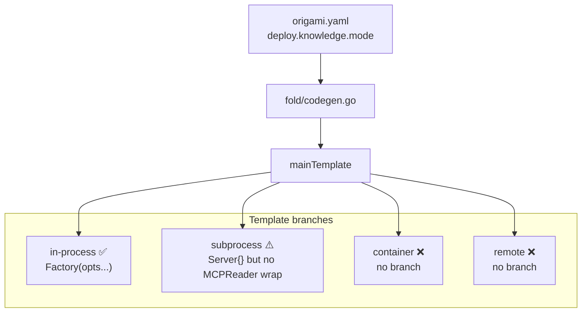
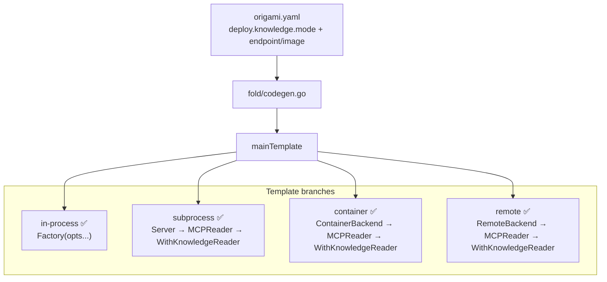

# Contract — fold-deploy-modes

**Status:** draft  
**Goal:** `origami fold` generates correct, compilable `main.go` code for all four secondary schematic deployment modes: in-process, subprocess, container, and remote.  
**Serves:** API Stabilization (gate)

## Contract rules

- Every generated `main.go` must compile with `go build`. String-presence tests are necessary but not sufficient — add compilation checks.
- The existing `in-process` and `subprocess` template branches must not regress.
- No new runtime reflection. All wiring is resolved at fold/codegen time via Go's type system.

## Context

Conversation: [Decoupled schematics architecture](66be52b6-6924-4dad-8855-0f4805f73825) built the infrastructure layer for multi-mode schematic deployment. Three `SchematicBackend` implementations exist (`Server`, `ContainerBackend`, `RemoteBackend`) and the type system is clean (`knowledge.Reader` in root package, no cross-schematic coupling). But `origami fold`'s codegen template only handles two of four modes, and the existing `subprocess` branch is structurally incomplete — it passes a `ToolCaller` where a `knowledge.Reader` is expected.

### Files in scope

- `fold/manifest.go` — `DeployConfig` struct (needs `Endpoint` field)
- `fold/codegen.go` — `secondaryEntry`, `buildTemplateContext`, `mainTemplate`
- `fold/codegen_test.go` — test coverage for all modes
- `fold/component.go` — `ComponentMeta` (needs `Adapter` field for MCP wrapper factory)
- `schematics/knowledge/component.yaml` — add `adapter: NewMCPReader`

### Current architecture



### Desired architecture



## FSC artifacts

| Artifact | Target | Compartment |
|----------|--------|-------------|
| Deploy mode glossary entries (in-process, subprocess, container, remote) | `glossary/glossary.mdc` | domain |

## Execution strategy

Four sequential streams. Each builds on the previous. Build + test after every stream.

### Stream A: Schema extensions

Extend `DeployConfig` and `ComponentMeta` to carry the data codegen needs.

1. Add `Endpoint string` field to `DeployConfig` in `fold/manifest.go` (YAML: `endpoint`).
2. Add `Adapter string` field to `ComponentMeta` in `fold/component.go` (YAML: `adapter`). This names the factory function that converts `ToolCaller → Reader` for non-in-process modes (e.g. `NewMCPReader`).
3. Add `adapter: NewMCPReader` to `schematics/knowledge/component.yaml`.
4. Extend `secondaryEntry` with `Image`, `Endpoint`, and `Adapter` fields populated from manifest + component.yaml.
5. Update `buildTemplateContext` / `resolveSecondaries` to propagate `Image`, `Endpoint`, `Adapter` into `secondaryEntry`.
6. Unit test: parse a manifest with `deploy.knowledge: {mode: container, image: "ghcr.io/origami/knowledge:latest"}` and `deploy.knowledge: {mode: remote, endpoint: "http://localhost:9100/mcp"}` — verify fields populate.

### Stream B: Template branches for container and remote

Extend the `mainTemplate` in `codegen.go` with two new branches.

1. **Container branch** — generates:
   ```go
   {{ .VarName }}Backend := &subprocess.ContainerBackend{
       Image: "{{ .Image }}",
   }
   if err := {{ .VarName }}Backend.Start(context.Background()); err != nil {
       log.Fatalf("start {{ .VarName }}: %v", err)
   }
   defer {{ .VarName }}Backend.Stop(context.Background())
   ```

2. **Remote branch** — generates:
   ```go
   {{ .VarName }}Backend := &subprocess.RemoteBackend{
       Endpoint: "{{ .Endpoint }}",
   }
   if err := {{ .VarName }}Backend.Start(context.Background()); err != nil {
       log.Fatalf("connect {{ .VarName }}: %v", err)
   }
   defer {{ .VarName }}Backend.Stop(context.Background())
   ```

3. Update the `HasSubprocess` check to also trigger for `remote` mode.
4. String-presence tests for container and remote mode output.

### Stream C: MCPReader adapter wiring

Fix the adapter gap: non-in-process modes need to wrap the backend in the schematic's MCP adapter before passing to the primary's `With*` option.

1. For `subprocess`, `container`, and `remote` modes, emit an adapter construction line after the backend:
   ```go
   {{ .VarName }} := {{ .Alias }}.{{ .Adapter }}({{ .VarName }}Backend)
   ```
   Where `Adapter` comes from component.yaml (e.g. `NewMCPReader`).

2. Update the Apply section to pass `{{ .VarName }}` (the adapter) instead of the raw backend:
   ```go
   {{ $.CmdAlias }}.{{ .OptionCmd }}({{ .VarName }}),
   ```

3. Fix the existing `subprocess` branch to follow the same pattern (currently passes the raw Server).
4. Ensure the import for the secondary schematic package is added when any non-in-process mode is used (needed for the Adapter factory).
5. Unit tests verify the adapter wrapping appears in generated code for all three non-in-process modes.

### Stream D: Validate + tune

1. Full build, lint, test-race across Origami.
2. Asterisk `just build` still succeeds (in-process mode, no regression).
3. Refactor for quality — no behavior changes.
4. Final validation.

## Coverage matrix

| Layer | Applies | Rationale |
|-------|---------|-----------|
| **Unit** | yes | DeployConfig parsing, secondaryEntry population, template output for all four modes |
| **Integration** | yes | `GenerateMain` → `go build` for generated source (compilation check) |
| **Contract** | yes | Go compiler verifies interface satisfaction (MCPReader → Reader) at build time |
| **E2E** | no | No live schematic — tested via compilation. Runtime E2E is out of scope. |
| **Concurrency** | N/A | Build-time codegen — no shared state |
| **Security** | yes | See Security assessment |

## Tasks

- [ ] Stream A — Schema extensions: DeployConfig.Endpoint, ComponentMeta.Adapter, secondaryEntry fields, parsing tests.
- [ ] Stream B — Template branches: container + remote codegen, HasSubprocess update, string-presence tests.
- [ ] Stream C — MCPReader adapter wiring: adapter construction for all non-in-process modes, fix existing subprocess, import management.
- [ ] Validate (green) — build, test-race, lint.
- [ ] Tune (blue) — refactor for quality. No behavior changes.
- [ ] Validate (green) — all tests still pass after tuning.

## Acceptance criteria

- **Given** a manifest with `deploy.knowledge: {mode: container, image: "ghcr.io/origami/knowledge:latest"}`, **when** `GenerateMain` runs, **then** the generated code contains `subprocess.ContainerBackend{Image: "ghcr.io/origami/knowledge:latest"}`, a `Start`/`Stop` lifecycle, an `Adapter` wrapping call, and `WithKnowledgeReader` receiving the adapted value.
- **Given** a manifest with `deploy.knowledge: {mode: remote, endpoint: "http://localhost:9100/mcp"}`, **when** `GenerateMain` runs, **then** the generated code contains `subprocess.RemoteBackend{Endpoint: "http://localhost:9100/mcp"}`, a `Start`/`Stop` lifecycle, an `Adapter` wrapping call, and `WithKnowledgeReader` receiving the adapted value.
- **Given** a manifest with `deploy.knowledge: {mode: subprocess}`, **when** `GenerateMain` runs, **then** the generated code wraps the `subprocess.Server` in the adapter before passing to `WithKnowledgeReader` (regression fix).
- **Given** a manifest with no `deploy` section (default in-process), **when** `GenerateMain` runs, **then** the generated code calls the factory directly without subprocess imports (no regression).
- **Given** `container` or `remote` mode without the required `image`/`endpoint` field, **when** `GenerateMain` runs, **then** it returns a clear validation error.

## Security assessment

| OWASP | Finding | Mitigation |
|-------|---------|------------|
| A03:2021 Injection | `endpoint` and `image` fields are embedded as string literals in generated Go code. Could a malicious value inject code? | Values are emitted inside Go string literals (`"..."`). The Go compiler rejects invalid string content. Additionally, `endpoint` is validated as a URL and `image` as an OCI reference at fold time. No shell interpolation. |
| A05:2021 Misconfiguration | Wrong endpoint could connect to a malicious MCP server. | Endpoint is declared in the checked-in manifest. Same trust boundary as any Go dependency. No runtime endpoint override. |

## Notes

2026-03-03 23:45 — Contract drafted from gap analysis in Refactor & Decompose session. The subprocess template branch already exists but is functionally broken for Knowledge (passes ToolCaller where Reader expected). This contract fixes that alongside adding the two missing modes. The `Adapter` field in component.yaml is the key design decision — it makes the wrapping generic so future schematics with different Reader interfaces can declare their own adapter factory.
