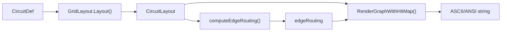
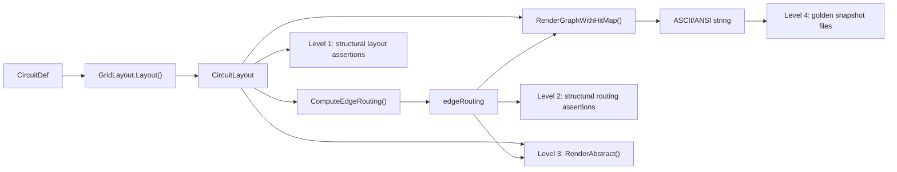

# Contract — graph-drawing

**Status:** draft  
**Goal:** Graph rendering tests validate layout correctness through structural assertions, not brittle ASCII character checks.  
**Serves:** API Stabilization

## Contract rules

Global rules only.

## Context

The Sumi graph rendering pipeline has natural separation points that are currently undertested:

1. `GridLayout.Layout()` in `view/grid.go` produces `CircuitLayout` (grid positions via Kahn's toposort).
2. `computeEdgeRouting()` in `sumi/graph.go` classifies edges into inline/below/loop and assigns channels.
3. `RenderGraphWithHitMap()` in `sumi/graph.go` composites everything onto a canvas.

Current tests jump straight to layer 3 and check for specific ASCII characters (`▸`, `─`, `╌`, `✓`). A cosmetic change (e.g., swapping `─` for `━`) breaks every test without indicating a real regression. The topology-loss bug (vertical bars in watch mode) was never caught because no test exercises the snapshot round-trip path.

### Current architecture



All existing tests operate only on the final `G` node — the rendered string.

### Desired architecture



Tests at levels 1-3 validate algorithm correctness. Level 4 catches visual regressions.

## FSC artifacts

| Artifact | Target | Compartment |
|----------|--------|-------------|
| Graph testing methodology reference | `docs/` | domain |

## Execution strategy

Bottom-up by test level. Each level adds test infrastructure and tests before moving to the next. The abstract renderer (Level 3) is the keystone — it produces the human-readable `*─*─*` visualization that makes layout bugs instantly visible in test failure output.

**Approach:**
1. Level 1 (layout) — test helpers + structural tests in `view/grid_test.go`
2. Level 2 (routing) — export `computeEdgeRouting`, test helpers + structural tests in `sumi/graph_test.go`
3. Level 3 (abstract) — implement `RenderAbstract()`, write tests against it
4. Level 4 (golden) — convert existing full-render tests to `.golden` snapshot files

## Coverage matrix

| Layer | Applies | Rationale |
|-------|---------|-----------|
| **Unit** | yes | Layout helpers, edge routing classification, abstract renderer |
| **Integration** | yes | Full pipeline: def → layout → routing → abstract render |
| **Contract** | no | No external API schemas affected |
| **E2E** | no | No circuit walk involved |
| **Concurrency** | no | All rendering is single-threaded |
| **Security** | no | No trust boundaries affected |

## Tasks

- [ ] Add Level 1 test helpers (`assertRow`, `assertCol`, `assertBefore`, `assertColSpan`) to `view/grid_test.go`
- [ ] Write Level 1 structural layout tests for: linear chain, circuit with shortcuts, circuit with loops, circuit with zones
- [ ] Export `computeEdgeRouting` (or add a test-only wrapper) so Level 2 tests can call it
- [ ] Add Level 2 test helpers (`assertInline`, `assertBelow`, `assertLoop`, `assertChannelCount`) to `sumi/graph_test.go`
- [ ] Write Level 2 structural edge routing tests for: deduplication, inline classification, below classification with channels, loop classification
- [ ] Implement `RenderAbstract(def, layout)` function in `sumi/graph.go`
- [ ] Write Level 3 abstract rendering tests for: linear, shortcut, loop, mixed topologies
- [ ] Convert existing Level-4-style tests to golden snapshot files (`.golden`)
- [ ] Validate (green) — all tests pass, acceptance criteria met.
- [ ] Tune (blue) — refactor for quality. No behavior changes.
- [ ] Validate (green) — all tests still pass after tuning.

## Acceptance criteria

**Given** a `CircuitDef` with nodes A→B→C→D, a shortcut A→D, and a loop D→B,  
**When** `GridLayout.Layout()` produces the layout,  
**Then** Level 1 assertions confirm: all nodes in row 0, col(A) < col(B) < col(C) < col(D).

**Given** the same circuit,  
**When** `ComputeEdgeRouting()` classifies the edges,  
**Then** Level 2 assertions confirm: A→B, B→C, C→D are inline; A→D is below with channel 0; D→B is a loop.

**Given** the same circuit,  
**When** `RenderAbstract()` produces the abstract visualization,  
**Then** the output matches:
```
*─*─*─*
└─────┘
 ◀──┘
```

**Given** a cosmetic rendering change (e.g., different box border characters),  
**When** all tests are run,  
**Then** Level 1-3 tests still pass. Only Level 4 golden snapshots fail (expected, regenerate with `-update`).

## Security assessment

No trust boundaries affected.

## Notes

2026-03-04 11:00 — Contract created. Motivated by the vertical-bars bug where topology loss in watch mode was never caught by tests. Research into graphviz, ratatui-testlib, and bubbletea teatest confirmed the 4-level approach: structural assertions for correctness, golden snapshots for regression.
