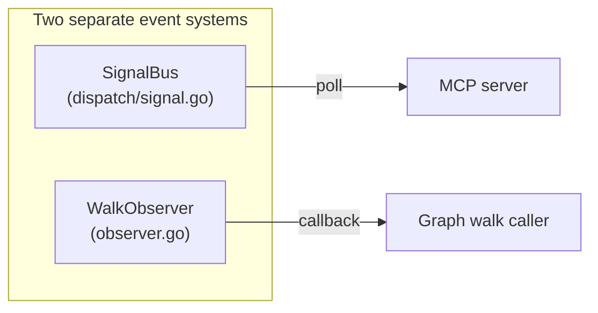
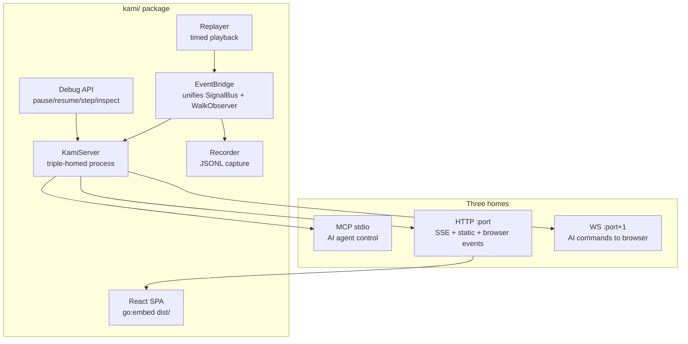

# Contract — Kami Live Debugger

**Status:** draft  
**Goal:** Build Kami — a live agentic pipeline debugger for Origami following the Demiurge pattern (triple-homed: MCP stdio + HTTP/SSE + WebSocket) — with a React demo frontend for interactive pipeline visualization.  
**Serves:** Polishing & Presentation (should)

## Contract rules

- Kami is a framework feature. It must not import any consumer code (Asterisk, Achilles).
- Domain-specific content (costumes, intro lines, node descriptions) comes from a `Theme` interface implemented by consumers.
- The frontend is embedded via `go:embed` — single binary, zero runtime dependencies.
- EventBridge unifies both `SignalBus` and `WalkObserver` into a single `KamiEvent` stream. No separate SSE endpoints.
- Replay mode must be indistinguishable from live mode in the frontend — same event format, same rendering.

## Context

- **Demiurge pattern (Hegemony):** Triple-homed process bridging AI, browser, and game engine. MCP stdio for AI control, HTTP for browser events, WS for AI-to-browser commands. Reference: `/home/dpopsuev/Projects/hegemony/tools/demiurge/`.
- **SignalBus** (`dispatch/signal.go`): Agent coordination signals — `session_started`, `step_ready`, `artifact_submitted`, `zone_shift`, worker lifecycle. Thread-safe append-only log.
- **WalkObserver** (`observer.go`): Graph walk events — `node_enter`, `node_exit`, `transition`, `walker_switch`, `fan_out_start/end`. Interface with `OnEvent(WalkEvent)`.
- **Pipeline Studio spec** (`contracts/completed/framework/origami-pipeline-studio.md`): Earlier product spec for web UI visualization. Kami supersedes this with the debugger + demo approach.
- **Origami Personas** (`persona.go`): 8 personas (4 Light + 4 Shadow) with element affinities, personality traits. Used for agent intro sequences.
- **Origami Elements** (`element.go`): 6 elements (Fire, Water, Earth, Air, Diamond, Lightning) with quantified traits and colors.
- **Conversation context:** Design emerged from a discussion combining Inside Out-inspired agent visualization, Hegemony's Demiurge debugger pattern, and the need for a PoC presentation tool. The name Kami (神) comes from Shinto — the divine spirits inhabiting nature. In Origami, the agents walking the pipeline graph are the kami inhabiting the nodes.

### Current architecture

No unified event stream. No browser visualization. No debug control. Signal consumers and walk observers are separate, uncoordinated systems.

### Desired architecture

## FSC artifacts

| Artifact | Target | Compartment |
|----------|--------|-------------|
| Kami architecture reference (Demiurge pattern mapping) | `docs/kami-architecture.md` | domain |
| KamiEvent schema reference | `docs/kami-events.md` | domain |
| Theme interface guide (for consumers) | `docs/kami-theme-guide.md` | domain |

## Execution strategy

Phase 1 builds the EventBridge — the core primitive that unifies both event systems. Phase 2 wires the triple-homed server (MCP + HTTP + WS) around the EventBridge. Phase 3 adds debug capabilities (pause/resume/breakpoints). Phase 4 registers MCP tools for AI control. Phase 5 adds session recording and replay. Phase 6 scaffolds the React frontend and embeds it. Phase 7 validates end-to-end.

## Coverage matrix

| Layer | Applies | Rationale |
|-------|---------|-----------|
| **Unit** | yes | EventBridge event routing, KamiEvent serialization, Recorder/Replayer JSONL parsing, Theme interface |
| **Integration** | yes | Full KamiServer startup (MCP + HTTP + WS), SSE streaming, WS command relay |
| **Contract** | yes | KamiEvent schema stability, Theme interface contract, MCP tool schemas |
| **E2E** | yes | `origami kami --replay recording.jsonl` serves SPA and plays back events |
| **Concurrency** | yes | EventBridge broadcasts to multiple SSE clients, WS clients, and Recorder concurrently |
| **Security** | yes | HTTP/WS server binds to localhost by default; no auth on debug API |

## Tasks

### Phase 1 — EventBridge

- [ ] **E1** Define `KamiEvent` struct: `Type`, `Timestamp`, `Agent`, `Node`, `Zone`, `CaseID`, `Data map[string]any`
- [ ] **E2** Implement `EventBridge` — implements `WalkObserver`, polls `SignalBus`, normalizes both into `KamiEvent`
- [ ] **E3** `EventBridge.Subscribe() <-chan KamiEvent` — fan-out to multiple consumers (SSE, WS, Recorder)
- [ ] **E4** Unit tests: WalkEvent → KamiEvent mapping, Signal → KamiEvent mapping, fan-out to N subscribers

### Phase 2 — KamiServer (triple-homed)

- [ ] **K1** Implement `KamiServer` struct with `Start(ctx, KamiConfig) error` — spins up MCP stdio, HTTP, and WS goroutines
- [ ] **K2** HTTP server: `GET /events/stream` (SSE from EventBridge), `GET /` (serves embedded SPA), `POST /events/click`, `POST /events/hover`, `POST /events/selection`
- [ ] **K3** WS server on `:port+1` — relays AI visualization commands to connected browser clients
- [ ] **K4** `origami kami --port 3000` CLI command wires KamiServer with config
- [ ] **K5** Integration test: start KamiServer, connect SSE client, emit WalkEvent, verify KamiEvent received

### Phase 3 — Debug API

- [ ] **D1** Breakpoint registry: `SetBreakpoint(node string)`, `ClearBreakpoint(node string)`, `ListBreakpoints() []string`
- [ ] **D2** Execution control: `Pause()`, `Resume()`, `AdvanceNode()` — EventBridge gates walk progression at node boundaries
- [ ] **D3** `PipelineSnapshot` struct: nodes (visited/active/pending), edges (taken/available), agents (position, persona, element), artifacts (per-node), zones (active, agent distribution)
- [ ] **D4** Assertion runner: configurable invariant checks (reachability, confidence bounds, evidence completeness)
- [ ] **D5** Unit tests: breakpoint hit pauses walk, resume continues, advance moves one node

### Phase 4 — MCP tools

- [ ] **M1** Read tools: `get_pipeline_state`, `get_node_artifact`, `get_agent_state`, `get_assertions`, `get_snapshot`
- [ ] **M2** Write tools: `pause`, `resume`, `advance_node`, `set_breakpoint`, `clear_breakpoint`, `set_speed`
- [ ] **M3** Visualization tools: `highlight_nodes`, `highlight_zone`, `zoom_to_zone`, `place_marker`, `clear_all`
- [ ] **M4** Register all tools via MCP `go-sdk` tool registration pattern
- [ ] **M5** Integration test: MCP tool call → Debug API → state change verified

### Phase 5 — Recorder and Replayer

- [ ] **R1** `Recorder` — subscribes to EventBridge, writes timestamped JSONL (`{"delay_ms": N, "event": {...}}`)
- [ ] **R2** `Replayer` — reads JSONL, emits events to EventBridge with original timing, supports speed multiplier
- [ ] **R3** `origami kami --replay recording.jsonl --speed 1.5` flag wiring
- [ ] **R4** Unit tests: record a sequence, replay at 2x, verify event order and approximate timing

### Phase 6 — Frontend scaffold

- [ ] **F1** Initialize React + Vite + TypeScript + Tailwind project in `kami/frontend/`
- [ ] **F2** `useSSE` hook — connects to `/events/stream`, parses `KamiEvent`, exposes reactive state
- [ ] **F3** `useKamiWS` hook — connects to WS port, receives AI visualization commands
- [ ] **F4** `ExpandablePanel` component — click-to-fullscreen wrapper for top/bottom panels
- [ ] **F5** `IntroSequence` component — agent card carousel with CSS 3D rotating polyhedra (Fire=Tetrahedron, Water=Icosahedron, Earth=Cube, Air=Octahedron, Diamond=Diamond, Lightning=Star)
- [ ] **F6** `PipelineGraph` component — React Flow interactive graph with zone backgrounds, agent position dots, hover tooltips, breakpoint indicators
- [ ] **F7** `MonologuePanel` (top), `CooperationPopup` (left/right), `EvidencePanel` (bottom)
- [ ] **F8** `KamiOverlay` — debug mode overlay (breakpoints, pause state, AI annotations)
- [ ] **F9** `go:embed frontend/dist/*` in `kami/embed.go`, verify `origami kami --port 3000` serves SPA
- [ ] **F10** `Theme` interface: `Name()`, `AgentIntros() []AgentIntro`, `NodeDescriptions() map[string]string`, `CostumeAssets() map[string]string`, `CooperationDialogs() []Dialog`

### Phase 7 — Validate and tune

- [ ] **V1** Validate (green) — `go build ./...`, `go test ./...` all pass. KamiServer starts, SSE streams events, WS relays commands, replay works.
- [ ] **V2** Tune (blue) — Event throttling, SSE reconnection, WS heartbeat, CSS polish.
- [ ] **V3** Validate (green) — all tests still pass after tuning.

## Acceptance criteria

**Given** a pipeline graph with 3+ nodes and a WalkObserver,  
**When** `origami kami --port 3000` is started and the pipeline is walked,  
**Then** a browser at `http://localhost:3000` receives SSE events for every node enter/exit, transition, and signal, rendered as an interactive React Flow graph.

**Given** a Kami MCP connection,  
**When** `set_breakpoint(node="triage")` is called and the walk reaches "triage",  
**Then** the walk pauses, `get_pipeline_state` shows "triage" as active with status "paused", and `resume` continues the walk.

**Given** a recorded JSONL session,  
**When** `origami kami --replay recording.jsonl --speed 2.0` is started,  
**Then** the browser shows the same visualization as a live run, at 2x speed, with identical event ordering.

**Given** a consumer implements `kami.Theme`,  
**When** the theme is passed to `KamiServer`,  
**Then** the frontend displays domain-specific agent intros, node descriptions, and costume overlays without any framework code changes.

## Security assessment

| OWASP | Finding | Mitigation |
|-------|---------|------------|
| A01 | HTTP/WS server exposes pipeline state and debug controls. | Bind to `localhost` by default. `--bind` flag for explicit override. No remote access without user intent. |
| A05 | Debug API allows pausing/advancing pipeline execution. | Debug tools gated by `--debug` flag. Disabled by default in live mode. Always available in replay mode. |
| A07 | WS bridge relays commands from AI to browser without auth. | Localhost-only. Origin check on WS upgrade. No sensitive data in visualization commands. |

## Notes

2026-02-25 — Contract created from plan `visual_live_demo_presentation_274f6eca.plan.md`. Kami follows the Demiurge pattern from Hegemony — triple-homed process bridging AI, browser, and pipeline. The name Kami (神) is from Shinto: divine spirits inhabiting nature. In Origami, agents walking the graph are the kami inhabiting the nodes. Element-to-shape mapping: Fire=Tetrahedron, Water=Icosahedron, Earth=Cube, Air=Octahedron, Diamond=Diamond, Lightning=Star polyhedron.
