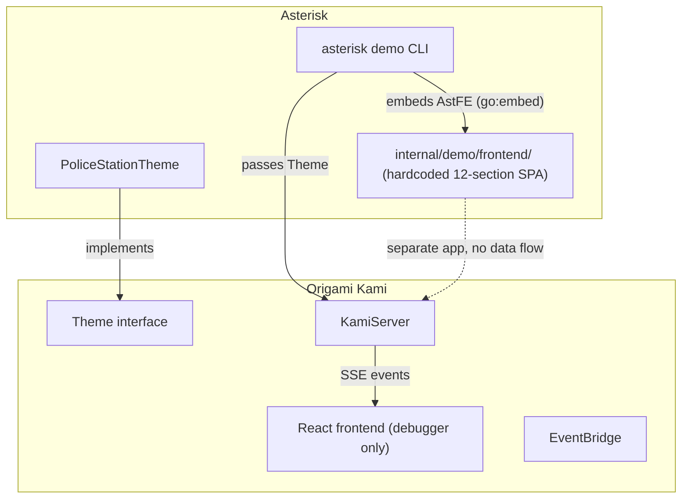
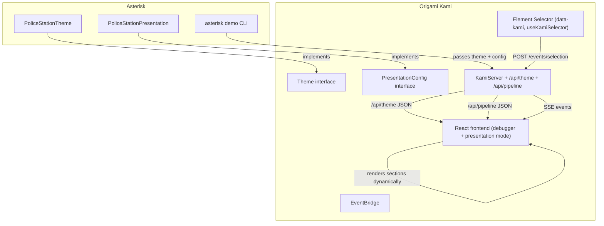

# Contract — Kami Presentation Engine

**Status:** draft  
**Goal:** Kami can render a data-driven, section-based presentation SPA when a consumer provides a `PresentationConfig` alongside a `Theme` — any pipeline developer plugs in personality and metrics, Kami renders the show.  
**Serves:** Polishing & Presentation (should)

## Contract rules

- The presentation engine is a **framework feature** in Origami. No consumer-specific content in Origami's codebase — domain flavor lives in consumer repos (Asterisk, Achilles, etc.).
- The existing Kami debugger layout (PipelineGraph + MonologuePanel + EvidencePanel) becomes one section ("Live Demo") within the presentation. It must continue to work standalone when no `PresentationConfig` is provided.
- Sections are optional — if a `PresentationConfig` method returns nil, that section is skipped. The only required section is the pipeline graph (auto-derived from events if not explicitly configured).
- The element selector (`data-kami`, `useKamiSelector`, `selector.css`) moves from Asterisk to Origami — it is a framework concern.
- All section data flows through `/api/theme` and `/api/pipeline` HTTP endpoints, not embedded in the frontend bundle. The React frontend fetches data on mount and renders dynamically.

## Context

- **Kami Live Debugger** (complete): EventBridge, KamiServer (HTTP/SSE + WS), Debug API, 14 MCP tools, Recorder/Replayer, React+Tailwind frontend. See `completed/framework/kami-live-debugger.md`.
- **Theme interface** (`kami/theme.go`): `Name()`, `AgentIntros()`, `NodeDescriptions()`, `CostumeAssets()`, `CooperationDialogs()`. Already implemented by Asterisk's `PoliceStationTheme`.
- **KamiServer** (`kami/server.go`): Serves SSE events, browser event endpoints, health check. `Config.Theme` is accepted but never exposed to the frontend.
- **Asterisk demo-presentation** (draft): Currently has a hardcoded 12-section React SPA in `internal/demo/frontend/`. This contract extracts the reusable engine into Origami so Asterisk (and future consumers) only provide data.
- **Red Hat Presentation DNA** (`docs/rh-presentation-dna.md`): Color system (4 collections), web section patterns (12 types). The presentation engine uses RH Color Collection 1 as the default palette, overridable via theme.
- **Hegemony lasso precedent**: Element selection for AI debugging (CTRL+hover blink, CTRL+click sparkle, parent-child consumption). Currently in Asterisk `internal/demo/frontend/`, must move here.

### Current architecture

### Desired architecture

## FSC artifacts

| Artifact | Target | Compartment |
|----------|--------|-------------|
| PresentationConfig interface design | `docs/presentation-config.md` | domain |
| Section pattern reference (RH DNA mapping) | `docs/presentation-sections.md` | domain |

## Execution strategy

Phase 1 defines the `PresentationConfig` interface and adds `/api/theme` + `/api/pipeline` endpoints to KamiServer. Phase 2 moves the element selector from Asterisk to Origami. Phase 3 builds the data-driven presentation frontend in Kami, replacing the hardcoded Asterisk sections with dynamic renderers that consume the API. Phase 4 validates that both presentation mode and standalone debugger mode work.

## Coverage matrix

| Layer | Applies | Rationale |
|-------|---------|-----------|
| **Unit** | yes | PresentationConfig struct defaults, section skip logic, API serialization |
| **Integration** | yes | `/api/theme` returns consumer data, frontend renders sections from API |
| **Contract** | yes | `PresentationConfig` interface compliance across consumers |
| **E2E** | yes | Full presentation mode with replay: sections render, events stream, selector works |
| **Concurrency** | no | Single-user presentation, no shared mutable state |
| **Security** | no | Localhost demo, no trust boundaries |

## Tasks

### Phase 1 — PresentationConfig interface + API endpoints

- [ ] **P1** Define `PresentationConfig` interface in `kami/presentation.go` with section methods (Hero, Problem, Results, Competitive, Roadmap, Closing, TransitionLine). Each returns a JSON-serializable struct pointer (nil = skip).
- [ ] **P2** Add `PresentationConfig` field to `kami.Config`. KamiServer accepts it alongside Theme.
- [ ] **P3** Implement `GET /api/theme` endpoint — serializes Theme (agent intros, node descriptions, dialogs) as JSON.
- [ ] **P4** Implement `GET /api/pipeline` endpoint — serializes pipeline structure (nodes, edges) as JSON. Accept pipeline data via Config or derive from Theme's NodeDescriptions.
- [ ] **P5** Implement `GET /api/presentation` endpoint — serializes PresentationConfig sections as JSON. Returns `null` sections for those the consumer doesn't implement.
- [ ] **P6** Unit tests: API endpoints return correct JSON, nil sections omitted, standalone mode (no PresentationConfig) returns empty presentation.

### Phase 2 — Move element selector to Origami

- [ ] **M1** Move `selector.css` from Asterisk to Origami's `kami/frontend/src/`.
- [ ] **M2** Move `useKamiSelector` hook from Asterisk to Origami's `kami/frontend/src/hooks/`.
- [ ] **M3** Move `data-kami` attribute convention: framework components (PipelineGraph, MonologuePanel, EvidencePanel) get `data-kami` attributes.
- [ ] **M4** Wire `useKamiSelector` in Origami's Kami App.tsx.
- [ ] **M5** Verify selector still posts to `/events/selection` and `kami_get_selection` MCP tool works.

### Phase 3 — Data-driven presentation frontend

- [ ] **F1** Create `usePresentation` hook — fetches `/api/theme`, `/api/pipeline`, `/api/presentation` on mount. Returns typed data or null.
- [ ] **F2** Create section components (data-driven, no hardcoded content): `HeroSection`, `AgendaSection`, `ProblemSection`, `SolutionSection`, `AgentIntrosSection`, `TransitionSection`, `ResultsSection`, `CompetitiveSection`, `RoadmapSection`, `ClosingSection`. Each receives its data as props.
- [ ] **F3** The existing debugger layout (PipelineGraph + MonologuePanel + EvidencePanel + KamiOverlay) becomes the `LiveDemoSection`.
- [ ] **F4** App.tsx gains presentation mode: if `usePresentation` returns sections, render scroll-snap SPA with `data-kami="section:*"` attributes. If no presentation data, render standalone debugger (current behavior).
- [ ] **F5** Scroll-snap navigation, keyboard nav (arrow keys, PageUp/PageDown), IntersectionObserver for active section tracking.
- [ ] **F6** Each section gets `data-kami` attributes on interactive child elements for the element selector.
- [ ] **F7** Build and verify: `npm run build` passes, `go build ./...` passes.

### Phase 4 — Validate and tune

- [ ] Validate (green) — `go build ./...`, `go test ./...` across Origami. Presentation mode renders with test data. Standalone debugger mode unchanged.
- [ ] Tune (blue) — Polish section transitions, animation timing, responsive layout.
- [ ] Validate (green) — all tests still pass after tuning.

## Acceptance criteria

**Given** a consumer provides a `PresentationConfig` and `Theme` to `kami.NewServer()`,  
**When** a browser navigates to the Kami server URL,  
**Then** the frontend renders a scroll-snap presentation SPA with sections dynamically populated from the API data, the Live Demo section embeds the existing debugger graph, and the element selector is active.

**Given** no `PresentationConfig` is provided (nil),  
**When** a browser navigates to the Kami server URL,  
**Then** the frontend renders the standalone debugger layout (PipelineGraph + panels) — no presentation sections, backward compatible.

**Given** a `PresentationConfig` where `Results()` returns nil,  
**When** the presentation renders,  
**Then** the Results section is skipped and the section order adjusts accordingly.

**Given** the element selector is active in presentation mode,  
**When** the user CTRL+hovers and CTRL+clicks elements,  
**Then** hover shows white blink, click toggles purple sparkle, parent-click consumes children, and the selection payload is available via `kami_get_selection` MCP tool.

## Security assessment

No trust boundaries affected. Presentation runs on localhost, serves embedded static content, and reads from in-process Go structs. No external API calls, no user input beyond CLI flags.

## Notes

2026-02-25 — Contract created to crystallize the concept that the presentation is a framework feature, not a consumer-specific app. The Asterisk `demo-presentation` contract is updated to consume this engine rather than building a standalone SPA. Any pipeline developer (Asterisk, Achilles, future tools) plugs in a Theme + PresentationConfig and gets a branded, section-based showcase.
