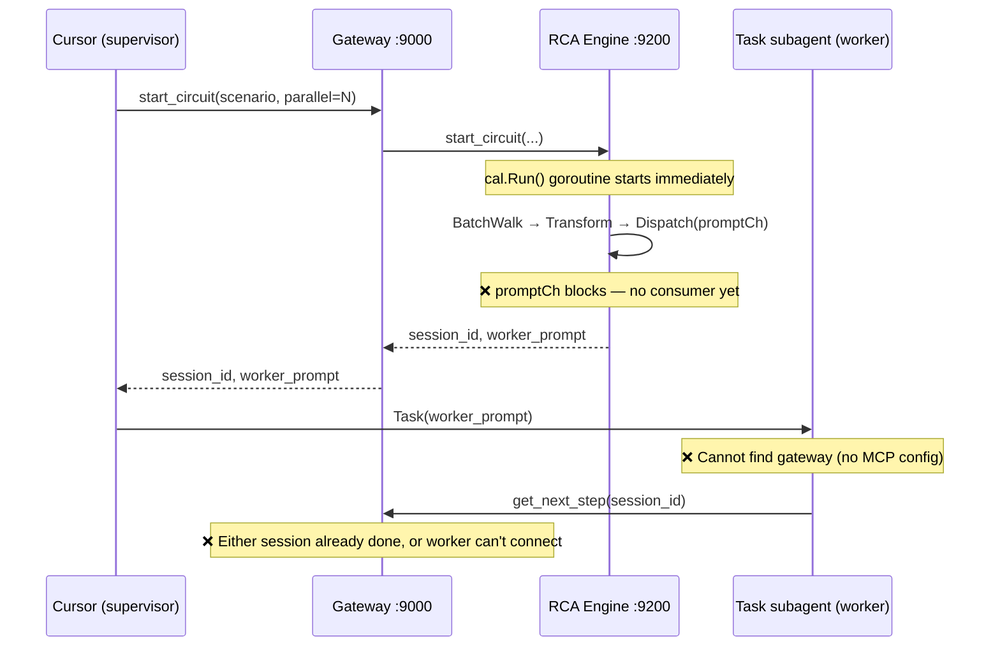
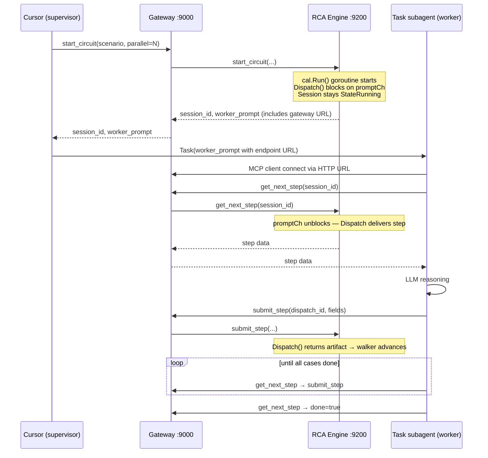

# Contract — llm-tie-up

**Status:** draft  
**Goal:** External LLM workers can connect to a running circuit session and process all steps, even when they arrive after `start_circuit` returns — closing both the dispatch gap and the MCP routing gap.  
**Serves:** 100% DSL — Zero Go (enables wet calibration, which validates accuracy metrics critical to the current goal)

## Contract rules

- Global rules only, plus:
- Every test must be deterministic: no LLM, no containers, no network flakes. Use `time.Sleep` for timing preconditions, in-memory MCP transports where possible, `net/http/httptest` for HTTP assertions.
- Red-Green-Refactor: write failing test first, then implement the fix. Each task includes the test and the fix together.
- All changes are in Origami (framework). Zero Go in Asterisk.

## Context

### Root cause analysis

Two gaps prevent external LLM workers (Cursor Dispatcher, Ollama, etc.) from participating in wet calibration:

**Gap 1 — Dispatch gap.** `cal.Run()` starts a goroutine that calls `BatchWalk` → `runner.Walk` → `rcaTransformer.Transform` → `MuxDispatcher.Dispatch()`. `Dispatch()` pushes to an unbuffered `promptCh`. If no `GetNextStep` consumer is reading when the push happens, `Dispatch` blocks — which is correct. But the circuit session's `run()` goroutine fires immediately on `NewCircuitSession()`, while external workers take seconds to spawn (Task subagent startup, MCP client handshake). The `MuxDispatcher` channel rendezvous works at the unit level, but at the session level the race between the push-model harness (walker drives transformer drives dispatcher) and the pull-model protocol (workers call `GetNextStep` when ready) creates a temporal coupling. If any dispatch fails (timeout, context cancel), the session completes with empty results → 0% metrics.

**Gap 2 — MCP routing gap.** The Papercup v2 `WorkerPrompt()` tells workers to call `get_next_step` and `submit_step` as MCP tools. But it never tells them *where* — no endpoint URL. Task subagents don't inherit project-level `.cursor/mcp.json` servers. Workers spawned via the Task tool literally cannot find the gateway. The fix: `WorkerPrompt()` must include the gateway endpoint, and workers must be able to connect via HTTP (Streamable HTTP transport) independently.

### Current architecture



### Desired architecture



## FSC artifacts

Code only — no FSC artifacts.

## Execution strategy

Seven test-fix pairs organized by gap and test level. Each task writes the failing test, then implements the minimal fix. Tasks within each gap are ordered from unit → integration (inner loop to outer loop). Gap 1 is addressed first because Gap 2's fix (endpoint in WorkerPrompt) depends on the session actually staying alive for workers.

## Coverage matrix

| Layer | Applies | Rationale |
|-------|---------|-----------|
| **Unit** | yes | T1a: MuxDispatcher late-consumer rendezvous. T2c: WorkerPrompt endpoint content. |
| **Integration** | yes | T1b: CircuitSession state with late workers. T1c: Full MCP tool-call round-trip. T1d: cal.Run + transformer + mux end-to-end. T2a: Gateway HTTP reachability. T2b: Worker loop via HTTP URL. |
| **Contract** | no | No new API schemas — existing tool schemas are unchanged. |
| **E2E** | no | Deterministic tests only; real LLM/container validation is a follow-up. |
| **Concurrency** | yes | T1a, T1b, T1c, T1d all exercise concurrent goroutine timing. Race detector required. |
| **Security** | no | No trust boundaries affected — existing auth/TLS story unchanged. |

## Tasks

### Gap 1 — Dispatch gap

- [ ] **T1a** — `TestMux_LateConsumer_BlocksUntilReady` (`dispatch/mux_test.go`). Write test: `Dispatch()` in goroutine, 500ms sleep, then `GetNextStep` + `SubmitArtifact`. Assert Dispatch succeeds (not errors). This test should pass today (channel rendezvous already blocks) — it's the baseline proof. If it fails, there's a deeper issue in MuxDispatcher.

- [ ] **T1b** — `TestCircuitSession_LateWorker_StillGetsSteps` (`mcp/circuit_server_test.go`). Write test: create `CircuitSession` with `stubRunFunc` (3 cases, 1 step), sleep 2s, assert `GetState() == StateRunning`, then run worker loop pulling all 3 steps. Assert session completes successfully with non-nil result. **This test will fail today** — it reproduces the exact production bug. Fix: the `MuxDispatcher.Dispatch` blocks correctly on `promptCh`, so the issue is either context cancellation or TTL expiry. Investigate and fix the session lifecycle to tolerate late workers (adjust TTL handling, ensure `run()` goroutine stays alive while dispatches are pending).

- [ ] **T1c** — `TestCircuitServer_MCP_LateWorkerEndToEnd` (`mcp/circuit_server_test.go`). Write test: `start_circuit` via MCP tools, sleep 2s, then `get_next_step`/`submit_step` loop. Assert all steps processed (not `done=true` on first call). Uses in-memory MCP transport. **Will fail today** if T1b's underlying issue exists. Fix is same as T1b — this tests the full MCP tool-call path on top.

- [ ] **T1d** — `TestCalibrationHarness_WithMux_LateWorker` (`mcp/circuit_server_test.go` or `schematics/rca/mcpconfig/calibrate_test.go`). Write test: wire `stubRunFunc` (simulating `cal.Run` dispatch pattern) through `CircuitServer`, sleep 1s, run worker loop, assert all steps delivered and report produced. This is the highest-fidelity reproduction — identical code path to production.

### Gap 2 — MCP routing gap

- [ ] **T2a** — `TestGateway_HTTPDirectAccess` (`gateway/gateway_test.go`). Write test: start gateway with `httptest.NewServer`, send raw HTTP POST to `/mcp` with a JSON-RPC `tools/list` payload. Assert HTTP 200 and valid JSON-RPC response listing tools. Proves the gateway is reachable via plain HTTP.

- [ ] **T2b** — `TestWorker_CanCallToolsViaHTTPTransport` (`gateway/gateway_test.go` or `mcp/circuit_server_test.go`). Write test: start a `CircuitServer` (with `stubRunFunc`) exposed via Streamable HTTP, create a Go MCP SDK client pointing at the HTTP URL (not in-memory transport), call `start_circuit`, then `get_next_step`/`submit_step` via the HTTP client. Assert full round-trip succeeds. Fix: ensure the `CircuitServer` can serve via Streamable HTTP (it already can via the gateway — this test verifies the client side).

- [ ] **T2c** — `TestWorkerPrompt_ContainsEndpointURL` (`mcp/circuit_session_test.go`). Write test: generate `WorkerPrompt()` with a `CircuitConfig` that has a `GatewayEndpoint` field set. Assert the prompt string contains the URL. Fix: add `GatewayEndpoint string` to `CircuitConfig`, thread it into `WorkerPrompt()` generation so workers know where to connect.

### Wrap-up

- [ ] Validate (green) — `go test -race ./dispatch/... ./mcp/... ./gateway/...` all pass. `origami lint --profile strict` clean on changed files.
- [ ] Tune (blue) — extract shared test helpers, remove duplication, improve error messages.
- [ ] Validate (green) — all tests still pass after tuning.

## Acceptance criteria

```gherkin
Scenario: Late worker connects and processes all steps (Gap 1)
  Given a circuit session is started with 3 cases and 1 step each
  And no worker calls get_next_step for 2 seconds
  When a worker connects and begins the get_next_step/submit_step loop
  Then all 3 steps are delivered and processed
  And the session completes with a non-nil result
  And the session state transitions to Done (not Error)

Scenario: Worker prompt includes gateway endpoint (Gap 2)
  Given a CircuitConfig with GatewayEndpoint = "http://localhost:9000/mcp"
  When WorkerPrompt() is called
  Then the generated prompt contains "http://localhost:9000/mcp"
  And the prompt instructs workers to connect to that URL

Scenario: Worker connects via HTTP URL (Gap 2)
  Given a CircuitServer exposed via Streamable HTTP on a test port
  And a circuit session is started with 2 cases
  When a Go MCP SDK client connects to the HTTP URL directly
  And calls get_next_step and submit_step
  Then all steps are processed successfully
  And the circuit completes with a valid report
```

## Security assessment

No trust boundaries affected. The gateway already exposes HTTP endpoints; this contract adds no new network-facing surface. Workers connecting via HTTP use the same unauthenticated path that already exists in the Streamable HTTP transport. TLS/auth hardening is a separate concern (see cloud-native contract's security section).

## Notes

2026-03-08 23:00 — Contract drafted from RCA of containerized wet calibration failure. Both gaps identified via code trace of `cal.Run` → `BatchWalk` → `MuxDispatcher.Dispatch` → `promptCh` rendezvous timing, and `WorkerPrompt()` content inspection. See conversation [llm-wet-calibration-rca](953ff995-8a8e-4928-9475-44db70d042ac) for full analysis.
