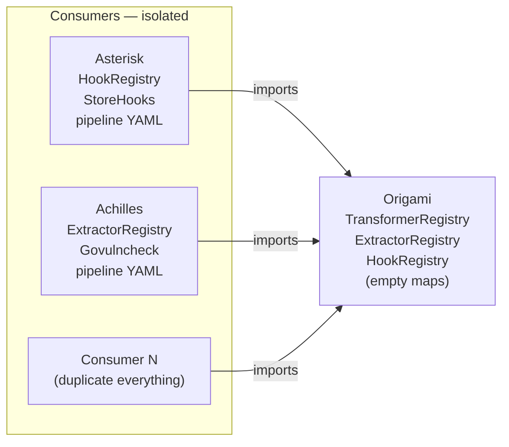
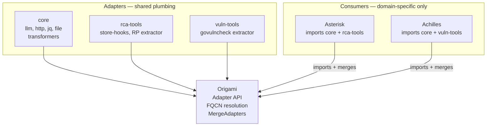

# Contract — Origami Adapters

**Status:** draft  
**Goal:** Define an adapter format, FQCN resolution, merge API, and CLI for distributing reusable Origami plumbing (transformers, extractors, hooks) across consumers — preventing the O(N) duplication problem as the consumer ecosystem grows.  
**Serves:** Polishing & Presentation (vision)

## Contract rules

- Adapters are Go modules. No dynamic/runtime plugin loading. Import at build time, compile into a single binary.
- FQCNs (`namespace.name`) are backward-compatible: unqualified names resolve as today. Qualified names are additive.
- The `core` adapter (built-in transformers: llm, http, jq, file) ships with Origami. It is not a separate Go module.
- Adapter manifest (`adapter.yaml`) is descriptive, not prescriptive. The Go type system is the authority; the manifest is for CLI tooling and discovery.
- Name collisions across adapters are errors, not silent overwrites.
- Adapters do NOT provide nodes or pipeline YAMLs. Reusable graph nodes are Marbles (see `origami-marbles.md`).

## Context

- **Origin:** Ansible Collections case study (`docs/case-studies/ansible-collections.md`) identified the duplication problem: Asterisk and Achilles independently build the same patterns (JSON extraction, hook wiring, pipeline embedding). As consumer count grows (N operators across RAN, Core, edge, platform), this becomes O(N) duplicated work.
- **Taxonomy split:** The original `origami-collections` contract mixed plumbing (hooks, extractors, transformers) with graph nodes (SubgraphNode). This contract covers only the plumbing — helper bundles that connect the graph to external systems. Reusable graph nodes are covered by the sibling `origami-marbles` contract.
- **Current state:** All registries (`TransformerRegistry`, `ExtractorRegistry`, `HookRegistry`) are simple Go maps with flat string keys. No namespacing, no packaging, no discovery, no merge helpers.
- **ResolvePipelinePath:** Already supports embedded registry (`RegisterEmbeddedPipeline`), env var (`$ORIGAMI_PIPELINES`), search dirs, and CWD. Adapters can register content via `init()`.
- **Cross-references:**
  - `origami-lsp` — LSP resolves FQCNs for completion and validation
  - `origami-marbles` — Marbles are the sibling concept for reusable graph nodes. `imports:` (Phase 3) loads both adapters and marbles.
  - `consumer-ergonomics` — `ResolvePipelinePath` is the pipeline discovery primitive
  - `e2e-dsl-testing` — scenario YAMLs can test FQCN resolution

### Current architecture

### Desired architecture

## FSC artifacts

| Artifact | Target | Compartment |
|----------|--------|-------------|
| Adapter format reference | `docs/adapters.md` | domain |
| Adapter manifest schema | `docs/adapter-yaml.md` | domain |

## Execution strategy

Phase 1 defines the Adapter struct and manifest parser. Phase 2 adds FQCN resolution to all registries. Phase 3 adds `imports:` to PipelineDef (shared with Marbles). Phase 4 extracts the `core` adapter from existing `transformers/` package. Phase 5 adds CLI commands. Phase 6 validates and tunes.

## Coverage matrix

| Layer | Applies | Rationale |
|-------|---------|-----------|
| **Unit** | yes | Manifest parsing, FQCN resolution, MergeAdapters collision detection |
| **Integration** | yes | Load pipeline YAML with `imports:`, resolve FQCNs, build graph |
| **Contract** | yes | Adapter manifest schema, FQCN format, registry merge semantics |
| **E2E** | yes | Walk pipeline using adapter-provided transformers |
| **Concurrency** | no | Adapters are registered at startup, not concurrently |
| **Security** | yes | `origami adapter install` wraps `go get` — supply chain trust |

## Tasks

### Phase 1 — Adapter struct and manifest

- [ ] **A1** Define `Adapter` struct in `adapter.go`: `Namespace`, `Name`, `Version`, `Description`, `Transformers TransformerRegistry`, `Extractors ExtractorRegistry`, `Hooks HookRegistry`
- [ ] **A2** Define `adapter.yaml` schema: `adapter`, `namespace`, `version`, `description`, `provides` (transformers, extractors, hooks), `requires` (origami version constraint)
- [ ] **A3** Implement `LoadAdapterManifest(path string) (*AdapterManifest, error)` — YAML parsing + validation
- [ ] **A4** Implement `MergeAdapters(base GraphRegistries, adapters ...*Adapter) (GraphRegistries, error)` — merge with collision detection
- [ ] **A5** Unit tests: manifest parsing, merge with no collisions, merge with collision produces error

### Phase 2 — FQCN resolution

- [ ] **F1** Add `namespace.name` parsing to `TransformerRegistry.Get()`, `ExtractorRegistry.Get()`, `HookRegistry.Get()` — look up `namespace + "." + name` first, fall back to unqualified name
- [ ] **F2** Add FQCN resolution to `resolveNode()` in `dsl.go` — `NodeDef.Transformer`, `NodeDef.Extractor` parsed for namespace prefix
- [ ] **F3** Backward compatibility: unqualified names resolve exactly as today (no namespace prefix required)
- [ ] **F4** Unit tests: FQCN lookup succeeds, unqualified lookup still works, unknown namespace produces error

### Phase 3 — `imports:` in PipelineDef

- [ ] **I1** Add `Imports []string yaml:"imports,omitempty"` to `PipelineDef`
- [ ] **I2** `LoadPipeline` + `BuildGraphWith` resolve `imports` → load adapter manifests → auto-register adapter content → FQCN shorthand (imported adapters' namespace can be omitted)
- [ ] **I3** Unit tests: pipeline with `imports:` resolves FQCNs without namespace prefix

### Phase 4 — Core adapter

- [ ] **K1** Create `adapter.yaml` manifest for core adapter (llm, http, jq, file transformers)
- [ ] **K2** Register core adapter transformers via `init()` with `core.` namespace
- [ ] **K3** Verify existing `builtin:` prefix in `TransformerNodeName()` maps to `core.` namespace

### Phase 5 — CLI

- [ ] **CLI1** `origami adapter list` — list installed adapters (from Go module dependencies)
- [ ] **CLI2** `origami adapter install <module>` — `go get <module>` + validate manifest
- [ ] **CLI3** `origami adapter inspect <namespace.name>` — show manifest details
- [ ] **CLI4** `origami adapter validate` — verify all `provides` items are resolvable in Go code
- [ ] Validate (green) — `go build ./...`, `go test ./...` all pass.
- [ ] Tune (blue) — CLI UX, error messages, manifest validation strictness.
- [ ] Validate (green) — all tests still pass after tuning.

## Acceptance criteria

**Given** a pipeline YAML with `extractor: achilles.govulncheck-v1`,  
**When** the `achilles` adapter is merged into the registry via `MergeAdapters`,  
**Then** `resolveNode` finds the extractor and builds the node successfully.

**Given** a pipeline YAML with `imports: [achilles.vuln-tools]` and `extractor: govulncheck-v1`,  
**When** the pipeline is loaded and built,  
**Then** the unqualified name `govulncheck-v1` resolves via the imported adapter's namespace.

**Given** two adapters both providing a transformer named `llm`,  
**When** `MergeAdapters` is called with both,  
**Then** an error is returned citing the collision: `transformer "llm" provided by both core and custom-adapter`.

**Given** `origami adapter list`,  
**When** the `core` and `achilles.vuln-tools` adapters are installed,  
**Then** the output lists both with name, namespace, version, and provides summary.

## Security assessment

| OWASP | Finding | Mitigation |
|-------|---------|------------|
| A08 | `origami adapter install` wraps `go get` — supply chain risk | Adapters are Go modules. `go.sum` provides integrity verification. No custom package format. |
| A05 | Adapters register code that runs in the pipeline | Same trust model as Go dependencies. Adapters are imported at build time, reviewed via code review. |

## Reference Adapter Inventory

The following adapters are identified from the Asterisk and Achilles codebases. Each maps existing Go code to a future adapter package with FQCN.

### Asterisk adapters

| FQCN | Current Code | Provides |
|------|-------------|----------|
| `asterisk.rp-source` | `internal/rp/` (client, fetcher, pusher, envelope) | ReportPortal API client, launch fetcher, defect pusher. The external data source. |
| `asterisk.model-adapters` | `internal/calibrate/adapt/` (StubAdapter, BasicAdapter, LLMAdapter) | Model adapter implementations for calibration. Wrap different AI backends. |
| `asterisk.step-extractors` | `internal/calibrate/extractor.go` | Step-specific artifact extractors for F0-F6 pipeline stages. Parse LLM responses into typed artifacts. |
| `asterisk.display` | `internal/display/display.go` | Human-readable name registry (defect types, symptom categories, metric names). Codes for machines, words for humans. |
| `asterisk.store-hooks` | `internal/orchestrate/hooks.go` | Pipeline lifecycle hooks: persist artifacts to store on node completion. |
| `asterisk.prompt-params` | `internal/orchestrate/params.go` + `template.go` | Prompt template parameter assembly. Builds `{{variable}}` context for each pipeline step. |
| `asterisk.report-formatters` | `internal/calibrate/report.go` + `rca_report.go` | Calibration report formatting (table, markdown, summary). RCA output formatting. |
| `asterisk.observability` | `internal/calibrate/tokimeter.go` + `transcript.go` | Token cost tracking, per-step transcript generation, cost bills. |

### Achilles adapters

| FQCN | Current Code | Provides |
|------|-------------|----------|
| `achilles.vuln-tools` | `GovulncheckExtractor`, `ClassifyExtractor` | Vulnerability scanner integration (govulncheck), severity classifier. |

### Core adapter additions

| Component | Current State | Change |
|-----------|--------------|--------|
| `exec` transformer | Does not exist | Add `exec` to the core adapter: run a shell command, capture stdout as artifact. Enables non-Go tool integration (govulncheck, trivy, etc.) without writing Go extractors. |

## Notes

2026-02-26 — Contract split from `origami-collections`. The original contract mixed plumbing (hooks, extractors, transformers) with graph nodes (SubgraphNode). Adapters cover the plumbing; Marbles cover the nodes. Vision-tier: significant architectural work, no timeline pressure. Go modules as distribution mechanism eliminates the need for a custom registry in the near term.

2026-02-26 — Adapter inventory injected from Asterisk/Achilles codebase analysis. 8 Asterisk adapters, 1 Achilles adapter, 1 core addition (`exec` transformer). This inventory demonstrates the scope of plumbing that would be duplicated by every new Origami consumer without the adapter mechanism.
