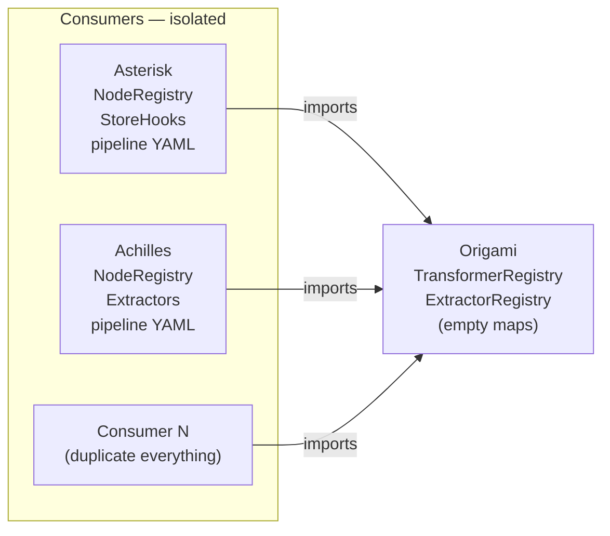
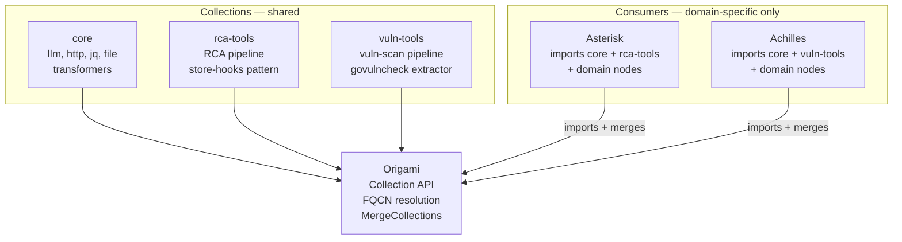

# Contract — Origami Collections

**Status:** draft  
**Goal:** Define a collection format, FQCN resolution, merge API, and CLI for distributing reusable Origami content (transformers, extractors, pipelines, hooks, nodes) across consumers — preventing the O(N) duplication problem as the consumer ecosystem grows.  
**Serves:** Polishing & Presentation (vision)

## Contract rules

- Collections are Go modules. No dynamic/runtime plugin loading. Import at build time, compile into a single binary.
- FQCNs (`namespace.name`) are backward-compatible: unqualified names resolve as today. Qualified names are additive.
- The `core` collection (built-in transformers: llm, http, jq, file) ships with Origami. It is not a separate Go module.
- Collection manifest (`collection.yaml`) is descriptive, not prescriptive. The Go type system is the authority; the manifest is for CLI tooling and discovery.
- Name collisions across collections are errors, not silent overwrites.

## Context

- **Origin:** Ansible Collections case study (`docs/case-studies/ansible-collections.md`) identified the duplication problem: Asterisk and Achilles independently build the same patterns (JSON extraction, node registry wiring, pipeline embedding). As consumer count grows (N operators across RAN, Core, edge, platform), this becomes O(N) duplicated work.
- **Current state:** All registries (`TransformerRegistry`, `ExtractorRegistry`, `NodeRegistry`, `EdgeFactory`, `HookRegistry`) are simple Go maps with flat string keys. No namespacing, no packaging, no discovery, no merge helpers.
- **ResolvePipelinePath:** Already supports embedded registry (`RegisterEmbeddedPipeline`), env var (`$ORIGAMI_PIPELINES`), search dirs, and CWD. Collections can register pipelines via `RegisterEmbeddedPipeline` in `init()`.
- **Cross-references:**
  - `origami-lsp` — LSP resolves FQCNs for completion and validation
  - `consumer-ergonomics` — `ResolvePipelinePath` is the pipeline discovery primitive collections build on
  - `e2e-dsl-testing` — scenario YAMLs can test FQCN resolution
  - LangGraph case study (`docs/case-studies/langgraph-graph-duality.md`) Gap 3 — LangGraph supports subgraphs (graphs as nodes). SubgraphNode (Phase 3.5) closes this gap. Collections distribute reusable subgraphs.

### Current architecture

### Desired architecture

## FSC artifacts

| Artifact | Target | Compartment |
|----------|--------|-------------|
| Collection format reference | `docs/collections.md` | domain |
| Collection manifest schema | `docs/collection-yaml.md` | domain |

## Execution strategy

Phase 1 defines the Collection struct and manifest parser. Phase 2 adds FQCN resolution to all registries. Phase 3 adds `imports:` to PipelineDef. Phase 4 extracts the `core` collection from existing `transformers/` package. Phase 5 adds CLI commands. Phase 6 validates and tunes.

## Coverage matrix

| Layer | Applies | Rationale |
|-------|---------|-----------|
| **Unit** | yes | Manifest parsing, FQCN resolution, MergeCollections collision detection |
| **Integration** | yes | Load pipeline YAML with `imports:`, resolve FQCNs, build graph |
| **Contract** | yes | Collection manifest schema, FQCN format, registry merge semantics |
| **E2E** | yes | Walk pipeline using collection-provided transformers |
| **Concurrency** | no | Collections are registered at startup, not concurrently |
| **Security** | yes | `origami collection install` wraps `go get` — supply chain trust |

## Tasks

### Phase 1 — Collection struct and manifest

- [ ] **C1** Define `Collection` struct in `collection.go`: `Namespace`, `Name`, `Version`, `Description`, `Transformers TransformerRegistry`, `Extractors ExtractorRegistry`, `Nodes NodeRegistry`, `Hooks HookRegistry`, `Pipelines map[string][]byte`
- [ ] **C2** Define `collection.yaml` schema: `collection`, `namespace`, `version`, `description`, `provides` (pipelines, transformers, extractors, nodes, hooks), `requires` (origami version constraint)
- [ ] **C3** Implement `LoadCollectionManifest(path string) (*CollectionManifest, error)` — YAML parsing + validation
- [ ] **C4** Implement `MergeCollections(base GraphRegistries, colls ...*Collection) (GraphRegistries, error)` — merge with collision detection
- [ ] **C5** Unit tests: manifest parsing, merge with no collisions, merge with collision produces error

### Phase 2 — FQCN resolution

- [ ] **F1** Add `namespace.name` parsing to `TransformerRegistry.Get()`, `ExtractorRegistry.Get()`, `HookRegistry.Get()` — look up `namespace + "." + name` first, fall back to unqualified name
- [ ] **F2** Add FQCN resolution to `resolveNode()` in `dsl.go` — `NodeDef.Transformer`, `NodeDef.Extractor` parsed for namespace prefix
- [ ] **F3** Backward compatibility: unqualified names resolve exactly as today (no namespace prefix required)
- [ ] **F4** Unit tests: FQCN lookup succeeds, unqualified lookup still works, unknown namespace produces error

### Phase 3 — `imports:` in PipelineDef

- [ ] **I1** Add `Imports []string yaml:"imports,omitempty"` to `PipelineDef`
- [ ] **I2** `LoadPipeline` + `BuildGraphWith` resolve `imports` → load collection manifests → auto-register collection pipelines → FQCN shorthand (imported collections' namespace can be omitted)
- [ ] **I3** Unit tests: pipeline with `imports:` resolves FQCNs without namespace prefix

### Phase 3.5 — SubgraphNode *(injected from LangGraph case study Gap 3)*

- [ ] **SG1** Define `SubgraphNode` in `subgraph.go` — wraps a compiled `Graph` and implements the `Node` interface. `InputMapper func(Artifact) (*WalkerState, error)` translates the parent artifact into subgraph walker state. `OutputMapper func(*WalkerState) (Artifact, error)` translates the subgraph's final state back into a parent artifact.
- [ ] **SG2** Add `Subgraph string` field to `NodeDef` in `dsl.go` — `subgraph: <pipeline-ref>` resolves via `ResolvePipelinePath`, loads the pipeline, builds the graph, and wraps it as a `SubgraphNode`
- [ ] **SG3** Collections distribute subgraph pipelines via `Pipelines map[string][]byte` (already defined in C1). A collection can provide a reusable sub-pipeline that consumers reference via FQCN in `subgraph: namespace.pipeline-name`.
- [ ] **SG4** Unit tests: build graph with subgraph node, walk parent → enters subgraph → subgraph nodes execute → returns to parent. Verify artifact flows through InputMapper/OutputMapper correctly.

### Phase 4 — Core collection

- [ ] **K1** Create `collection.yaml` manifest for core collection (llm, http, jq, file transformers)
- [ ] **K2** Register core collection transformers via `init()` with `core.` namespace
- [ ] **K3** Verify existing `builtin:` prefix in `TransformerNodeName()` maps to `core.` namespace

### Phase 5 — CLI

- [ ] **CLI1** `origami collection list` — list installed collections (from Go module dependencies)
- [ ] **CLI2** `origami collection install <module>` — `go get <module>` + validate manifest
- [ ] **CLI3** `origami collection inspect <namespace.name>` — show manifest details
- [ ] **CLI4** `origami collection validate` — verify all `provides` items are resolvable in Go code
- [ ] Validate (green) — `go build ./...`, `go test ./...` all pass.
- [ ] Tune (blue) — CLI UX, error messages, manifest validation strictness.
- [ ] Validate (green) — all tests still pass after tuning.

## Acceptance criteria

**Given** a pipeline YAML with `extractor: achilles.govulncheck-v1`,  
**When** the `achilles` collection is merged into the registry via `MergeCollections`,  
**Then** `resolveNode` finds the extractor and builds the node successfully.

**Given** a pipeline YAML with `imports: [achilles.vuln-tools]` and `extractor: govulncheck-v1`,  
**When** the pipeline is loaded and built,  
**Then** the unqualified name `govulncheck-v1` resolves via the imported collection's namespace.

**Given** two collections both providing a transformer named `llm`,  
**When** `MergeCollections` is called with both,  
**Then** an error is returned citing the collision: `transformer "llm" provided by both core and custom-collection`.

**Given** `origami collection list`,  
**When** the `core` and `achilles.vuln-tools` collections are installed,  
**Then** the output lists both with name, namespace, version, and provides summary.

## Security assessment

| OWASP | Finding | Mitigation |
|-------|---------|------------|
| A08 | `origami collection install` wraps `go get` — supply chain risk | Collections are Go modules. `go.sum` provides integrity verification. No custom package format. |
| A05 | Collections register code that runs in the pipeline | Same trust model as Go dependencies. Collections are imported at build time, reviewed via code review. |

## Notes

2026-02-25 — Contract created from Ansible Collections case study. Vision-tier: significant architectural work, no timeline pressure. Go modules as distribution mechanism eliminates the need for a custom registry (Galaxy equivalent) in the near term. FQCN resolution is backward-compatible — no breaking changes to existing pipelines.
