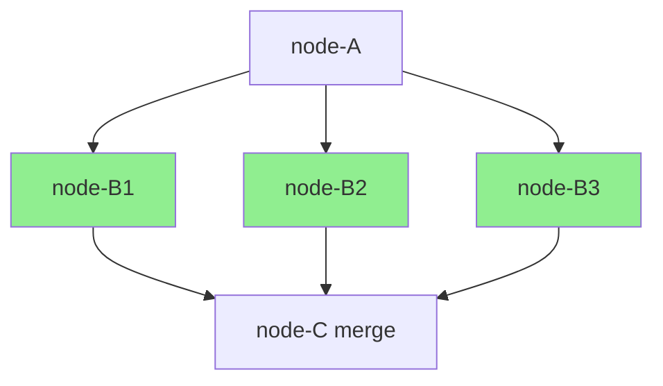

# Contract — origami-fan-out-fan-in

**Status:** draft  
**Goal:** Graph walk supports parallel node execution at declared fan-out points, with artifact collection at fan-in merge nodes.  
**Serves:** Framework Maturity (current goal)

## Contract rules

Global rules only, plus:

- **Opt-in parallelism.** Existing sequential walks are unaffected. Fan-out requires explicit `parallel: true` on edges.
- **Race-safe.** All shared state access must pass `-race`. `WalkerState.Outputs` needs synchronization when written from parallel goroutines.
- **Reuse MuxDispatcher patterns.** The pull-based artifact routing proven by MuxDispatcher informs the fan-in collection mechanism.

## Context

- `strategy/origami-vision.mdc` — Execution model trajectory: "Next: fan-out / fan-in inside graph."
- `graph.go` — `Walk()` currently processes nodes sequentially.
- `dsl.go` — `EdgeDef` with `When`, `From`, `To`. No parallelism concept yet.
- `dispatch/mux.go` — `MuxDispatcher` pull model: `GetNextStep` / `SubmitArtifact`. Patterns for concurrent artifact routing.
- `walker.go` — `WalkerState` with `Outputs map[string]Artifact`. Currently unsynchronized (single goroutine).

### Desired architecture

Fan-out: A -> {B1, B2, B3} execute concurrently. Fan-in: C waits for all B outputs.

## FSC artifacts

| Artifact | Target | Compartment |
|----------|--------|-------------|
| Parallel execution design reference | `docs/` | domain |

## Execution strategy

Phase 1: Add `parallel: true` to `EdgeDef` DSL. Phase 2: Walk detects fan-out nodes (multiple outgoing `parallel: true` edges) and spawns goroutines. Phase 3: Fan-in merge node waits for all incoming parallel artifacts. Phase 4: Synchronize `WalkerState.Outputs`. Phase 5: Validate with `-race`.

## Coverage matrix

| Layer | Applies | Rationale |
|-------|---------|-----------|
| **Unit** | yes | Fan-out detection, merge node collection, timeout handling |
| **Integration** | yes | Full pipeline with parallel and sequential segments |
| **Contract** | yes | `parallel: true` YAML field accepted; backward compatible |
| **E2E** | no | No consumer uses fan-out yet |
| **Concurrency** | yes | Core of this contract — goroutine fan-out, synchronized state, `-race` |
| **Security** | no | No new trust boundaries |

## Tasks

- [ ] Add `Parallel bool` field to `EdgeDef` (YAML tag: `parallel`)
- [ ] Detect fan-out nodes in Walk: nodes with 2+ outgoing `parallel: true` edges
- [ ] Spawn goroutines for parallel successor nodes; each gets its own `NodeContext`
- [ ] Implement fan-in merge: node with 2+ incoming parallel edges waits for all predecessors
- [ ] Synchronize `WalkerState.Outputs` with `sync.Mutex` for concurrent writes
- [ ] Add timeout for fan-out group (context deadline)
- [ ] Error propagation: if any parallel node fails, cancel siblings and propagate error
- [ ] Unit tests: fan-out detection, merge collection, timeout, error propagation
- [ ] Integration test: pipeline with parallel segment followed by sequential segment
- [ ] Validate (green) — all tests pass with `-race`
- [ ] Tune (blue) — refactor for quality
- [ ] Validate (green) — all tests still pass after tuning

## Acceptance criteria

**Given** a pipeline YAML with `parallel: true` edges from node A to nodes B1, B2, B3,  
**When** the pipeline is executed,  
**Then**:
- B1, B2, B3 execute concurrently (goroutines, not sequential)
- Merge node C receives all three artifacts before processing
- Sequential segments before and after the parallel section work normally
- `WalkerState.Outputs` is race-free
- Fan-out group respects context deadline
- If B2 fails, B1 and B3 are cancelled
- `go test -race ./...` passes

## Security assessment

No new trust boundaries. Parallelism is internal to the process.

## Notes

2026-02-18 — Contract created. Next-milestone for Framework Maturity goal. First step in the execution model trajectory (sequential -> fan-out/fan-in -> network -> K8s).
