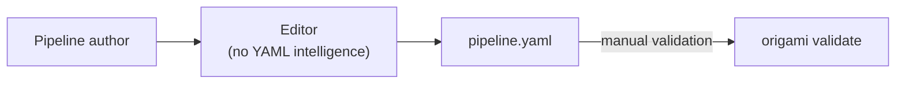
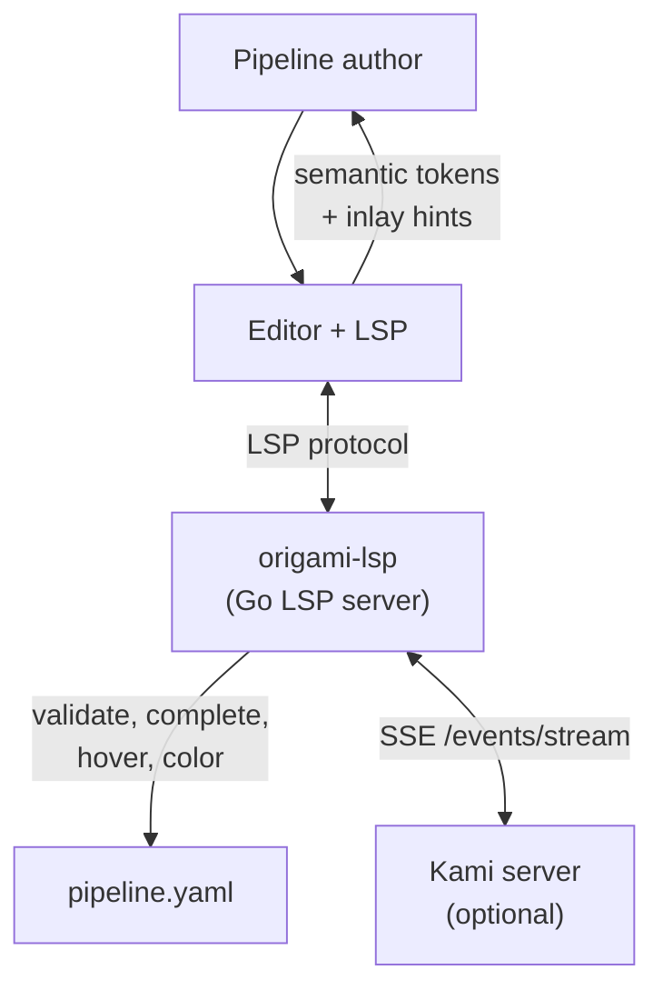

# Contract — Origami LSP

**Status:** draft  
**Goal:** Ship a Language Server for Origami pipeline YAML that provides validation, completion, hover docs, color coding, virtual text hints, and a Kami live connection -- making pipeline authoring a first-class IDE experience.  
**Serves:** Polishing & Presentation (vision)

## Contract rules

- The LSP is a framework feature. It must not import any consumer code (Asterisk, Achilles).
- Adapter-provided names (FQCNs) are resolved when the `origami-adapters` contract ships. Until then, the LSP validates framework-level names only (elements, personas, structural integrity).
- E2E scenario YAMLs from `e2e-dsl-testing` are the LSP's test fixtures. If a scenario YAML is valid and walks correctly, the LSP must validate it without errors.
- Virtual text hints are inlay hints (LSP 3.17+), not diagnostic messages. They inform, not warn.
- Kami connection is optional -- the LSP must function fully without a running Kami instance.

## Context

- **Reference:** Ansible Language Server (`ansible-language-server.readthedocs.io`) -- domain-specific YAML LSP with syntax highlighting, validation (+ ansible-lint), auto-completion (module names, FQCNs), documentation on hover, go-to-definition. See `docs/case-studies/ansible-collections.md` for the full case study.
- **DSL schema:** `dsl.go` defines `PipelineDef`, `NodeDef`, `EdgeDef`, `ZoneDef`, `WalkerDef`. All fields, valid values, and cross-reference rules are documented in the E2E DSL testing inventory.
- **Element palette:** Fire=Crimson (`#DC143C`), Water=Cerulean (`#007BA7`), Earth=Cobalt (`#0047AB`), Air=Amber (`#FFBF00`), Diamond=Sapphire (`#0F52BA`), Lightning (no persona color), Iron (`#48494B`).
- **Kami EventBridge:** When `origami kami --port 3000` is running, SSE endpoint `/events/stream` emits `KamiEvent` structs with node enter/exit, transitions, walker positions.
- **Dependencies:** Stable DSL (all sprints complete), `e2e-dsl-testing` scenario YAMLs as test fixtures.

### Current architecture

### Desired architecture

## FSC artifacts

| Artifact | Target | Compartment |
|----------|--------|-------------|
| LSP architecture reference | `docs/lsp-architecture.md` | domain |
| VS Code extension scaffold | `lsp/vscode/` | domain |

## Execution strategy

Phase 1 builds the LSP core (validation, completion, hover). Phase 2 adds element-aware color coding via semantic tokens. Phase 3 adds virtual text hints via inlay hints. Phase 4 connects to Kami for live state overlay. Phase 5 packages the CLI command and VS Code extension.

## Coverage matrix

| Layer | Applies | Rationale |
|-------|---------|-----------|
| **Unit** | yes | Schema validation, completion candidates, element/persona lookup |
| **Integration** | yes | LSP protocol round-trip (initialize, textDocument/didOpen, completion, hover) |
| **Contract** | yes | LSP protocol compliance, semantic token types, inlay hint format |
| **E2E** | yes | Open E2E scenario YAML in mock editor, verify no false diagnostics |
| **Concurrency** | yes | Multiple documents open, concurrent edit/validate |
| **Security** | yes | Kami SSE connection localhost-only by default |

## Tasks

### Phase 1 -- LSP core

- [ ] **L1** Create `lsp/` package with Go LSP server using `go.lsp.dev/protocol`
- [ ] **L2** YAML document model: parse pipeline YAML on `textDocument/didOpen` and `textDocument/didChange`, maintain in-memory AST
- [ ] **L3** Validation diagnostics: required fields, node/edge/zone cross-references, element/persona enum values, `when:` expression compilation via expr-lang
- [ ] **L4** Completion: top-level keys (`pipeline`, `nodes`, `edges`, etc.), node/edge/walker field keys, element values (7), persona values (8), node names in `from`/`to`/`start`/`zones.*.nodes`/`step_affinity`
- [ ] **L5** Hover documentation: element traits (speed, max loops, shortcut affinity, failure mode), persona descriptions, expression context (`output`, `state`, `config`)
- [ ] **L6** Go-to-definition: node name from edge `from`/`to`, zone node lists, `start` field
- [ ] **L7** Unit tests: validate E2E scenario YAMLs produce zero diagnostics, validate intentionally broken YAML produces correct diagnostics

### Phase 2 -- Color coding

- [ ] **C1** Register semantic token types for Origami elements: `origami.fire`, `origami.water`, `origami.earth`, `origami.air`, `origami.diamond`, `origami.lightning`, `origami.iron`
- [ ] **C2** Map element token types to the persona color palette (Fire=Crimson, Water=Cerulean, Earth=Cobalt, Air=Amber, Diamond=Sapphire)
- [ ] **C3** Apply semantic tokens to `element:` values, zone names (by zone element), walker `element:` fields
- [ ] **C4** VS Code theme contribution: semantic token color rules for Origami element types

### Phase 3 -- Virtual text hints

- [ ] **H1** Element trait hints: `element: earth` shows inlay hint `steady | 1 loop | 0.1 shortcut`
- [ ] **H2** Persona description hints: `persona: sentinel` shows inlay hint `Steady resolver, follows proven paths`
- [ ] **H3** Expression validity hints: `when: "..."` shows inlay hint `expr-lang valid` or `error: <message>`
- [ ] **H4** Element flow hints on edges: `from: triage` / `to: investigate` shows inlay hint `(fire -> water)`
- [ ] **H5** Start node element hint: `start: recall` shows inlay hint `(fire)`

### Phase 4 -- Kami bridge

- [ ] **K1** SSE client connecting to `http://localhost:<port>/events/stream` when Kami is running
- [ ] **K2** Auto-discovery: check `localhost:3000` on LSP startup, reconnect on connection loss
- [ ] **K3** Live state overlay as inlay hints: active node shows `ACTIVE [persona]`, visited shows `visited (Xs ago)`, paused shows `PAUSED`
- [ ] **K4** Last transition highlight: edge `from`/`to` matching last KamiEvent transition
- [ ] **K5** Configuration: `origami.kami.port` setting, `origami.kami.enabled` toggle

### Phase 5 -- CLI + packaging

- [ ] **P1** `origami lsp` CLI command: starts the LSP server over stdio
- [ ] **P2** VS Code extension scaffold in `lsp/vscode/`: `package.json`, `extension.ts` (launch `origami lsp`), language configuration for `.yaml` files matching `pipeline:` key
- [ ] **P3** Installation guide in `docs/lsp-architecture.md`
- [ ] Validate (green) -- `go build ./...`, `go test ./...` all pass. LSP starts, validates, completes.
- [ ] Tune (blue) -- completion ranking, hover formatting, hint density.
- [ ] Validate (green) -- all tests still pass after tuning.

## Acceptance criteria

**Given** a pipeline YAML with a misspelled element (`element: fyre`),  
**When** opened in an editor with origami-lsp,  
**Then** a diagnostic error appears: `unknown element "fyre" (valid: fire, lightning, earth, diamond, water, air, iron)`.

**Given** a pipeline YAML with `element: earth` on a node,  
**When** viewed in an editor with origami-lsp,  
**Then** the `earth` text has Cobalt semantic coloring and an inlay hint showing `steady | 1 loop | 0.1 shortcut`.

**Given** a running Kami server at `localhost:3000` and a pipeline being walked,  
**When** the walk reaches node `triage`,  
**Then** the `triage` node definition in the editor shows an inlay hint `ACTIVE [herald]` (or the active walker's persona).

**Given** the cursor is on an edge's `to: investigate` field,  
**When** the user triggers go-to-definition,  
**Then** the cursor jumps to the `- name: investigate` node definition.

**Given** any E2E scenario YAML from `testdata/scenarios/`,  
**When** opened in an editor with origami-lsp,  
**Then** zero diagnostic errors are reported.

## Security assessment

| OWASP | Finding | Mitigation |
|-------|---------|------------|
| A01 | Kami SSE connection exposes pipeline state | Localhost-only by default. Configurable port. No sensitive data in inlay hints. |
| A05 | LSP has read access to pipeline YAML files | Read-only -- LSP never modifies files. Standard LSP trust model. |

## Notes

2026-02-25 -- Contract created. Inspired by Ansible Language Server case study. Element color palette from `persona.go` color constants. Kami bridge depends on `kami-live-debugger` contract (Sprint 4). FQCN awareness deferred until `origami-adapters` ships.
