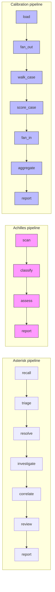
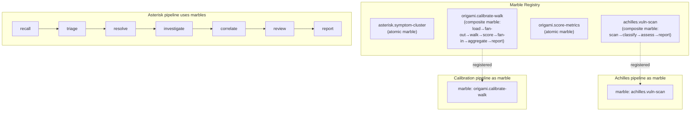

# Contract — Origami Marbles

**Status:** draft  
**Goal:** Define a Marble type — self-contained, reusable graph nodes (atomic or composite) with defined input/output artifact contracts — that enables cross-project node sharing, subgraph encapsulation, and Kami fold/unfold visualization.  
**Serves:** Polishing & Presentation (vision)

## Contract rules

- Marbles are graph nodes. The walker visits them. They appear in the pipeline graph.
- A composite marble wraps a compiled `Graph` behind the `Node` interface. Internally it runs a sub-walk; externally it looks like a single node.
- Marble nesting is allowed: a marble can contain other marbles. Cycle detection is required at build time.
- Input/output mapping at the marble boundary is explicit via `InputMapper`/`OutputMapper`. No implicit artifact pass-through.
- Marbles can be distributed alongside adapters in the same Go module. The `imports:` mechanism (Phase 3 in Adapters) loads both. But they are conceptually distinct: adapters are plumbing, marbles are graph nodes.
- The marble FQCN namespace is shared with adapters to avoid confusion: `<namespace>.<marble-name>`.
- Atomic marbles (Go-registered single nodes) and composite marbles (YAML subgraph) use the same `Marble` interface.

## Context

- **Origin:** Graph Folding discussion — the concept of collapsing a subgraph into a single abstract node. A marble is a "snow globe": a smaller world you work with in a black-box manner.
- **Taxonomy split:** The original `origami-collections` contract mixed plumbing (hooks, extractors, transformers) with graph nodes (SubgraphNode). This contract covers the graph nodes — reusable node units that appear in the pipeline and are visited by the walker. Plumbing is covered by the sibling `origami-adapters` contract.
- **Asterisk symptom-cluster:** The symptom clustering logic (`internal/calibrate/cluster.go`) is an example of an atomic marble — a deterministic, reusable node that groups similar failures by symptom pattern. Currently hardcoded in Asterisk; extractable to a marble.
- **Achilles vuln-pipeline:** The 4-node vulnerability scanning pipeline (scan → classify → assess → report) is an example of a composite marble — a subgraph that could be folded into a single node and imported by other projects.
- **Origami calibration walk:** The calibration runner (load → fan-out → walk → score → fan-in → aggregate → report) is a composite marble that lives in the framework itself — Origami dog-foods its own marble system.
- **SubgraphNode (Phase 3.5 from old Collections):** The technical kernel (SG1-SG4) is the starting point for this contract, renamed from `SubgraphNode` to `Marble`.
- **Cross-references:**
  - `origami-adapters` — Adapters provide plumbing; marbles can be distributed in the same module
  - `kami-live-debugger` — Kami must support fold/unfold visualization for composite marbles
  - `visual-editor` — Visual Editor component palette shows available marbles

### Current architecture

Pink-highlighted nodes are consumer marble candidates. Blue-highlighted nodes are framework marble candidates (calibration pipeline).

### Desired architecture

## FSC artifacts

| Artifact | Target | Compartment |
|----------|--------|-------------|
| Marble design reference | `docs/marbles.md` | domain |
| Marble interface + registry | `marble.go` | framework |

## Execution strategy

Phase 1 defines the `Marble` interface and `MarbleRegistry`. Phase 2 adds the `marble:` DSL field to `NodeDef`. Phase 3 implements composite marble mechanics (sub-walk, I/O mapping). Phase 4 adds marble nesting with cycle detection. Phase 5 integrates with Kami for fold/unfold visualization. Phase 6 validates and tunes.

## Coverage matrix

| Layer | Applies | Rationale |
|-------|---------|-----------|
| **Unit** | yes | Marble interface compliance, I/O mapping, registry lookup, cycle detection |
| **Integration** | yes | Build graph with marbles, walk pipeline, verify marble artifacts |
| **Contract** | yes | Marble interface, YAML surface, fold/unfold API |
| **E2E** | yes | Walk pipeline with nested composite marbles, verify output |
| **Concurrency** | yes | Composite marble sub-walk must respect parent walker context |
| **Security** | no | Marbles are compile-time imports, same trust model as any Go code |

## Tasks

### Phase 1 — Marble interface and registry

- [ ] **M1** Define `Marble` interface in `marble.go`: embeds `Node`, adds `PipelineDef() *PipelineDef`, `IsComposite() bool`
- [ ] **M2** Define `MarbleRegistry` type: `map[string]func(def NodeDef) Marble` — parallel to `NodeRegistry`
- [ ] **M3** Implement `RegisterMarble(fqcn string, factory func(NodeDef) Marble)` — registers with collision detection
- [ ] **M4** Implement `AtomicMarble` struct: wraps a standard `Node` + output artifact contract, `IsComposite()` returns `false`
- [ ] **M5** Unit tests: register atomic marble, look up by FQCN, collision detection

### Phase 2 — DSL field `marble:`

- [ ] **D1** Add `Marble string yaml:"marble,omitempty"` to `NodeDef`
- [ ] **D2** In `resolveNode()`: when `NodeDef.Marble` is set, look up `MarbleRegistry` by FQCN. Error if not found.
- [ ] **D3** Validation: `marble:` is mutually exclusive with `extractor:` and `transformer:` on the same node
- [ ] **D4** Unit tests: pipeline YAML with `marble:` field builds correctly, mutual exclusion validated

### Phase 3 — Composite marble

- [ ] **SG1** Implement `CompositeMarble` struct: wraps a compiled `Graph`, runs a sub-walk on `Handle()`, maps input/output artifacts via `InputMapper`/`OutputMapper`
- [ ] **SG2** Define `InputMapper` and `OutputMapper` function types: `func(parentArtifacts map[string]any) map[string]any` — translate artifacts at the boundary
- [ ] **SG3** `PipelineDef()` returns the inner pipeline definition for Kami introspection
- [ ] **SG4** Unit tests: build composite marble from YAML, walk it, verify inner sub-walk produces correct output artifacts

### Phase 4 — Nesting and cycle detection

- [ ] **N1** Allow `marble:` nodes inside a composite marble's inner pipeline
- [ ] **N2** Build-time cycle detection: walk the marble dependency graph, error on cycles
- [ ] **N3** Depth limit: configurable max nesting depth (default 8) to prevent accidental deep recursion
- [ ] **N4** Unit tests: nested marble walks correctly, cycle detected and rejected, depth limit enforced

### Phase 5 — Kami integration

- [ ] **V1** `GET /api/marble/:node` returns inner `PipelineDef` for composite marbles
- [ ] **V2** React frontend: click composite marble node → expand inline (fold/unfold toggle)
- [ ] **V3** KamiEvent: sub-walk events scoped to marble namespace (`marble:achilles.vuln-pipeline:scan`)
- [ ] **V4** Recorder: marble sub-walk events recorded for replay
- [ ] Validate (green) — `go build ./...`, `go test ./...` all pass.
- [ ] Tune (blue) — fold/unfold UX, marble naming conventions, error messages.
- [ ] Validate (green) — all tests still pass after tuning.

## Acceptance criteria

**Given** a pipeline YAML with `marble: asterisk.symptom-cluster` on a node,  
**When** the marble is registered in `MarbleRegistry` and the pipeline is built,  
**Then** the node is backed by the marble's `Handle()` method and produces the expected `ClusterResult` artifact.

**Given** a pipeline YAML with `marble: achilles.vuln-scan` pointing to a 4-node subgraph,  
**When** the pipeline is walked,  
**Then** the marble runs its inner sub-walk (scan→classify→assess→report), maps output artifacts via `OutputMapper`, and the parent walk continues with the mapped artifacts.

**Given** a composite marble A containing a marble B, and marble B containing marble A,  
**When** the pipeline is built,  
**Then** build fails with a cycle detection error: `marble cycle detected: A → B → A`.

**Given** a running Kami server and a pipeline with composite marble `achilles.vuln-scan`,  
**When** the user clicks the marble node in the Kami frontend,  
**Then** the node expands to show the inner pipeline (scan → classify → assess → report) with live walker state.

**Given** `origami adapter list` showing the `achilles` module installed,  
**When** the module provides both adapters and marbles,  
**Then** the output lists adapters and marbles separately with their FQCNs.

## Security assessment

| OWASP | Finding | Mitigation |
|-------|---------|------------|
| A08 | Marbles can embed arbitrary pipeline logic | Same trust model as Go dependencies. Compile-time imports, reviewed via code review. |
| A01 | Composite marble sub-walk has access to parent walker context | InputMapper/OutputMapper form an explicit boundary. Only mapped artifacts cross the boundary. |

## Notes

## Reference Marble Inventory

| FQCN | Current Code | Type | Description |
|------|-------------|------|-------------|
| `asterisk.symptom-cluster` | `internal/calibrate/cluster.go` | Atomic | Groups similar failures by symptom pattern during recall/triage. |
| `origami.score-metrics` | `internal/calibrate/metrics.go` (to migrate) | Atomic | Evaluates a `ScoreCard` against metric values. Uses `DefaultScoreCard()` internally; consumers override with their own ScoreCard. The 7 universal metrics from `DefaultMetrics()` are always included unless explicitly excluded. Framework-level, reusable by any consumer. |
| `origami.calibrate-walk` | `internal/calibrate/runner.go` (to migrate) | Composite | Full calibration pipeline: load → fan-out → walk → score → fan-in → aggregate → report. Origami dog-foods its own marble system. |
| `achilles.vuln-scan` | Achilles 4-node pipeline | Composite | Vulnerability scanning subgraph: scan → classify → assess → report. |

**Superseded:** ~~`asterisk.rtfm-context`~~ — the RTFM node is replaced by `ReadPolicy` on `knowledge.Source`. No marble needed; mandatory documentation is injected into prompt templates via `{{always_read_sources}}`.

## Notes

2026-02-26 — Contract split from `origami-collections`. The SubgraphNode kernel (SG1-SG4) is the foundation of Phase 3. Marble metaphor agreed: "like a snow globe — a smaller world which we work with in a black-box manner." Vision-tier: no timeline pressure.

2026-02-26 — Marble inventory updated. RTFM marble (`asterisk.rtfm-context`) removed — superseded by ReadPolicy on `knowledge.Source`. New marbles added: `asterisk.symptom-cluster`, `origami.score-metrics`, `origami.calibrate-walk`, `achilles.vuln-scan`. The framework marbles (`origami.*`) demonstrate Origami eating its own dog food — calibration uses the same marble system that consumers use.
