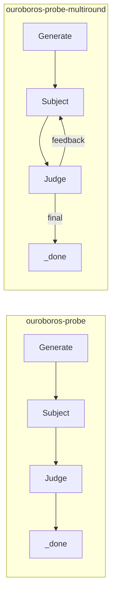
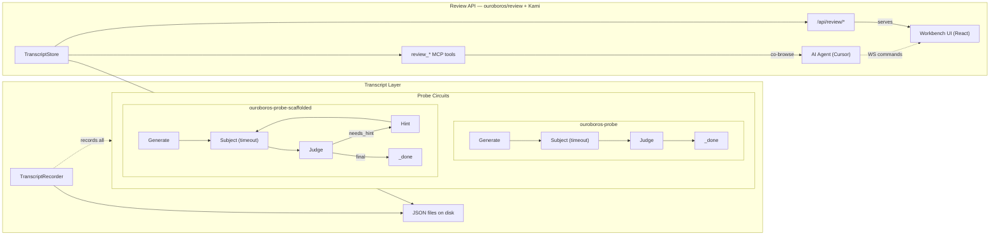

# Contract — ouroboros-probe-extensions

**Status:** draft  
**Goal:** Ouroboros probes support timed handicaps, scaffolded prompt-chains, and persistent transcripts with human review.  
**Serves:** Containerized Runtime (Ouroboros enrichment)

## Contract rules

Global rules only.

## Context

Three independent extensions to Ouroboros that each reveal a different axis of model behavior:

1. **Timed Handicap Probes** — measure behavioral degradation under time pressure. A model scoring "methodical" at 30s might flip to "reactive" at 5s. The shift itself is a signal.
2. **Scaffolded Prompt-Chain Probes** — compare one-shot performance vs guided (hint-by-hint) performance. The delta reveals HITL dependency: how much does a model depend on human problem decomposition?
3. **Transcript Persistence + Human Review** — save every probe run as a reviewable record (Generator/Subject/Judge prompts and responses). Human operators or AI agents attach ratings, overrides, and prompt-tuning suggestions post-hoc.

Downstream: `ouroboros-workbench` contract builds the visual layer on top of Track C's API.

### Current architecture

Subject dispatches with no timeout. No transcript recording. No hint-based scaffolding.

### Desired architecture

All circuits gain optional timeout enforcement and transcript recording via `CircuitOpts`. The scaffolded circuit is a new topology. Track C builds the `TranscriptStore`, HTTP API, and MCP tools that the Ouroboros Workbench UI consumes.

## FSC artifacts

| Artifact | Target | Compartment |
|----------|--------|-------------|
| Transcript format reference | `docs/ouroboros-transcript-format.md` | domain |
| Review API reference | `docs/ouroboros-review-api.md` | domain |

## Execution strategy

Three independent tracks, each building on `seed.go` + `circuit.go`. Execute in order because each track is small and later tracks benefit from earlier type additions.

**Track A — Timed Handicap (smallest, schema-only + circuit wiring)**
1. Add `TimeLimit` to Seed, validate as parseable duration
2. Wire timeout into Subject dispatch context (cascade + multiround)
3. Add `TimedOut` + `TimeLimit` to `PoleResult` / `ProbeResult`
4. Create 3 timed seed variants

**Track B — Scaffolded Prompt-Chain (new circuit topology)**
5. Add `Hints []string` to Seed with validation
6. Implement `scaffolded.go` (scaffoldedJudgeNode, hintNode, HintFeedback type)
7. Create `ouroboros-probe-scaffolded.yaml` circuit
8. Add `HintsUsed` to `PoleResult`, compute HITL dependency ratio

**Track C — Transcript Persistence + Review API (recording, review, HTTP surface)**
9. Create `transcript.go` with ProbeTranscript, Exchange, HumanReview types + save/load
10. Add `TranscriptRecorder` to `CircuitOpts`, wire into all node Process methods
11. Create `ouroboros/review/` package: `TranscriptStore` (directory-backed), list/get/score operations
12. Add review HTTP handlers to Kami server: `GET /api/review` (list), `GET /api/review/{id}` (detail), `POST /api/review/{id}/score` (attach HumanReview)
13. Add review MCP tools: `review_get_current_view`, `review_get_transcript`, `review_set_score`, `review_highlight_exchange`, `review_suggest_tuning`
14. Add `ReviewConfig` to Kami `Config` struct (transcript directory, optional — nil = no review mode)
15. Document transcript format

## Coverage matrix

| Layer | Applies | Rationale |
|-------|---------|-----------|
| **Unit** | yes | Timeout enforcement, hint progression, transcript save/load round-trip, HumanReview attachment |
| **Integration** | yes | Full circuit walk with timeout triggering, scaffolded circuit walk consuming all hints |
| **Contract** | yes | Review API HTTP contract: list/get/score endpoints return expected JSON shapes |
| **E2E** | no | Ouroboros probes are run in calibration, not in production circuits |
| **Concurrency** | no | All state is per-probe-run, no shared mutable state |
| **Security** | yes | Review score endpoint accepts external input (HumanReview payload) — validate ratings 1-5, sanitize notes |

## Tasks

### Track A — Timed Handicap
- [ ] A1. Add `TimeLimit string` to `Seed`, parse as `time.Duration` in `Validate()`
- [ ] A2. Wire `context.WithTimeout` into `subjectNode.Process` when `TimeLimit` is set (cascade + multiround + scaffolded)
- [ ] A3. Add `TimedOut bool` and `TimeLimit time.Duration` to `PoleResult` and `ProbeResult`
- [ ] A4. Create 3 timed seed variants (`debug-skill-timed-5s.yaml`, `refactor-skill-timed-10s.yaml`, `debug-ws-lagged-timed-15s.yaml`)

### Track B — Scaffolded Prompt-Chain
- [ ] B1. Add `Hints []string` to `Seed` with validation (non-empty strings when present)
- [ ] B2. Create `HintFeedback` type and `scaffoldedJudgeNode` in `ouroboros/scaffolded.go`
- [ ] B3. Create `ouroboros/circuits/ouroboros-probe-scaffolded.yaml`
- [ ] B4. Add `HintsUsed int` to `PoleResult`, wire into aggregation path
- [ ] B5. Create 2 scaffolded seed variants with progressive hints

### Track C — Transcript Persistence + Review API
- [ ] C1. Create `ouroboros/transcript.go` with `ProbeTranscript`, `Exchange`, `HumanReview`, `SaveTranscript`, `LoadTranscript`
- [ ] C2. Add `TranscriptRecorder` callback to `CircuitOpts`, wire into generate/subject/judge node Process methods
- [ ] C3. Wire recorder into multiround and scaffolded circuits
- [ ] C4. Create `ouroboros/review/store.go` — `TranscriptStore` (directory-backed: list, get, attach score, list models)
- [ ] C5. Add `ReviewConfig` to Kami `Config` + review HTTP handlers (`/api/review`, `/api/review/{id}`, `/api/review/{id}/score`)
- [ ] C6. Add review MCP tools (`review_get_current_view`, `review_get_transcript`, `review_set_score`, `review_highlight_exchange`, `review_suggest_tuning`)
- [ ] C7. Frontend mode detection: extend `useKabuki` to probe `/api/review` and return `mode: 'review'` when data exists

### Validation
- [ ] Validate (green) — all tests pass, acceptance criteria met
- [ ] Tune (blue) — refactor for quality, no behavior changes
- [ ] Validate (green) — all tests still pass after tuning

## Acceptance criteria

**Track A — Timed Handicap:**
- Given a seed with `time_limit: 5s` and a dispatcher that takes 10s
- When the Subject node processes
- Then the context deadline fires, `PoleResult.TimedOut` is true, and partial output (if any) is judged

**Track B — Scaffolded Prompt-Chain:**
- Given a seed with 3 hints and a subject that gives an insufficient first response
- When the scaffolded circuit walks
- Then the Judge reveals hints one at a time until the response is sufficient or hints are exhausted
- And `PoleResult.HintsUsed` reflects how many hints were consumed

**Track C — Transcript Persistence + Review API:**
- Given a probe run through any circuit (cascade, multiround, scaffolded)
- When `TranscriptRecorder` is provided in `CircuitOpts`
- Then all exchanges (role, prompt, response, elapsed) are recorded
- And `SaveTranscript` produces a valid JSON file that `LoadTranscript` round-trips
- And `HumanReview` can be attached to a loaded transcript and re-saved
- Given a directory of saved transcripts
- When `GET /api/review` is called
- Then the response lists all transcripts grouped by model with AI score, human score, and status (green/yellow/red)
- Given a transcript ID
- When `POST /api/review/{id}/score` is called with a `HumanReview` payload
- Then the review is persisted to the transcript file and the status transitions from yellow to green
- Given the AI agent calls `review_get_current_view` via MCP
- Then it receives the run_id and exchange index the human is currently viewing in the browser

## Security assessment

| OWASP | Finding | Mitigation |
|-------|---------|------------|
| A03 Injection | `POST /api/review/{id}/score` accepts `notes` free text and `prompt_tuning` map — stored to disk as JSON | Validate `id` as alphanumeric+dash only (no path traversal). Sanitize `notes` length (max 10KB). Ratings must be 1-5. |
| A01 Broken Access Control | Review endpoints are unauthenticated (localhost only) | Kami binds to `127.0.0.1` by default. Document that production deployments need auth middleware. |

## Notes

2026-03-05 — Contract drafted from plan discussion. Three independent tracks: timed handicap, scaffolded prompt-chain, transcript persistence with human review.
2026-03-05 — Track C expanded with Review API foundation (C4-C7): `TranscriptStore`, HTTP handlers, MCP tools, frontend mode detection. This is the API surface the Ouroboros Workbench contract consumes.
