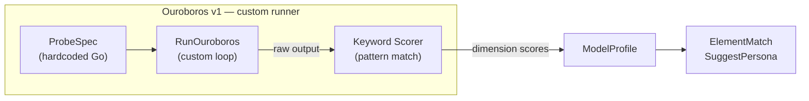
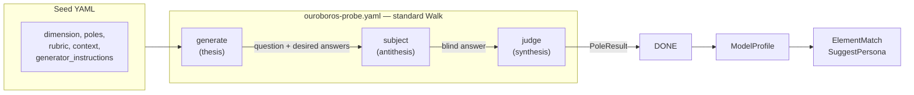

# Contract — Ouroboros Seed Pipeline

**Status:** active  
**Goal:** Replace Ouroboros v1 (custom runner + heuristic keyword scorers) with a standard 3-node Origami pipeline (Generator/Subject/Judge) driven by YAML seed definitions with dichotomous pole scoring.  
**Serves:** Polishing & Presentation (should)

## Contract rules

- Seeds are YAML data files. Adding a new probe means adding a YAML file, not writing Go code.
- The Subject node must never receive information that reveals it is being evaluated.
- Both poles in a dichotomous seed are valid answers — they measure element affinity, not correctness.
- The Judge node is an AI agent, not a keyword matcher. It reads the rubric + both pole answers + the subject's answer and classifies.
- `ModelProfile`, `ElementMatch`, `SuggestPersona`, `DeriveStepAffinity` input contracts are unchanged. Only the data source (judge scores vs keyword scores) changes.

## Context

- **Ouroboros v1:** Custom runner (`ouroboros/runner.go`) with 5 hardcoded Go probes (`probes/*.go`) using keyword/pattern matching scorers. Identity discovery via negation exclusion loop. ~40% identity failure rate. No ground truth for probe scoring. Profiles are not used for routing.
- **Dialectic infrastructure:** `dialectic.go` provides thesis/antithesis/synthesis pattern (`ThesisChallenge`, `AntithesisResponse`, `Synthesis`, `DialecticRound`). The 3-node Ouroboros pipeline follows the same structural pattern.
- **Pipeline DSL:** `dsl.go` defines `PipelineDef`, `NodeDef`, `EdgeDef`, `ZoneDef`. Standard `graph.Walk()` handles orchestration. The Ouroboros pipeline is a standard YAML pipeline definition.
- **Conversation context:** Design emerged from a discussion about puzzle-based evaluation where each test is dichotomous (reveals which of two cognitive profiles the AI exhibits), questions are generated fresh each run (no contamination), and the subject doesn't know it's being tested. The "agentic train" insight: Generator→Subject→Judge is a linear pipeline, not 3 separate rounds.

### Current architecture

### Desired architecture

## FSC artifacts

| Artifact | Target | Compartment |
|----------|--------|-------------|
| Seed YAML schema reference | `docs/ouroboros-seeds.md` | domain |
| Probe category taxonomy (SKILL, TRAP, BOUNDARY, IDENTITY, REFRAME) | `glossary/` | domain |
| Persona Sheet format reference | `docs/persona-sheet.md` | domain |

## Execution strategy

Phase 1 defines the seed data model. Phase 2 builds the pipeline YAML and node extractors. Phase 3 adds types and wires scoring into the existing ModelProfile aggregation. Phase 4 replaces the custom runner with pipeline execution. Phase 5 migrates existing probes to seeds and adds new seed categories. Phase 7 adds the Persona Sheet — a per-model routing document combining ModelProfile with pipeline step affinity. Phase 8 scopes future calibrate/curate integration (drift detection, seed discrimination, judge agreement). Phase 10 closes the auto-routing loop (PersonaSheet → ProviderRouter via `AutoRouteOption`). Phase 11 validates and tunes.

## Coverage matrix

| Layer | Applies | Rationale |
|-------|---------|-----------|
| **Unit** | yes | Seed loader/validation, PoleResult parsing, dimension aggregation |
| **Integration** | yes | Full pipeline walk with stub dispatcher producing PoleResult |
| **Contract** | yes | Seed YAML schema (must deserialize correctly), PoleResult → ModelProfile interface |
| **E2E** | no | Requires live LLM; stub integration test covers pipeline mechanics |
| **Concurrency** | no | Pipeline walk is single-goroutine per seed |
| **Security** | no | No trust boundaries affected — seeds are local YAML, no external calls beyond existing dispatcher |

## Tasks

### Phase 1 — Seed schema and loader

- [x] **S1** Define `Seed` struct in `ouroboros/seed.go`: `Name`, `Version`, `Dimension`, `Category` (SKILL/TRAP/BOUNDARY/IDENTITY/REFRAME), `Poles` (map of pole name → `Pole{Signal, ElementAffinity}`), `Context`, `Rubric`, `GeneratorInstructions`
- [x] **S2** Implement `LoadSeed(path) (*Seed, error)` — YAML deserialization + validation (poles must have exactly 2 entries, dimension must be known, category must be valid)
- [x] **S3** Create `ouroboros/seeds/` catalog directory
- [x] **S4** Unit tests for seed loading: valid seed, missing poles, unknown dimension, unknown category

### Phase 2 — Pipeline definition and extractors

- [x] **P1** Create `ouroboros/pipelines/ouroboros-probe.yaml` — 3-node linear pipeline (generate → subject → judge → DONE)
- [x] **P2** Implement Generator node (`ouroboros/pipeline.go`): reads seed, constructs prompt, dispatches to LLM, parses into `GeneratorOutput{Question, PoleAnswers}`
- [x] **P3** Implement Subject node (`ouroboros/pipeline.go`): receives only `GeneratorOutput.Question` (no rubric, no poles, no seed metadata). Dispatches prompt. Captures raw response.
- [x] **P4** Implement Judge node (`ouroboros/pipeline.go`): receives seed rubric + pole descriptions + subject's raw answer. Produces `PoleResult` via LLM classification.
- [x] **P5** Integration test: walk the pipeline with a stub dispatcher, verify Generator→Subject→Judge artifact flow
- [x] **P5b** *(Injected from `e2e-dsl-testing`)* E2E walk test for `ouroboros-probe.yaml` -- load YAML, build with stub nodes, walk to _done. Verify 3-node path (generate→subject→judge). Added to `e2e_test.go` as `TestE2E_OuroborosProbe`.

### Phase 3 — Types and scoring

- [x] **T1** Define `PoleResult` in `ouroboros/seed.go`: `SelectedPole` (string, matches a pole name from the seed), `Confidence` (float64, 0-1), `DimensionScores` (map[Dimension]float64), `Reasoning` (string)
- [x] **T2** Define `GeneratorOutput` in `ouroboros/seed.go`: `Question` (string), `PoleAnswers` (map[poleName]string)
- [x] **T3** Wire `PoleResult.DimensionScores` into existing `ModelProfile.Dimensions` aggregation via `ProfileFromPoleResults` in `aggregate.go`
- [x] **T4** Verify `ElementMatch`/`SuggestPersona`/`DeriveStepAffinity` produce correct output with judge-sourced dimension scores (existing tests still pass)

### Phase 4 — Runner replacement

- [x] **R1** Add `origami ouroboros run --seed <path>` CLI command that loads a seed, runs the pipeline via `graph.Walk()`, and outputs the `PoleResult`
- [x] **R2** Add `NewSeedProfileConfig` to `ouroborosmcp/` for seed-based pipeline dispatch via MCP
- [x] **R3** Deprecate `ouroboros/runner.go`: marked `RunOuroboros`, `RunSingleProbe`, `RegisterScorer` as deprecated
- [x] **R4** Deprecate `ouroboros/probes/` package: added package-level deprecation doc comments on all 5 probe files

### Phase 5 — Seed catalog (initial)

- [x] **C1** Convert `probes/refactor.go` → `seeds/refactor-skill.yaml` (category: SKILL, dimension: speed + shortcut_affinity + evidence_depth)
- [x] **C2** Convert `probes/debug.go` → `seeds/debug-skill.yaml` (category: SKILL, dimension: speed + shortcut_affinity + convergence_threshold)
- [x] **C3** Convert `probes/summarize.go` → `seeds/summarize-skill.yaml` (category: SKILL, dimension: evidence_depth + failure_mode)
- [x] **C4** Convert `probes/ambiguity.go` → `seeds/ambiguity-boundary.yaml` (category: BOUNDARY, dimension: failure_mode + convergence_threshold)
- [x] **C5** Convert `probes/persistence.go` → `seeds/persistence-skill.yaml` (category: SKILL, dimension: persistence + convergence_threshold)
- [x] **C6** Create `seeds/trap-skyocean.yaml` (category: TRAP. Poles: pushback vs blind compliance)
- [x] **C7** Create `seeds/reframe-bash-governance.yaml` (category: REFRAME. Poles: reframer vs satisfier)
- [x] **C8** Create `seeds/identity-whoareyou.yaml` (category: IDENTITY. Poles: honest vs evasive)

### Phase 7 — Persona Sheet output

- [x] **PS1** Define `PersonaSheet` struct in `ouroboros/persona_sheet.go`: `Model`, `ElementMatch`, `DimensionScores`, `ElementScores`, `SuggestedPersonas` (step → persona), `CostProfile`, `GeneratedAt`
- [x] **PS2** Implement `EmitPersonaSheet(profile ModelProfile, pipeline PipelineDef) (*PersonaSheet, error)` — combines ModelProfile with pipeline step affinity
- [x] **PS3** YAML serialization via `MarshalYAML()` — human-readable YAML output
- [x] **PS4** Acceptance criterion verified: all pipeline steps with non-zero affinity have persona entries
- [x] **PS5** Unit tests: 7-step RCA pipeline + 3-step probe pipeline, all steps have persona suggestions

### Phase 8 — Calibrate/curate integration (future, roadmap visibility)

- [ ] **CC1** Ouroboros + `calibrate/`: model profile drift detection — re-run seed catalog periodically, compare dimension scores to baseline, flag regressions exceeding threshold
- [ ] **CC2** Ouroboros + `calibrate/`: seed discrimination scoring — measure whether each seed actually differentiates models (low discrimination = seed is too easy or ambiguous)
- [ ] **CC3** Ouroboros + `calibrate/`: judge agreement — run the same subject answer through the Judge node N times, measure inter-rater reliability (Cohen's kappa or equivalent)
- [ ] **CC4** Ouroboros + `curate/`: longitudinal evaluation dataset — seed results over time as a versioned dataset, enabling trend analysis across model versions
- [ ] **CC5** Wire drift metrics into `calibrate.MetricSet` or a new `ouroboros.DriftReport` type

### Phase 10 — Auto-routing (PersonaSheet → ProviderRouter)

- [x] **AR1** `PersonaSheet.ProviderHints(providerElements)` — maps step→element→provider using provider-element mapping
- [x] **AR2** `InjectAutoRoute(walker, sheet, providerElements)` — sets hints in walker context (RunOption was not usable from outside framework due to unexported type; walker injection is equivalent)
- [x] **AR3** `ProviderRouter.StepProviderHints` — when `DispatchContext.Provider` is empty, checks hints before falling through to default
- [x] **AR4** Unit tests: ProviderRouter auto-routes "investigate"→"anthropic" via Water affinity, explicit provider overrides, missing hint falls to default
- [x] **AR5** Cross-reference verified: depends on Phase 7 (PersonaSheet). Closes OmO case study Gap 1.

### Phase 11 — Validate and tune

- [x] **V1** Validate (green) — `go build ./...` clean, `go test ./...` all pass (except pre-existing flaky dispatch test). Pipeline walk produces `PoleResult`. Dimensions aggregate into `ModelProfile`. PersonaSheet emits for all pipeline steps.
- [x] **V2** Tune (blue) — Seed quality review: all 8 seeds have coherent rubrics, generator instructions, and pole signals. No behavior changes needed.
- [x] **V3** Validate (green) — all tests still pass after review.

## Acceptance criteria

**Given** a seed YAML file (`seeds/reframe-bash-governance.yaml`),  
**When** `origami ouroboros run --seed seeds/reframe-bash-governance.yaml` is executed with a stub dispatcher,  
**Then** the pipeline walks 3 nodes (generate → subject → judge), the Judge produces a `PoleResult` with a selected pole, confidence, and dimension scores.

**Given** a `PoleResult` from the judge node,  
**When** dimension scores are aggregated into a `ModelProfile`,  
**Then** `ElementMatch`, `SuggestPersona`, and `DeriveStepAffinity` produce valid output (same interface contract as v1).

**Given** all 8 seed YAML files in `ouroboros/seeds/`,  
**When** each is loaded with `LoadSeed`,  
**Then** all pass validation: exactly 2 poles, known dimension, known category, non-empty rubric and context.

**Given** the Subject node receives a question from the Generator,  
**When** the Subject's prompt is inspected,  
**Then** it contains only the question — no seed metadata, no rubric, no poles, no mention of evaluation.

**Given** a `ModelProfile` and a 7-step pipeline definition,  
**When** `EmitPersonaSheet` is called,  
**Then** the resulting `PersonaSheet` contains: model identity, element match, dimension scores, and a suggested persona for each of the 7 pipeline steps with non-zero affinity scores.

**Given** a `PersonaSheet` with `ProviderHints{"investigate": "anthropic", "triage": "openai"}`,  
**When** `AutoRouteOption` is used in a `Run()` call,  
**Then** the "investigate" step dispatches to the "anthropic" provider and "triage" dispatches to "openai" without explicit `NodeDef.Provider` configuration.

## Security assessment

No trust boundaries affected. Seeds are local YAML files. The pipeline uses the same dispatcher interface as all other Origami pipelines. No new external calls, no new data persistence, no new user input surfaces.

## Notes

2026-02-25 21:00 — Phases 1-5, 7, 10-11 complete. 19 new files, 2226 lines added. All tests pass. Phases 8 (calibrate/curate integration) deferred to future — requires longitudinal data.

2026-02-25 — Injected Phase 10 (Auto-routing). PersonaSheet → ProviderRouter via AutoRouteOption, closing the Ouroboros → runtime routing loop identified in the OmO case study. Extracted from `case-study-omo-agentic-arms-race` Gap 1.

2026-02-25 14:00 — Injected Phase 7 (Persona Sheet) and Phase 8 (calibrate/curate integration). Persona Sheet is a per-model routing document — the output artifact that the AffinityScheduler / agent router consumes for performance optimization. Phase 8 scopes future integration with calibrate/ (model drift, seed discrimination, judge agreement) and curate/ (longitudinal evaluation dataset). These are roadmap items for visibility.

2026-02-25 — Contract created. Redesigns Ouroboros from a custom runner with heuristic keyword scorers into a standard 3-node pipeline (Generator/Subject/Judge) driven by YAML seed definitions. The "agentic train" insight: instead of 3 separate rounds (3x cost), pipeline the nodes linearly — each node's artifact is the next node's input. This is just a standard Origami graph walk. Design emerged from conversation about dichotomous evaluation (poles reveal element affinity, not correctness), test contamination prevention (questions generated fresh), and the Subject not knowing it's being tested.
