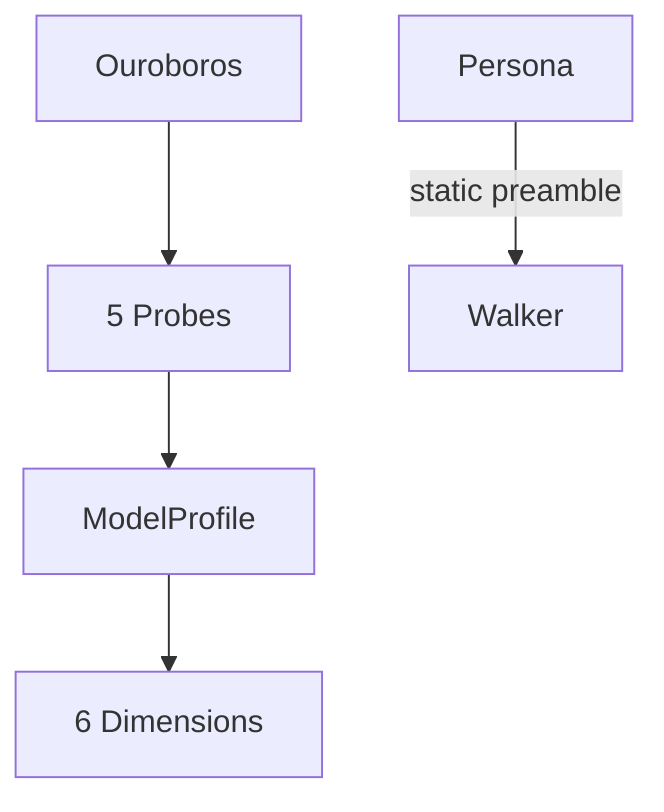
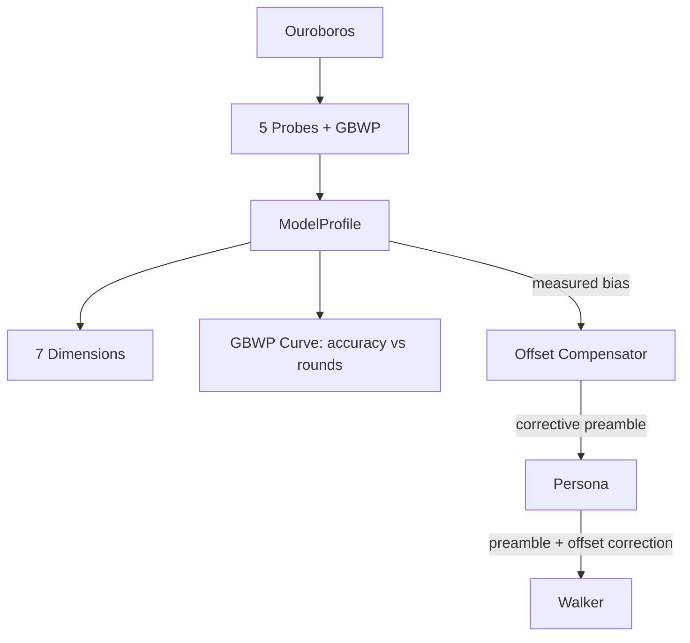

# Contract — ouroboros-signal-analysis

**Status:** draft  
**Goal:** Add quality-speed product (GBWP) measurement and persona offset compensation to Ouroboros metacalibration.  
**Serves:** API Stabilization

## Contract rules

- GBWP probe uses existing Ouroboros infrastructure (probe registration, ProbeResult, DimensionScores).
- Persona offset compensation auto-generates corrective preamble instructions, does not modify the persona's base identity.
- Both features are opt-in via Ouroboros configuration, not mandatory for all discovery runs.
- Derived from: [electronic-circuit-theory.md](../../docs/case-studies/electronic-circuit-theory.md), Takeaways 11-12.

## Context

- [electronic-circuit-theory.md](../../docs/case-studies/electronic-circuit-theory.md) — GBWP (gain-bandwidth product) analogy, persona offset voltage compensation.
- [ouroboros/probes/](../../../../ouroboros/probes/) — 5 existing probes (refactor, debug, summarize, ambiguity, persistence).
- [ouroboros/types.go](../../../../ouroboros/types.go) — `ProbeResult.DimensionScores` (line 78), `Dimension` constants (lines 16-25).
- [persona.go](../../../../persona.go) — `AgentIdentity.PromptPreamble` field. Offset compensation appends corrective instructions.
- [dialectic.go](../../../../dialectic.go) — `DialecticConfig.MaxTurns`. GBWP probe varies this parameter.

### Current architecture

### Desired architecture

## FSC artifacts

| Artifact | Target | Compartment |
|----------|--------|-------------|
| GBWP, persona offset compensation glossary entries | `glossary/` | domain |

## Execution strategy

1. Implement `GBWPProbe` — runs a fixed dialectic scenario at varying `MaxTurns` (1, 2, 4, 6, 8), measures accuracy at each setting.
2. Add `DimGBWP Dimension = "gbwp"` to dimension constants.
3. Compute GBWP score: the area under the accuracy-vs-rounds curve, normalized.
4. Implement `OffsetCompensator` — takes a `ModelProfile` and generates corrective preamble instructions to counteract measured biases.
5. Add `WithOffsetCompensation(profile ModelProfile)` as a `RunOption` or walker configuration.

## Coverage matrix

| Layer | Applies | Rationale |
|-------|---------|-----------|
| **Unit** | yes | GBWP probe scoring, offset compensation preamble generation |
| **Integration** | yes | GBWP probe runs through Ouroboros discovery pipeline |
| **Contract** | yes | Probe interface compliance, ProbeResult shape |
| **E2E** | no | Ouroboros discovery is a separate pipeline, not integrated into main walk E2E |
| **Concurrency** | no | Probes run serially within a discovery session |
| **Security** | no | No trust boundaries affected |

## Tasks

- [ ] Implement `GBWPProbe` — runs dialectic at varying MaxTurns, measures accuracy curve
- [ ] Add `DimGBWP Dimension = "gbwp"` to `ouroboros/types.go`
- [ ] Compute GBWP score: AUC of accuracy-vs-rounds, normalized to [0, 1]
- [ ] Register GBWP probe in probe registry
- [ ] Implement `OffsetCompensator` — generates corrective preamble from measured bias
- [ ] Add `WithOffsetCompensation` walker configuration option
- [ ] Add unit tests for GBWP scoring and offset compensation preamble generation
- [ ] Update glossary with GBWP and offset compensation terms
- [ ] Validate (green) — all tests pass, acceptance criteria met.
- [ ] Tune (blue) — refactor for quality. No behavior changes.
- [ ] Validate (green) — all tests still pass after tuning.

## Acceptance criteria

- **Given** a model that achieves 60% accuracy at MaxTurns=1, 80% at MaxTurns=4, and 85% at MaxTurns=8,
- **When** the GBWP probe runs,
- **Then** `DimensionScores["gbwp"]` reflects the area under the accuracy-vs-rounds curve.

- **Given** a model profile showing the Herald persona has a +0.12 confidence bias (consistently overestimates),
- **When** `OffsetCompensator` generates a corrective preamble,
- **Then** the preamble includes an instruction to self-calibrate confidence downward.

- **Given** a walker configured with `WithOffsetCompensation(profile)`,
- **When** the walker processes a node,
- **Then** the effective `PromptPreamble` includes both the persona's base preamble and the corrective offset.

## Security assessment

No trust boundaries affected.

## Notes

2026-03-01 — Contract created from electronic circuit case study. GBWP measurement implements Takeaway 11 (quality-speed product). Persona offset compensation implements Takeaway 12 (analogous to op-amp offset null adjustment). Both extend Ouroboros without modifying its core infrastructure.
