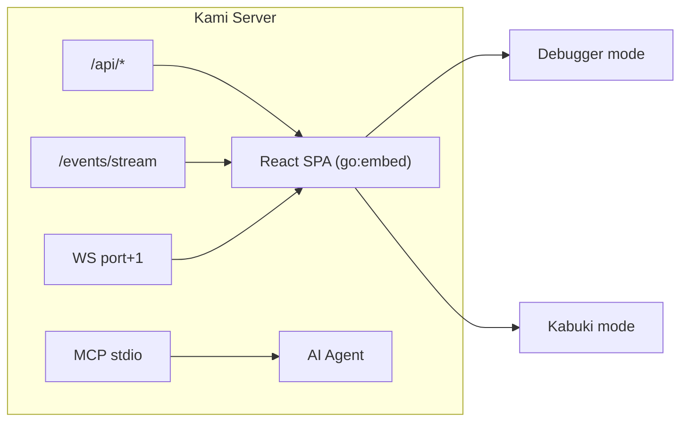
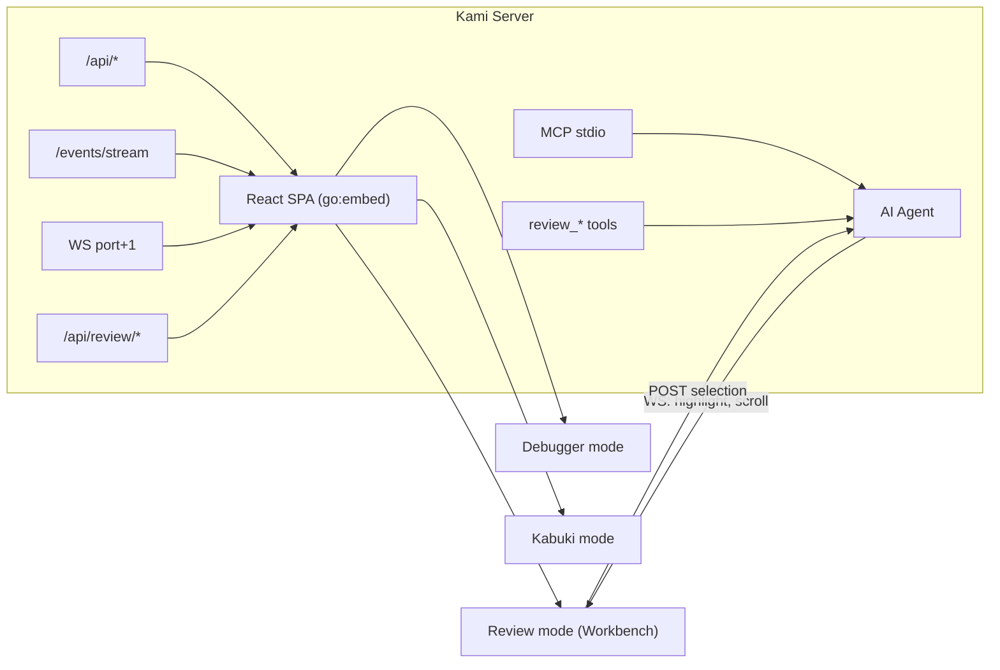

# Contract — ouroboros-workbench

**Status:** draft  
**Goal:** Ouroboros probe transcripts are reviewable in a mail-like Web UI where a human and AI agent co-assess results, score roles, and tune prompts.  
**Serves:** Containerized Runtime (Ouroboros enrichment)

## Contract rules

- Reuse the Kami frontend (React 19, Vite, Tailwind 4) as a third mode alongside `debugger` and `kabuki`.
- Follow the Demiurge pattern: HTTP for the UI, WebSocket for AI→browser commands, MCP for AI tool calls.
- All review state is persisted to transcript JSON files on disk — no separate database.
- Design tokens come from `index.css` (Red Hat palette, semantic classes). No new design system.

## Context

After an Ouroboros calibration run, transcript JSON files accumulate on disk. Today there is no way to review them except reading raw JSON. The Workbench gives a "mail inbox" experience: browse by model, see at a glance which probes have been scored, click into the full Generator → Subject → Judge exchange, and score collaboratively with an AI agent watching the same page.

**Prerequisite:** `ouroboros-probe-extensions` Track C (C1-C7) delivers the `TranscriptStore`, HTTP API (`/api/review/*`), MCP tools (`review_*`), and frontend mode detection. This contract builds the visual layer on top.

### Current architecture

Two modes: debugger (circuit visualization) and kabuki (presentation). No review capability.

### Desired architecture

Third mode: Workbench. The AI agent sees what the human sees via `review_get_current_view` MCP tool and can highlight exchanges, propose scores, and suggest prompt tuning — all through the existing Demiurge channels.

## FSC artifacts

| Artifact | Target | Compartment |
|----------|--------|-------------|
| Workbench UX patterns | `docs/ouroboros-workbench-ux.md` | domain |

## Execution strategy

The contract delivers the React frontend in layers, from data display to interactivity to AI co-browsing. Each layer is independently testable.

**Layer 1 — Inbox (read-only display)**
1. `ReviewInbox` component: fetches `GET /api/review`, renders model groups with probe rows
2. Status badges: green (both scores), yellow (AI only), red (no scores / failed)
3. Model grouping header with aggregate pass rate

**Layer 2 — Transcript viewer (click-to-expand)**
4. `TranscriptViewer` component: fetches `GET /api/review/{id}`, renders scroll of exchanges
5. Exchange cards: role badge (Generator/Subject/Judge), prompt, response, elapsed time
6. Mechanical verification section (compile/test/benchmark results when present)
7. Metadata bar: seed name, difficulty, time limit, hints used

**Layer 3 — Scoring form (human input)**
8. Score panel: role ratings (1-5), notes textarea, prompt tuning key-value editor
9. Save button: `POST /api/review/{id}/score` with `HumanReview` payload
10. Optimistic UI update: badge transitions yellow → green on save

**Layer 4 — AI co-browsing (Demiurge glue)**
11. `data-kami` annotations on exchange cards (`data-kami="exchange:{index}"`) and inbox rows (`data-kami="transcript:{run_id}"`)
12. Selection reporting: clicking a transcript or exchange posts to `/events/selection` (existing Kami pattern)
13. WS command handler: `highlight_exchange` action highlights a specific exchange card, `scroll_to_exchange` scrolls the viewer
14. `useReviewWS` hook: listens for AI commands and applies visual effects (border glow, scroll)

## Coverage matrix

| Layer | Applies | Rationale |
|-------|---------|-----------|
| **Unit** | yes | Component rendering (inbox row status, transcript exchange cards, score form validation) |
| **Integration** | yes | Full flow: load inbox → click transcript → score → verify badge transition |
| **Contract** | yes | Frontend fetches match API response shapes from `ouroboros-probe-extensions` Track C |
| **E2E** | yes | Playwright: load workbench → click probe → verify transcript renders → submit score → verify green badge |
| **Concurrency** | no | Single-user review workflow, no shared mutable state |
| **Security** | yes | Score form input validation (ratings 1-5, notes length cap) before POST |

## Tasks

### Layer 1 — Inbox
- [ ] W1. Create `useReview` hook: fetch `/api/review`, parse into model-grouped transcript list
- [ ] W2. Create `ReviewInbox` component: model group headers, probe rows with title, AI score, human score
- [ ] W3. Status border logic: green (`border-success`), yellow (`border-warning`), red (`border-danger`) based on score presence
- [ ] W4. Wire into `App.tsx`: detect `review` mode when `/api/review` returns data, render `ReviewInbox`

### Layer 2 — Transcript Viewer
- [ ] W5. Create `TranscriptViewer` component: fetches `/api/review/{id}`, renders exchange cards in scroll layout
- [ ] W6. Create `ExchangeCard` component: role badge, prompt section, response section, elapsed time
- [ ] W7. Create `MechanicalVerifyCard` component: compile/test/benchmark status with pass/fail indicators
- [ ] W8. Metadata bar: seed name, difficulty badge, time limit, hints used, self-verify score

### Layer 3 — Scoring Form
- [ ] W9. Create `ScorePanel` component: three 1-5 rating inputs (generator, subject, judge), notes textarea, prompt tuning editor
- [ ] W10. Save handler: validate inputs, POST to `/api/review/{id}/score`, optimistic badge update
- [ ] W11. Display existing `HumanReview` when present (pre-fill form for edits)

### Layer 4 — AI Co-browsing
- [ ] W12. Add `data-kami` attributes to `ReviewInbox` rows and `ExchangeCard` components
- [ ] W13. Selection reporting: on click, post current transcript ID + exchange index to `/events/selection`
- [ ] W14. Create `useReviewWS` hook: handle `highlight_exchange` and `scroll_to_exchange` WS actions
- [ ] W15. Visual effects: border glow animation on highlighted exchange, smooth scroll on AI-directed navigation

### Validation
- [ ] Validate (green) — all tests pass, acceptance criteria met
- [ ] Tune (blue) — refactor for quality, no behavior changes
- [ ] Validate (green) — all tests still pass after tuning

## Acceptance criteria

**Inbox:**
- Given a directory with 10 transcripts across 2 models (some scored, some not)
- When the Workbench loads
- Then probes are grouped by model name, each row shows title + AI score + human score
- And scored probes have green borders, unscored have yellow, failed have red

**Transcript Viewer:**
- Given the user clicks a probe row in the inbox
- When the transcript loads
- Then three exchange cards render in order: Generator, Subject, Judge
- And each card shows the role badge, full prompt, full response, and elapsed time
- And if mechanical verification exists, a verify card shows compile/test/benchmark status

**Scoring:**
- Given the user fills in ratings (generator: 4, subject: 3, judge: 5) and notes
- When they click Save
- Then `POST /api/review/{id}/score` is called with a valid `HumanReview` payload
- And the inbox row transitions from yellow to green without a page reload

**AI Co-browsing:**
- Given the AI agent calls `review_get_current_view` via MCP
- Then it receives `{run_id, exchange_index, model}` matching what the human sees
- Given the AI agent sends `review_highlight_exchange` with `{index: 2}`
- Then the Judge exchange card in the browser gets a visible highlight effect

## Security assessment

| OWASP | Finding | Mitigation |
|-------|---------|------------|
| A03 Injection | Notes and prompt tuning values rendered in the browser | React's default JSX escaping prevents XSS. No `dangerouslySetInnerHTML`. |
| A01 Broken Access Control | Workbench is unauthenticated | Kami binds `127.0.0.1` by default (localhost only). Production auth is out of scope (documented). |

## Notes

2026-03-05 — Contract drafted. Option A chosen: Workbench lives as a third mode inside Kami, reusing the existing Demiurge infrastructure (HTTP + WS + MCP). Depends on `ouroboros-probe-extensions` Track C for the backend API surface.
