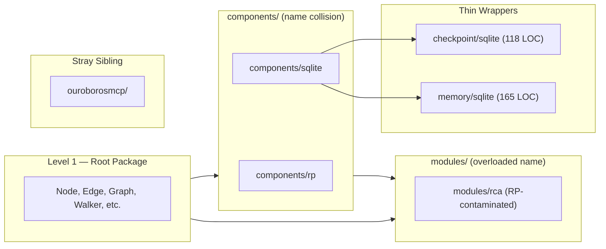
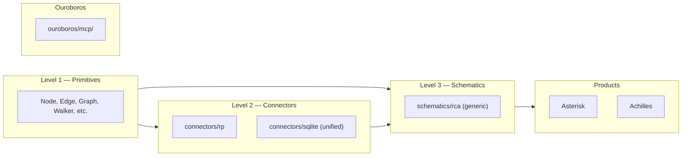

# Contract — refactor-decompose

**Status:** draft  
**Goal:** Origami packages are organized into a three-level taxonomy (Primitives / Connectors / Schematics) with zero RP-specific concepts in the generic RCA schematic.  
**Serves:** API Stabilization

## Contract rules

- Every stream must leave `go build ./...` and `go test -race ./...` green before proceeding to the next.
- Rename streams (B, C) are mechanical — no behavioral changes. Decontamination (D) changes type names and signatures.
- Origami is committed first; Asterisk and Achilles update imports in the same session.
- Global rules only otherwise.

## Context

- [decouple-rca-rp](../completed/api-stabilization/decouple-rca-rp.md) — prior contract that introduced `rcatype/` and `rpconv/` but left RP concepts in generic types.
- [glossary](../../glossary/glossary.mdc) — current definitions for Module, Component, and DSL primitives.
- [555 timer IC analysis](https://en.wikipedia.org/wiki/555_timer_IC#Internal_schematic) — the three-resolution-level analogy that inspired this taxonomy.
- Plan file: `~/.cursor/plans/refactor_decompose_contract_afbe7178.plan.md`

### Current architecture

### Desired architecture

## FSC artifacts

| Artifact | Target | Compartment |
|----------|--------|-------------|
| Level 1/2/3 taxonomy definitions | `glossary/glossary.mdc` | domain |
| Connector, Schematic glossary entries | `glossary/glossary.mdc` | domain |
| Architecture diagram (three-level) | `docs/architecture.md` | domain |
| Naming rationale note | `notes/` | domain |

## Execution strategy

Five sequential streams. Each builds on the previous and must leave the build green.

**Stream A — Taxonomy and glossary.** Define Level 1 (Primitives), Level 2 (Connectors), Level 3 (Schematics) in the glossary. Rename "Module" to "Schematic". Add "Connector" entry. Disambiguate "Component" (DSL type vs directory name collision that motivated the rename). Document naming rationale.

**Stream B — Directory renames.** Mechanical renames with import updates across all 3 repos:
- `components/rp/` → `connectors/rp/`
- `components/sqlite/` → `connectors/sqlite/`
- `modules/rca/` → `schematics/rca/` (and all sub-packages: `rcatype/`, `rpconv/`, `store/`, `cmd/`, `mcpconfig/`, `vocabulary/`, `scenarios/`, `prompts/`)
- `ouroborosmcp/` → `ouroboros/mcp/`
- Delete empty parents: `components/`, `modules/`

**Stream C — Consolidate SQLite.** Merge `checkpoint/sqlite/sqlite.go` (118 LOC) and `memory/sqlite/sqlite.go` (165 LOC) into `connectors/sqlite/` as `checkpoint.go` and `memory.go`. Move tests alongside. Delete empty parents `checkpoint/`, `memory/`. Update imports.

**Stream D — Decontaminate RCA.** Clean 5 contamination patterns from `schematics/rca/`:

1. Hardcoded product names → configurable via `SchematicConfig` struct
2. RP fields in generic types → generic names (`SourceLaunchID`, `SourceItemID`) or extension map
3. RP functions in generic files → inject via vocabulary/config adapter
4. Domain-specific string patterns → configurable pattern registry
5. RP-specific template params → generic `SourceURLs`, `ExternalLinks`

SQLite migration for renamed columns in `schematics/rca/store/migrations/`.

**Stream E — Knowledge store.** Update contract index, glossary, architecture docs, all rules and completed contracts that reference old paths (`components/`, `modules/`, `ouroborosmcp/`).

## Coverage matrix

| Layer | Applies | Rationale |
|-------|---------|-----------|
| **Unit** | yes | Conversion functions, store operations with renamed fields, configurable component names, pattern registry loading. |
| **Integration** | yes | `connectors/sqlite/` checkpoint + memory implementations; `schematics/rca/` store with generic field names. |
| **Contract** | yes | `store.Store` interface field renames; `SchematicConfig` API surface; connector package paths. |
| **E2E** | yes | `just calibrate-stub` must pass after every stream — validates full circuit with new paths and types. |
| **Concurrency** | yes | `go test -race ./...` on all packages. |
| **Security** | N/A | No trust boundaries affected — internal refactoring of package names and type fields. |

## Tasks

- [ ] Stream A — Define Level 1/2/3 taxonomy in glossary; add Connector and Schematic entries; disambiguate Component; document naming rationale.
- [ ] Stream B — Rename `components/` → `connectors/`, `modules/` → `schematics/`, `ouroborosmcp/` → `ouroboros/mcp/`. Update all imports across Origami, Asterisk, Achilles. Build + test.
- [ ] Stream C — Merge `checkpoint/sqlite/` and `memory/sqlite/` into `connectors/sqlite/`. Delete empty parents. Build + test.
- [ ] Stream D — Clean 5 RP contamination patterns from `schematics/rca/`: hardcoded names, RP fields, RP functions, domain patterns, RP-specific params. Add SQLite migration. Build + test.
- [ ] Stream E — Update contract index, architecture docs, rules, completed contracts referencing old paths.
- [ ] Validate (green) — `go build ./...`, `go test -race ./...`, `origami lint --profile strict`, `just calibrate-stub` all pass across 3 repos.
- [ ] Tune (blue) — refactor for quality. No behavior changes.
- [ ] Validate (green) — all tests still pass after tuning.

## Acceptance criteria

- Given any directory listing of Origami's top level, when I look for `components/`, `modules/`, `checkpoint/`, `memory/`, or `ouroborosmcp/`, then none exist.
- Given `connectors/rp/`, `connectors/sqlite/`, `schematics/rca/`, `ouroboros/mcp/`, when I check each exists and builds, then all succeed.
- Given any `.go` file in `schematics/rca/` (excluding `cmd/`, `mcpconfig/`, `rpconv/`), when I search for `RPLaunchID`, `RPItemID`, `PolarionID`, `"asterisk"`, `".asterisk"`, `AsteriskCircuitDef`, then zero matches are found.
- Given `rg 'components/rp|components/sqlite|modules/rca|checkpoint/sqlite|memory/sqlite|ouroborosmcp' --type go` across all 3 repos, when executed, then the output is empty.
- Given `go test -race ./...` in Origami, when run after all changes, then zero failures and zero data races.
- Given `go build ./...` in Asterisk and Achilles, when run after import updates, then both compile.
- Given `just calibrate-stub` in Asterisk, when run after all changes, then all metrics pass acceptance thresholds.

## Security assessment

No trust boundaries affected. This is a pure internal refactoring of package paths, directory names, and type field names within the same binary. No new inputs, serialization boundaries, or network paths.

## Notes

2026-03-03 — Contract drafted from conversation analysis. RP contamination audit identified 18 GENERIC, 18 MIXED, and 1 DOMAIN file in `modules/rca/` root. Prior `decouple-rca-rp` contract (complete) achieved zero `components/rp` imports in core but left RP concepts (field names, hardcoded strings) in 18 MIXED files. This contract finishes that work and establishes the architectural taxonomy. Naming decision: "Connector" (Level 2) avoids collision with Origami's `Component` DSL type; "Schematic" (Level 3) avoids collision with Go modules. Three-level model inspired by 555 timer IC schematic resolutions.
