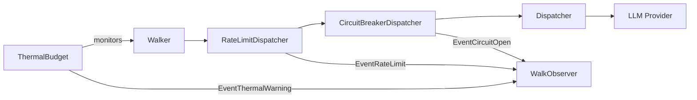

# Contract — resilience

**Status:** draft  
**Goal:** Add circuit breaker, rate limiting, and thermal budget patterns to the dispatch and walk layers.  
**Serves:** API Stabilization

## Contract rules

- Resilience patterns are opt-in decorators (middleware), not baked into core interfaces.
- Circuit breaker wraps `Dispatcher`; rate limiter wraps `Dispatcher`; thermal budget wraps `Walk`.
- All state transitions emit `WalkObserver` events for observability.
- Patterns follow established distributed systems conventions (Hystrix, resilience4j, Go stdlib `x/time/rate`).
- Derived from: [electronic-circuit-theory.md](../../docs/case-studies/electronic-circuit-theory.md), Gap 4.

## Context

- [electronic-circuit-theory.md](../../docs/case-studies/electronic-circuit-theory.md) — Thermal throttling / backpressure gap (lines 515-524).
- [dispatch/](../../../../dispatch/) — `Dispatcher` interface. Circuit breaker and rate limiter wrap dispatchers.
- [graph.go](../../../../graph.go) — Walk loop. Thermal budget checks cumulative latency per iteration.
- [observer.go](../../../../observer.go) — `WalkEvent` with extensible `Metadata`.
- Provider resilience completed contract — fallback chains are the foundation for circuit breaker.
- `agent-operations.mdc` — Existing timeout SLAs. Resilience patterns complement these.

### Current architecture

### Desired architecture

## FSC artifacts

| Artifact | Target | Compartment |
|----------|--------|-------------|
| Circuit breaker, rate limiter, thermal budget glossary entries | `glossary/` | domain |

## Execution strategy

1. Implement `CircuitBreakerDispatcher` wrapping any `Dispatcher` — open after N consecutive failures, half-open after cooldown, close on success.
2. Implement `RateLimitDispatcher` wrapping any `Dispatcher` — token bucket rate limiting per node or zone.
3. Implement `ThermalBudget` walk option — tracks cumulative latency, emits warning at threshold, aborts at ceiling.
4. Add `WalkEvent` types: `EventCircuitOpen`, `EventCircuitClose`, `EventRateLimit`, `EventThermalWarning`.
5. Wire into Prometheus: `origami_circuit_breaker_state`, `origami_rate_limit_waits_total`, `origami_thermal_budget_used`.

## Coverage matrix

| Layer | Applies | Rationale |
|-------|---------|-----------|
| **Unit** | yes | Circuit breaker state machine, rate limiter token bucket, thermal budget tracking |
| **Integration** | yes | Dispatcher wrapping, Walk thermal budget abort |
| **Contract** | yes | `Dispatcher` interface compliance for wrappers |
| **E2E** | no | Resilience patterns are opt-in; E2E tests use default dispatchers |
| **Concurrency** | yes | Circuit breaker and rate limiter state is shared across concurrent dispatches |
| **Security** | no | No trust boundaries affected |

## Tasks

- [ ] Implement `CircuitBreakerDispatcher` with open/half-open/closed states
- [ ] Implement `RateLimitDispatcher` with configurable token bucket
- [ ] Implement `ThermalBudget` as a `RunOption` tracking cumulative walk latency
- [ ] Add `WalkEvent` types: `EventCircuitOpen`, `EventCircuitClose`, `EventRateLimit`, `EventThermalWarning`
- [ ] Add Prometheus metrics: `origami_circuit_breaker_state`, `origami_rate_limit_waits_total`, `origami_thermal_budget_used`
- [ ] Wire thermal budget into `Walk` and `WalkTeam` loops
- [ ] Update glossary with circuit breaker, rate limiter, thermal budget terms
- [ ] Validate (green) — all tests pass, acceptance criteria met.
- [ ] Tune (blue) — refactor for quality. No behavior changes.
- [ ] Validate (green) — all tests still pass after tuning.

## Acceptance criteria

- **Given** a `CircuitBreakerDispatcher` wrapping a failing provider (3 consecutive errors),
- **When** the 4th dispatch attempt occurs,
- **Then** the circuit opens immediately (no provider call), `EventCircuitOpen` is emitted.

- **Given** a `RateLimitDispatcher` configured at 5 requests/second,
- **When** 10 requests arrive in 1 second,
- **Then** 5 execute immediately, 5 are delayed, `EventRateLimit` is emitted for each delayed request.

- **Given** a walk with `ThermalBudget(ceiling: 30s)`,
- **When** cumulative node latency reaches 25s,
- **Then** `EventThermalWarning` is emitted. At 30s, the walk aborts with a descriptive error.

- **Given** a pipeline using default options (no resilience wrappers),
- **When** the pipeline walks,
- **Then** behavior is identical to the current framework (opt-in, progressive disclosure).

## Security assessment

No trust boundaries affected. Rate limiting is a DoS mitigation pattern but is applied to outbound calls (provider protection), not inbound requests.

## Notes

2026-03-01 — Contract created from electronic circuit case study (Gap 4: no thermal throttling / backpressure). Circuit breaker and rate limiter are standard distributed systems patterns. Thermal budget is the circuit-theory-specific addition — analogous to junction temperature monitoring.
