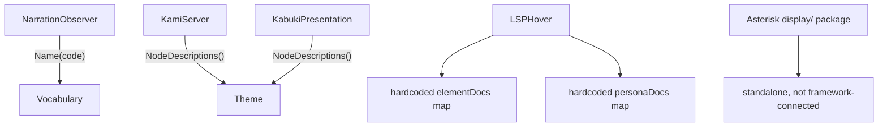
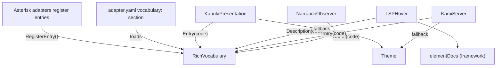

# Contract — rich-vocabulary

**Status:** draft  
**Goal:** `Vocabulary` supports structured metadata (short name, long name, description) and is wired into Kami hover, LSP hover, and Kabuki cards.  
**Serves:** Polishing & Presentation (should)

## Contract rules

- Backward compatible: existing `Vocabulary` interface and all consumers (`NarrationObserver`, `WithVocabulary`) must work unchanged.
- No domain imports: Origami must never import from consumer tools.
- YAML-loadable: vocabulary entries declarable in adapter manifests, not just Go code.

## Context

Three disconnected display-name mechanisms exist today:

| Mechanism | Location | Consumer | Limitation |
|-----------|----------|----------|------------|
| `Vocabulary.Name()` | `vocabulary.go` | `NarrationObserver` | Single string — no short/long/description distinction |
| `Theme.NodeDescriptions()` | `kami/theme.go` | Kami hover, Kabuki cards | Hardcoded per consumer theme, not adapter-driven |
| LSP `elementDocs`/`personaDocs` | `lsp/hover.go` | LSP hover | Framework-level only, no pipeline-level vocabulary |

Asterisk's `display/` package (221 lines) is a parallel code-to-name registry that maps defect codes, pipeline stages, metrics, and heuristics to human names. This duplicates what `Vocabulary` should provide at the framework level.

The user identified the gap: "We could have shortname:longname:description, which would allow us to have a great hover display on node/pipeline in the UI."

### Current architecture



### Desired architecture



## FSC artifacts

| Artifact | Target | Compartment |
|----------|--------|-------------|
| `VocabEntry` glossary term | `glossary/` | domain |
| `RichVocabulary` glossary term | `glossary/` | domain |

## Execution strategy

Bottom-up: define types first, then implement concrete vocabulary, then wire into each consumer (Kami, LSP, Kabuki). Each phase builds and tests independently. Asterisk migration (`display/` → `RichMapVocabulary`) is tracked by the companion `asterisk-internal-cleanup` contract (P7).

## Coverage matrix

| Layer | Applies | Rationale |
|-------|---------|-----------|
| **Unit** | yes | `VocabEntry`, `RichMapVocabulary`, `RichChainVocabulary` — all need unit tests |
| **Integration** | yes | Kami hover with vocabulary, LSP hover with vocabulary |
| **Contract** | yes | `RichVocabulary` interface compliance for all implementations |
| **E2E** | no | No pipeline walk behavior changes |
| **Concurrency** | yes | `RichMapVocabulary` must be thread-safe (concurrent reads during walk + hover) |
| **Security** | no | No trust boundaries affected — display metadata only |

## Tasks

- [ ] **P1: Define types and implement** — Add `VocabEntry` struct and `RichVocabulary` interface to `vocabulary.go`. Implement `RichMapVocabulary` (with `RegisterEntry`, `RegisterEntries`) and `RichChainVocabulary`. `RichMapVocabulary` embeds backward-compatible `Name()` that returns `Long` (falling back to `Short`, then code). Update `NameWithCode` to use `Short` when available via type assertion. Unit tests for all new types.
- [ ] **P2: YAML vocabulary loading** — Add optional `vocabulary:` section to adapter manifest schema. Each entry: `code`, `short`, `long`, `description`. Loader produces a `RichMapVocabulary`. When adapters are merged via `MergeAdapters`, vocabularies chain.
- [ ] **P3: Wire into Kami** — `KamiServer` accepts optional `RichVocabulary`. Node hover tooltip: try `RichVocabulary.Description(code)` first, fall back to `Theme.NodeDescriptions()`, then raw node ID. Node label: use `RichVocabulary.Short(code)` if available.
- [ ] **P4: Wire into LSP** — `hover.go` checks `RichVocabulary` for node name hover. Supplements existing `elementDocs`/`personaDocs` with pipeline-level descriptions. Inlay hints can show `Short` names.
- [ ] **P5: Wire into Kabuki** — `presentation.go` passes `RichVocabulary` entries to frontend via `/api/theme` or `/api/vocabulary` endpoint. Cards show `Long` as label, `Description` as body. Falls back to `Theme.NodeDescriptions()` when no vocabulary is registered.
- [ ] Validate (green) — all tests pass, acceptance criteria met.
- [ ] Tune (blue) — refactor for quality. No behavior changes.
- [ ] Validate (green) — all tests still pass after tuning.

## Acceptance criteria

```gherkin
Given a RichMapVocabulary with entry {code: "F0_RECALL", short: "F0", long: "Recall", description: "Initial symptom recall from failure data."}
When I call Name("F0_RECALL")
Then it returns "Recall"

When I call Short("F0_RECALL")
Then it returns "F0"

When I call Description("F0_RECALL")
Then it returns "Initial symptom recall from failure data."

When I call Entry("F0_RECALL")
Then it returns (VocabEntry{Short: "F0", Long: "Recall", Description: "Initial symptom recall from failure data."}, true)

Given a RichMapVocabulary with no entry for "UNKNOWN"
When I call Name("UNKNOWN")
Then it returns "UNKNOWN" (pass-through)

Given a NarrationObserver using WithVocabulary(richVocab)
When a walk event fires for node "F0_RECALL"
Then narration uses "Recall" (backward compatible)

Given an adapter.yaml with:
  vocabulary:
    - code: pb001
      short: PB
      long: Product Bug
      description: A defect in the product under test.
When the adapter is loaded
Then a RichMapVocabulary with that entry is available

Given the Kami UI hovering over node "F0_RECALL"
When RichVocabulary is registered
Then the tooltip shows "Initial symptom recall from failure data."

Given the LSP hovering over a node name "F0_RECALL" in YAML
When RichVocabulary is registered
Then hover shows the description
```

## Security assessment

No trust boundaries affected. Vocabulary entries are display metadata with no privilege implications.

## Notes

2026-02-27 — Contract drafted. Companion: Asterisk `asterisk-internal-cleanup` P7 migrates `display/` to `RichMapVocabulary`. Existing `Vocabulary` interface preserved as subset — no breaking change to `NarrationObserver` or any existing consumer.
