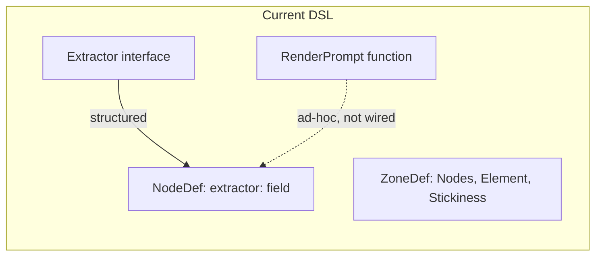
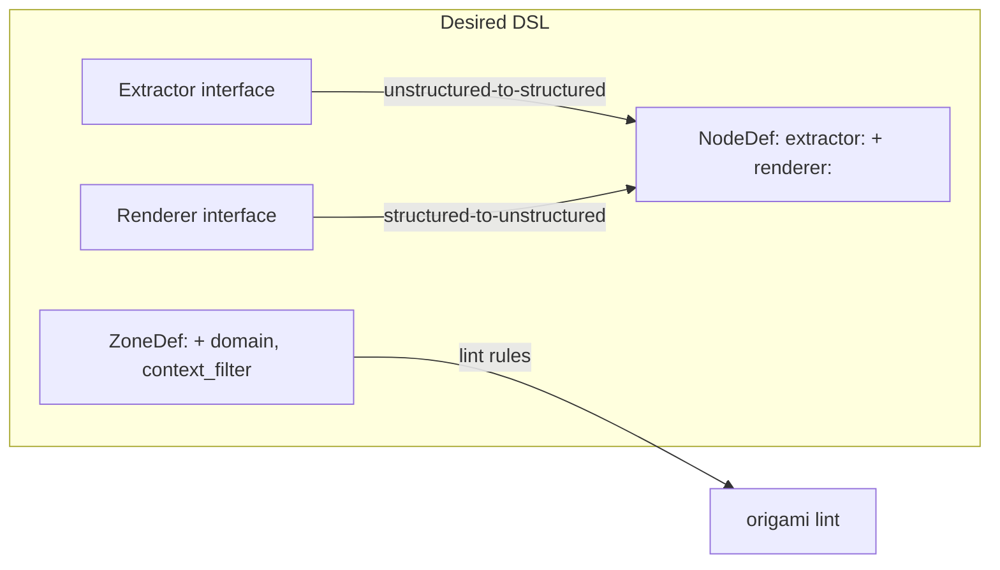

# Contract — signal-domains

**Status:** draft  
**Goal:** Add Renderer interface (DAC symmetry), zone data-domain annotations, and context filtering on zone boundaries.  
**Serves:** API Stabilization

## Contract rules

- The `Renderer` interface must mirror `Extractor` in shape: `Name() string`, `Render(ctx, data) (string, error)`.
- `RenderPrompt` becomes the default `Renderer` implementation, not a standalone utility.
- Zone `domain:` values are `unstructured`, `structured`, `hybrid` — no EE terms (analog/digital/mixed).
- Context filter is additive — walkers that never cross zone boundaries see zero behavior change.
- Derived from: [electronic-circuit-theory.md](../../docs/case-studies/electronic-circuit-theory.md), Takeaways 1-3, Gap 1.

## Context

- [electronic-circuit-theory.md](../../docs/case-studies/electronic-circuit-theory.md) — ADC/DAC symmetry analysis, mixed-signal architecture pattern, decoupling capacitor pattern.
- [extractor.go](../../../../extractor.go) — `Extractor` interface (lines 15-23), `ExtractorRegistry` (lines 25-56). Renderer mirrors this.
- [dsl.go](../../../../dsl.go) — `ZoneDef` (lines 47-53: `Nodes`, `Element`, `Stickiness`), `NodeDef` (lines 54-71: has `extractor:` but no `renderer:`).
- [vars.go](../../../../vars.go) — `RenderPrompt` (lines 43-56). Standalone function that becomes the default Renderer.
- [graph.go](../../../../graph.go) — `Walk`/`WalkTeam` call `state.MergeContext()` (line 263) with no zone boundary filtering.

### Current architecture

### Desired architecture

## FSC artifacts

| Artifact | Target | Compartment |
|----------|--------|-------------|
| Renderer glossary entry | `glossary/` | domain |
| Zone domain annotation glossary entries | `glossary/` | domain |
| Signal conditioning vocabulary in framework-guide.md | `docs/` | domain |

## Execution strategy

1. Define `Renderer` interface and `RendererRegistry` in new `renderer.go`.
2. Implement `TemplateRenderer` wrapping existing `RenderPrompt`.
3. Add `renderer:` field to `NodeDef` in `dsl.go`.
4. Wire renderer resolution in `BuildGraph` (mirror extractor resolution).
5. Add `Domain` and `ContextFilter` fields to `ZoneDef`.
6. Implement zone boundary context filtering in `Walk`/`WalkTeam`.
7. Add lint rules for domain annotation consistency.
8. Update docs and glossary.

## Coverage matrix

| Layer | Applies | Rationale |
|-------|---------|-----------|
| **Unit** | yes | Renderer interface, TemplateRenderer, context filter logic, lint rules |
| **Integration** | yes | BuildGraph wiring of renderer: field, zone boundary filtering during Walk |
| **Contract** | yes | Renderer interface shape must match Extractor symmetry |
| **E2E** | yes | Pipeline YAML with renderer: and domain: fields must walk correctly |
| **Concurrency** | no | No shared state; renderers are stateless |
| **Security** | no | No trust boundaries affected |

## Tasks

- [ ] Define `Renderer` interface and `RendererRegistry` in `renderer.go`
- [ ] Implement `TemplateRenderer` wrapping `RenderPrompt`
- [ ] Add `renderer:` field to `NodeDef`, wire in `BuildGraph`
- [ ] Add `Domain` and `ContextFilter` fields to `ZoneDef`
- [ ] Implement zone boundary context filtering in `Walk`/`WalkTeam`
- [ ] Add lint rules: extractor nodes at unstructured-to-structured boundaries, renderer nodes at structured-to-unstructured boundaries
- [ ] Add testdata pipeline YAML exercising renderer: and domain: fields
- [ ] Update `docs/framework-guide.md` with signal conditioning vocabulary (Takeaway 7)
- [ ] Update glossary with Renderer, zone domain, context filter terms
- [ ] Validate (green) — all tests pass, acceptance criteria met.
- [ ] Tune (blue) — refactor for quality. No behavior changes.
- [ ] Validate (green) — all tests still pass after tuning.

## Acceptance criteria

- **Given** a pipeline YAML with `renderer: narrative-v1` on a node,
- **When** `BuildGraph` resolves the pipeline,
- **Then** the node delegates to the registered Renderer, symmetric to extractor resolution.

- **Given** a ZoneDef with `domain: unstructured`,
- **When** `origami lint --profile strict` runs,
- **Then** a warning is emitted if a node with `schema:` is placed in the unstructured zone.

- **Given** a ZoneDef with `context_filter: { block: [raw_logs, debug_trace] }`,
- **When** a walker transitions from that zone to another zone,
- **Then** the blocked keys are stripped from `WalkerState.Context`.

- **Given** a pipeline with no `domain:` or `renderer:` annotations,
- **When** the pipeline walks,
- **Then** behavior is identical to the current framework (progressive disclosure).

## Security assessment

No trust boundaries affected.

## Notes

2026-03-01 — Contract created from electronic circuit case study. Renderer closes the ADC/DAC asymmetry (Gap 1). Zone domain annotations formalize the mixed-signal architecture pattern (Pattern 2). Context filter implements the decoupling capacitor pattern (Pattern 6).
