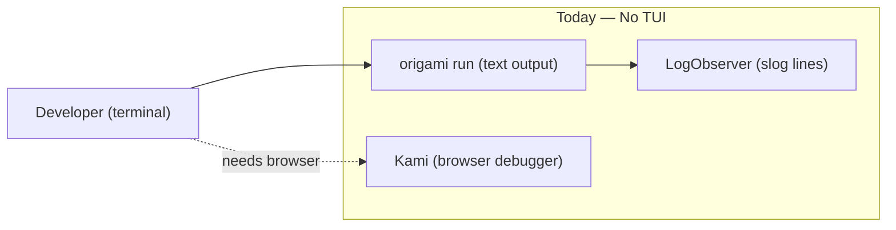
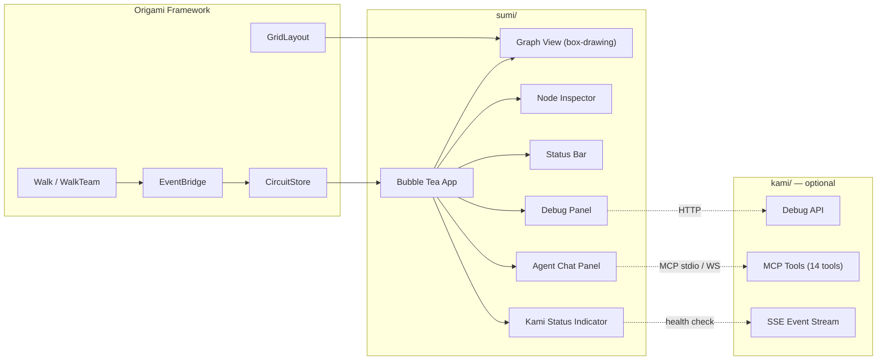

# Contract — sumi

**Status:** draft  
**Goal:** Ship Sumi — the Origami TUI circuit viewer and debugger — with live circuit visualization, walker animation, interactive debugging, and element-colored rendering in the terminal. Extends the product family: Kami (debugger), Kabuki (demo), Washi (enterprise GUI), Sumi (terminal).  
**Serves:** API Stabilization (vision — post-stabilization product)

## Contract rules

Global rules only, plus:

- **Framework package, not a separate repo.** Sumi lives in `sumi/` within the Origami repo, same pattern as `kami/`. It consumes framework types (`CircuitDef`, `WalkObserver`, `kami.Event`) and the ViewModel layer (`view.CircuitStore`, `view.CircuitRenderer`, `view.LayoutEngine`).
- **No web dependencies.** Sumi is pure Go + terminal. No HTTP server, no React, no browser. It may connect to Kami's Debug API over HTTP for breakpoint/pause/resume, but it does not serve HTTP itself.
- **Bubble Tea MVU.** The architecture follows Bubble Tea's Model-View-Update pattern: `CircuitStore` is the Model, Bubble Tea's `Update` processes key events and store diffs, `View` renders the terminal output.
- **OSS pictograms in Unicode.** The Origami Symbol Standard (from `electronic-symbols-washi-pictograms.md`) translates to Unicode/box-drawing characters. Deterministic = `[D]`, Stochastic = `[S]`, Dialectic = `[Δ]`. Element colors map to ANSI 256-color palette.
- **ViewModel dependency.** Sumi depends on the `viewmodel-layer` contract. `CircuitStore` and `GridLayout` must exist before Phase 1 work begins.

## Context

- `contracts/draft/viewmodel-layer.md` — ViewModel layer: `CircuitStore`, `CircuitRenderer`, `LayoutEngine`. Prerequisite.
- `contracts/draft/washi.md` — Washi enterprise GUI. Sumi is the terminal counterpart.
- `kami/server.go` — Kami HTTP/SSE/WS server. Sumi does not replace Kami; it is an alternative view.
- `kami/debug.go` — `DebugController`, `CircuitSnapshot`, breakpoints, pause/resume. Sumi Phase 4 integrates with this API.
- `kami/event.go` — Unified `kami.Event` type consumed via `CircuitStore`.
- `observer.go` — `WalkObserver`, `WalkEvent`, `MultiObserver`.
- `dsl.go` — `CircuitDef`, `NodeDef`, `EdgeDef`, `ZoneDef`.
- `docs/case-studies/electronic-symbols-washi-pictograms.md` — OSS pictogram vocabulary, semantic zoom, D/S boundary rendering.
- `docs/case-studies/electronic-circuit-theory.md` — Component mappings (transistor = Node, op-amp = Dialectic, etc.).
- `strategy/origami-vision.mdc` — Product Topology, BYO Architecture, Four Layers of Interaction.

### Naming lineage

All Origami product names follow a Japanese paper/art tradition:

| Name | Kanji | Meaning | Role |
|------|-------|---------|------|
| **Origami** | 折り紙 | Paper folding | The framework |
| **Kami** | 神 | Spirits / the paper itself | MCP debugger |
| **Kabuki** | 歌舞伎 | Theatrical performance | Demo presentation layer |
| **Washi** | 和紙 | Traditional handmade paper | Enterprise circuit management UI |
| **Sumi** | 墨 | Ink for calligraphy | Terminal circuit viewer/debugger |

Sumi (墨) is the ink used for shodo (calligraphy) and sumi-e (ink wash painting). The terminal is text — ink on paper. Washi is the paper surface (GUI); Sumi is the ink on it (TUI). Both need the same paper (`CircuitStore`) to work.

### Five Layers of Circuit Interaction

With Sumi, Origami circuits are accessible through five interaction layers:

| Layer | Modality | Interface | Audience |
|-------|----------|-----------|----------|
| **Agent** | Verbal | R/W API — guide, focus, highlight, simulate, observe | AI agents as co-pilots |
| **Washi** | Visual (GUI) | Drag-and-drop, no-code builder + ops dashboard (browser) | Operators, managers, non-developers |
| **Sumi** | Visual (TUI) | Terminal circuit viewer + debugger (SSH, CI, headless) | Developers, CI pipelines, headless environments |
| **DSL** | Textual | YAML circuit definitions — human and agent readable | Circuit developers |
| **Go** | Programmatic | Framework API — Node, Edge, Graph, Walker, Extractor | Framework developers |

Sumi fills the gap between Washi (requires a browser) and DSL (no visual feedback). It serves developers who want visual circuit observation without leaving the terminal, SSH sessions into remote hosts, CI pipelines that need visual circuit validation output, and headless environments where a browser is unavailable.

### Current architecture

Developers in the terminal get text-only output from `origami run`. Visual circuit observation requires opening a browser for Kami.

### Desired architecture

## FSC artifacts

| Artifact | Target | Compartment |
|----------|--------|-------------|
| `Sumi` glossary term | `glossary/` | domain |
| Five Layers interaction model update | `contracts/draft/washi.md` | domain |
| Element-to-ANSI color mapping reference | `docs/sumi-colors.md` | domain |

## Execution strategy

Seven phases, each delivering a usable increment. Phase 0 depends on the `viewmodel-layer` contract. Phases 1-5 are sequential within Sumi but can proceed in parallel with other Origami work.

### Phase 0: Scaffold (depends on: viewmodel-layer)

- Bubble Tea application scaffold in `sumi/`
- `SumiRenderer` implementing `view.CircuitRenderer`
- `GridLayout` consumer (from `view/` package)
- `origami sumi` CLI command registration

### Phase 1: Static view

- Render `CircuitDef` as a terminal graph using box-drawing characters
- Zone backgrounds as bordered regions
- D/S badges: `[D]` deterministic, `[S]` stochastic, `[Δ]` dialectic
- Edge rendering: `───▸` normal, `- - ▸` shortcut, `◀──╯` loop
- Element-to-ANSI color mapping (Fire=red, Water=blue, Earth=green, Lightning=yellow, Air=cyan, Void=magenta)
- Node labels, edge labels, zone labels

### Phase 2: Live view

- Subscribe to `CircuitStore` for real-time state updates
- Walker animation: colored dot (`●`) moves along edges on `node_enter` events
- Node state indicators: idle (dim), active (bright + highlight), completed (green check), error (red cross)
- Progress bar: `Walker: Fire1 @ triage [████░░░░] 3/8 nodes`
- Auto-scroll to follow active walker

### Phase 3: Interactive

- Keyboard navigation: Tab cycles nodes, Arrow keys move between connected nodes
- Enter opens node inspector side panel (configuration, recent artifacts, element affinity)
- Esc closes panels
- `/` opens search (fuzzy match on node names, zones, walkers)
- `q` quits

### Phase 4: Debug mode

- Connect to Kami's Debug API over HTTP (optional — Sumi works without Kami)
- Breakpoint toggle: Space key on selected node sets/clears breakpoint (red `●` marker)
- Pause/Resume: `p` pauses walk, `r` resumes
- Step: `n` advances one node (calls `DebugController.AdvanceNode()`)
- Breakpoint list in status bar
- Snapshot view: current `CircuitSnapshot` as formatted text

### Phase 4.5: Agent Co-pilot (depends on: Kami MCP)

When Kami's MCP server is active, Sumi surfaces the Agent interaction layer directly in the terminal:

- **Kami status indicator** — persistent UI element in the status bar: `🟢 Kami: connected` (green) or `⚫ Kami: offline` (dim). Health-checked via Kami's `/api/health` endpoint. The indicator is always visible so the developer knows whether AI assistance is available.
- **Agent chat panel** — toggleable split pane (`c` key) at the bottom or right of the terminal. The developer types natural language; the agent responds with circuit-aware guidance. The agent has full context via Kami's 14 MCP tools: it can read the circuit snapshot (`kami_get_snapshot`), see the selected node (`kami_get_selection`), check breakpoints, and observe live walk events.
- **Agent visual cues in Sumi** — when the agent calls MCP tools like `kami_highlight_nodes`, `kami_zoom_to_zone`, or `kami_place_marker`, those visual cues render in the TUI: highlighted nodes get a colored border, markers appear as labeled badges, zone zoom scrolls the viewport.
- **Narration feed** — the agent can push narration messages (via `kami_place_marker` or a dedicated narration channel) that appear as timestamped lines in the chat panel. The agent proactively explains what it observes: "Node triage took 12s — 3x normal. Check the prompt template."
- **Graceful degradation** — when Kami MCP is unavailable, the chat panel shows "Agent: unavailable (no Kami MCP connection)". The `c` key is disabled. All non-agent features work normally. No crash.

This phase bridges the Agent layer (verbal, R/W API) into the Sumi layer (visual, TUI). The developer gets AI assistance without leaving the terminal.

### Phase 5: CLI integration

- `origami sumi` command: load circuit YAML, start walk with Sumi renderer
- `origami sumi --watch` mode: connect to a running Kami server's SSE stream
- `origami sumi --replay FILE` mode: replay a recorded JSONL session
- `--no-color` flag for CI/pipe-friendly output
- `--compact` flag for reduced-width rendering

## Coverage matrix

| Layer | Applies | Rationale |
|-------|---------|-----------|
| **Unit** | yes | `SumiRenderer` output for known circuit topologies, element-to-ANSI mapping, keyboard input handling |
| **Integration** | yes | Walk a circuit with `CircuitStore` + `SumiRenderer`, verify terminal output matches expected state |
| **Contract** | yes | `CircuitRenderer` interface conformance — `SumiRenderer` implements all methods |
| **E2E** | yes | `origami sumi` command loads a circuit YAML and renders without error. `--no-color` output is parseable. |
| **Concurrency** | yes | Bubble Tea runs on its own goroutine; `CircuitStore` diffs arrive from walk goroutines. No race conditions. |
| **Security** | no | No network exposure (Sumi is a local process). Debug mode connects to Kami as a client, not a server. |

## Tasks

### Phase 0 — Scaffold

- [ ] **S0** Add `charmbracelet/bubbletea`, `charmbracelet/lipgloss`, `charmbracelet/bubbles` dependencies
- [ ] **S1** Create `sumi/` package scaffold — Bubble Tea `Model`, `Update`, `View` structure
- [ ] **S2** Implement `SumiRenderer` — `view.CircuitRenderer` implementation that maps `StateDiff` to Bubble Tea model updates
- [ ] **S3** Register `origami sumi` CLI command (alongside `origami run`, `origami washi`)

### Phase 1 — Static view

- [ ] **S4** Graph renderer — box-drawing layout from `GridLayout`, zone borders, node rectangles with D/S badges
- [ ] **S5** Edge renderer — `───▸`, `- - ▸`, `◀──╯` with labels
- [ ] **S6** Element-to-ANSI color mapping — Fire=red(196), Water=blue(33), Earth=green(34), Lightning=yellow(226), Air=cyan(51), Void=magenta(129), Diamond=white(255)
- [ ] **S7** Unit tests — static rendering of canonical circuits (`defect-dialectic.yaml`, `rca-investigation.yaml`)

### Phase 2 — Live view

- [ ] **S8** `CircuitStore` subscription — Bubble Tea `tea.Cmd` that reads `StateDiff` channel and emits `tea.Msg`
- [ ] **S9** Walker animation — colored `●` on active node, dim trail on visited nodes
- [ ] **S10** Node state indicators — idle/active/completed/error visual states
- [ ] **S11** Progress bar — walker name + element + current node + completion bar
- [ ] **S12** Integration test — walk a circuit, verify `SumiRenderer` receives all state transitions in order

### Phase 3 — Interactive

- [ ] **S13** Keyboard navigation — Tab, Arrow, Enter, Esc, `/`, `q`
- [ ] **S14** Node inspector panel — side panel showing node config, element, transformer, extractor, recent artifacts
- [ ] **S15** Search — fuzzy match on node names, zone names, walker names

### Phase 4 — Debug mode

- [ ] **S16** Kami Debug API client — HTTP client for `pause`, `resume`, `advance_node`, `set_breakpoint`, `clear_breakpoint`, `snapshot`
- [ ] **S17** Breakpoint visualization — red `●` on breakpoint nodes, breakpoint list in status bar
- [ ] **S18** Debug keybindings — Space (breakpoint), `p` (pause), `r` (resume), `n` (step)
- [ ] **S19** Graceful degradation — when Kami is unavailable, debug keybindings are disabled with a status message

### Phase 4.5 — Agent Co-pilot

- [ ] **S20** Kami status indicator — health-check Kami `/api/health`, render `🟢 Kami: connected` or `⚫ Kami: offline` in status bar, poll on interval
- [ ] **S21** Agent chat panel — toggleable split pane (`c` key), text input at bottom, scrollable message history, Bubble Tea `textarea` + `viewport` components
- [ ] **S22** MCP visual cue rendering — translate `kami_highlight_nodes` → colored node borders, `kami_place_marker` → labeled badges, `kami_zoom_to_zone` → viewport scroll
- [ ] **S23** Narration feed — timestamped agent messages in chat panel, auto-scroll, severity coloring (info=dim, suggestion=cyan, warning=yellow, action-required=red)
- [ ] **S24** Graceful degradation — chat panel disabled with "Agent: unavailable" message when Kami MCP is unreachable, `c` key no-ops

### Phase 5 — CLI integration

- [ ] **S25** `origami sumi` command — load circuit YAML, optional `--port` for Kami connection
- [ ] **S26** `--watch` mode — connect to running Kami SSE stream for live observation
- [ ] **S27** `--replay` mode — load recorded JSONL and play back through Sumi
- [ ] **S28** `--no-color` and `--compact` flags
- [ ] **S29** E2E test — `origami sumi --no-color` on canonical circuit, verify output is parseable

### Finalize

- [ ] Validate (green) — all tests pass, acceptance criteria met.
- [ ] Tune (blue) — refactor for quality. No behavior changes.
- [ ] Validate (green) — all tests still pass after tuning.

## Acceptance criteria

**Given** a circuit YAML with 5+ nodes across 2 zones,  
**When** `origami sumi` is run,  
**Then** the terminal renders a graph with box-drawing characters, zone borders, D/S badges, edge labels, and element colors. The layout is readable at 80-column terminal width.

**Given** a circuit walk in progress,  
**When** observed in Sumi,  
**Then** the walker's position animates from node to node in real-time. Active nodes are highlighted. Completed nodes show a green indicator. Error nodes show a red indicator.

**Given** Sumi running with Kami's Debug API available,  
**When** the user presses Space on a node,  
**Then** a breakpoint is set (red marker appears). When the walker reaches that node, execution pauses. Pressing `r` resumes.

**Given** Sumi running without Kami,  
**When** the user presses Space,  
**Then** the status bar shows "Debug: unavailable (no Kami connection)". No crash. All non-debug features work normally.

**Given** Sumi running with Kami MCP server active,  
**When** the user presses `c` to open the chat panel,  
**Then** a split pane appears with a text input and message history. The status bar shows `🟢 Kami: connected`. The user can type a question and receive a response from an agent that has access to the current circuit state via Kami's MCP tools.

**Given** an agent connected via Kami MCP that calls `kami_highlight_nodes` on `["triage", "investigate"]` with color `"red"`,  
**When** Sumi receives the visual cue,  
**Then** the `triage` and `investigate` nodes render with red-colored borders in the TUI graph. The highlight persists until cleared.

**Given** Sumi running without Kami MCP,  
**When** the user presses `c`,  
**Then** the status bar shows `⚫ Kami: offline`. The chat panel does not open. No crash. All other features work normally.

**Given** `origami sumi --no-color`,  
**When** output is piped to a file,  
**Then** the output contains no ANSI escape sequences. Node badges (`[D]`, `[S]`, `[Δ]`) and box-drawing characters are preserved.

**Given** a recorded JSONL session,  
**When** `origami sumi --replay session.jsonl` is run,  
**Then** the circuit replays with correct timing, walker positions, and node state transitions matching the original walk.

## Security assessment

No trust boundaries affected. Sumi is a local terminal process. Debug mode connects to Kami as an HTTP client (Kami is already localhost-only by default). No user input is sent to external services. No credentials are handled.

## Notes

2026-03-02 — Contract created. Sumi completes the Five Layers of Circuit Interaction by filling the TUI gap between Washi (browser) and DSL (text-only). Depends on `viewmodel-layer` contract for `CircuitStore`, `CircuitRenderer`, and `GridLayout`.

2026-03-02 — Added Phase 4.5: Agent Co-pilot. When Kami MCP is active, Sumi surfaces a status indicator and chat panel for AI-assisted circuit observation. The agent has full circuit awareness via Kami's 14 MCP tools. Visual cues (highlights, markers, zoom) from the agent render in the TUI. This bridges the Agent layer into the terminal — developers get AI assistance without leaving Sumi.
