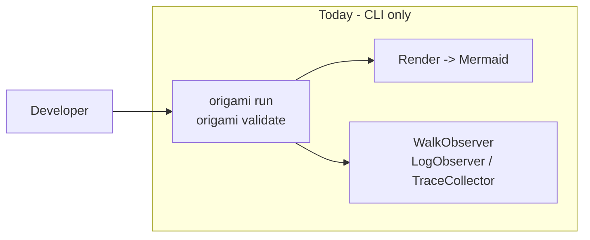
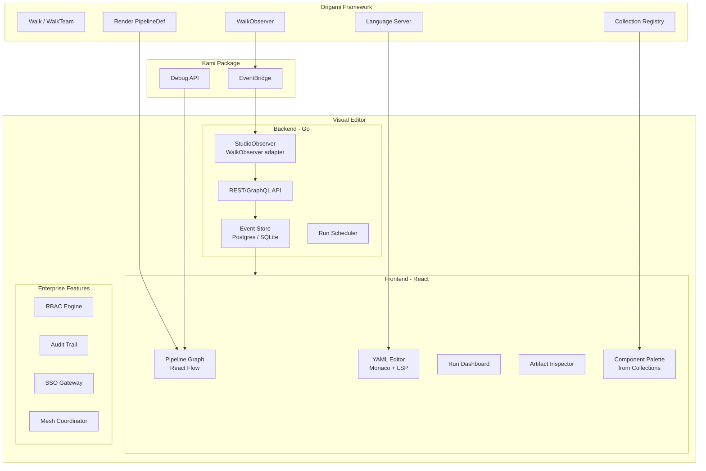

# Contract — visual-editor

**Status:** draft  
**Goal:** Ship a Visual Editor for Origami pipelines — drag-and-drop graph builder, bidirectional YAML sync, run management dashboard — with Community (open source) and Enterprise (commercial) editions following the Ansible open-core model.  
**Serves:** Polishing & Presentation (vision)

## Contract rules

Global rules only, plus:

- **Separate product.** The Visual Editor is NOT part of the Origami framework. It consumes Origami's structured output (WalkObserver events, Artifact data, Mermaid diagrams, PipelineDef). The framework has no dependency on the editor.
- **Red border respected.** "No web UI" remains true for the framework itself. This is a separate product built on the framework's output.
- **Two editions, one codebase.** Community and Enterprise editions share the same codebase. Enterprise features are gated by license, not by separate repositories.
- **AWX model for Community Edition.** The Community Edition is fully functional for single-user use — not a crippled trial. Enterprise features (RBAC, multi-tenancy, audit, SSO) only activate with an enterprise license.
- **Kami integration, not replacement.** The Visual Editor embeds Kami's graph visualization and event streaming. Kami remains the developer debugger; the Visual Editor is the operational management plane.
- **Red Hat brand compliance.** All UI colors must use the RH color system defined in `docs/rh-presentation-dna.md`. Element-to-color mapping per Section 2. Enterprise Edition must use [PatternFly](https://www.patternfly.org/) (Red Hat's open-source design system) for all UI components. Community Edition: PatternFly recommended, RH color collections required.

## Context

- `strategy/origami-vision.mdc` — Product Topology: "Future UI product — pipeline definitions, run history, artifact inspection, visualization."
- `contracts/completed/framework/origami-pipeline-studio.md` — Completed design-only contract. Architecture sketch, API contract, data model. This contract supersedes Pipeline Studio with implementation scope.
- `contracts/draft/kami-live-debugger.md` — EventBridge, KamiServer (triple-homed), Debug API, React frontend. The Visual Editor shares Kami's React Flow graph component and EventBridge data source.
- `contracts/draft/origami-lsp.md` — Language Server for pipeline YAML. The Visual Editor embeds Monaco + LSP for the YAML editing pane.
- `contracts/draft/origami-collections.md` — Collection format, FQCN resolution. The Visual Editor's component palette shows available collections and their contents.
- `docs/case-studies/visual-editor-landscape.md` — Case study of Excalidraw, Mermaid, and Ansible Automation Controller. Business model analysis recommending the Ansible open-core model.
- `docs/case-studies/ansible-collections.md` — Ansible Collections and Automation Hub as second revenue stream (certified content).
- `docs/rh-presentation-dna.md` — Red Hat brand color system, element-to-color mapping, accessibility constraints. All Visual Editor UI must comply.

### Current architecture

No visual interface. Pipeline authoring is YAML-only. Run monitoring is terminal output. Artifact inspection requires CLI queries or log parsing. No operational management layer for teams.

### Desired architecture

## FSC artifacts

| Artifact | Target | Compartment |
|----------|--------|-------------|
| Visual Editor product spec | `docs/visual-editor-product.md` | domain |
| StudioObserver adapter design | `docs/studio-observer.md` | domain |
| Business model decision record | `docs/case-studies/visual-editor-landscape.md` | domain |
| Edition feature matrix | `docs/visual-editor-editions.md` | domain |

## Execution strategy

This is the largest product scope in Origami's roadmap. Execution is split into phases that each deliver a usable increment. Phase 1 delivers a read-only viewer (graph + run history). Phase 2 adds the pipeline builder (drag-and-drop + bidirectional YAML). Phase 3 adds run management (launch, schedule, monitor). Phase 4 adds enterprise features (RBAC, multi-tenancy, audit, SSO). Phase 5 adds the collections palette and certified content integration.

Dependencies are strict: Kami (EventBridge + React Flow) must ship before Phase 1. LSP must ship before Phase 2. Collections must ship before Phase 5.

## Coverage matrix

| Layer | Applies | Rationale |
|-------|---------|-----------|
| **Unit** | yes | API handlers, StudioObserver event mapping, RBAC permission checks, audit event recording |
| **Integration** | yes | Full backend startup (API + EventBridge), SSE streaming to frontend, YAML-to-graph bidirectional sync |
| **Contract** | yes | API schema stability (REST/GraphQL), StudioObserver event format, RBAC permission model |
| **E2E** | yes | Launch Visual Editor, create pipeline via drag-and-drop, run it, inspect artifacts, verify YAML matches graph |
| **Concurrency** | yes | Multiple SSE clients, concurrent run management, multi-tenant isolation |
| **Security** | yes | Web application security (OWASP full checklist), RBAC enforcement, audit completeness, SSO integration |

## Tasks

### Phase 1 — Read-only viewer (depends on: Kami)

- [ ] **V1** Implement `StudioObserver` — `WalkObserver` adapter that sends KamiEvents to the Visual Editor API
- [ ] **V2** Implement Event Store schema (runs, events, artifacts) with SQLite for Community and Postgres for Enterprise
- [ ] **V3** REST API: `GET /pipelines`, `GET /runs`, `GET /runs/:id/events` (SSE stream), `GET /runs/:id/artifacts/:node`
- [ ] **V4** React scaffold: Vite + TypeScript + Tailwind + React Flow. Configure Tailwind theme with RH Color Collection 1 tokens per `docs/rh-presentation-dna.md`. Enterprise Edition: use PatternFly components.
- [ ] **V5** Pipeline graph component — render PipelineDef as interactive React Flow graph with zone backgrounds, element colors, and node status indicators
- [ ] **V6** Run history dashboard — list past runs with status, duration, pipeline name, walker count
- [ ] **V7** Artifact inspector — click a node in a completed run to see its input/output artifacts
- [ ] **V8** `go:embed frontend/dist/*` — single binary with embedded SPA
- [ ] **V9** `origami studio --port 8080` CLI command
- [ ] **V10** Integration test: start StudioObserver, walk a pipeline, verify events appear in Event Store, verify SSE stream delivers to frontend

### Phase 2 — Pipeline builder (depends on: LSP)

- [ ] **B1** YAML editor pane — Monaco editor connected to Origami LSP via WebSocket
- [ ] **B2** Bidirectional sync engine: graph changes generate YAML diffs; YAML changes update graph model
- [ ] **B3** Drag-and-drop node palette — built-in node families (generic, transformer types) plus registered transformers
- [ ] **B4** Edge drawing — click source node, click target node, configure `when:` condition via expression builder
- [ ] **B5** Zone editor — create/resize/recolor zones, assign nodes, configure stickiness
- [ ] **B6** Walker editor — define WalkerDefs (name, element, persona, preamble, step affinity) via form UI
- [ ] **B7** Pipeline validation — call `origami validate` on every change, show diagnostics inline on graph and in YAML pane
- [ ] **B8** Export — download pipeline as `.yaml` file, copy Mermaid diagram to clipboard
- [ ] **B9** Unit tests: bidirectional sync (graph -> YAML -> graph roundtrip preserves structure)

### Phase 3 — Run management

- [ ] **R1** Launch button — select pipeline, configure vars, choose walkers, start run
- [ ] **R2** Live graph animation — nodes light up on enter/exit, edges animate on transition, artifacts appear as badges
- [ ] **R3** Run comparison — side-by-side view of two runs of the same pipeline (diff artifacts, diff timing)
- [ ] **R4** Run replay — load recorded JSONL, play back through the graph visualization (reuse Kami Replayer)
- [ ] **R5** Run scheduling — cron-style schedules for recurring pipeline runs (Enterprise only)
- [ ] **R6** Run notifications — webhook on completion/failure (Enterprise only)

### Phase 4 — Enterprise features

- [ ] **E1** RBAC engine — roles (admin, operator, viewer), teams, org-scoped permissions on pipelines, runs, collections
- [ ] **E2** Audit trail — every action (create pipeline, launch run, modify RBAC, install collection) logged with actor, timestamp, diff
- [ ] **E3** SSO gateway — LDAP, SAML 2.0, OIDC integration for enterprise authentication
- [ ] **E4** Multi-tenancy — organization isolation (separate namespaces, credentials, pipelines, run history)
- [ ] **E5** Centralized logging — aggregated run logs with search, filtering, and export
- [ ] **E6** License gate — enterprise features activate only with valid license key; Community runs fully without one
- [ ] **E7** Topology viewer — visualize execution topology (workers, zones, providers, mesh nodes)

### Phase 5 — Collections integration (depends on: Collections)

- [ ] **C1** Component palette integration — browse installed collections, show available transformers, extractors, nodes, pipelines
- [ ] **C2** Collection installer — `Install` button wraps `origami collection install` with progress feedback
- [ ] **C3** FQCN autocomplete in YAML editor — LSP provides collection-aware completion
- [ ] **C4** Certified badge — visual indicator for enterprise-certified collections (from registry)
- [ ] **C5** Collection dependency viewer — show which collections a pipeline uses, their versions, and update availability

### Phase 6 — Validate and tune

- [ ] **T1** Validate (green) — `go build ./...`, `go test ./...`, all E2E tests pass. Visual Editor starts, graph renders, runs stream, YAML syncs.
- [ ] **T2** Tune (blue) — performance (virtualized React Flow for 100+ node pipelines), UX polish (keyboard shortcuts, responsive layout), accessibility (ARIA labels, screen reader support).
- [ ] **T3** Validate (green) — all tests still pass after tuning.

## Acceptance criteria

**Given** a pipeline YAML with 5+ nodes across 2 zones,  
**When** loaded in the Visual Editor,  
**Then** the graph renders with correct topology, zone backgrounds, element colors, and node labels. Clicking a node shows its configuration. The YAML pane shows the source YAML with LSP diagnostics.

**Given** a user drags a new node onto the graph and connects it with an edge,  
**When** the edge `when:` condition is configured,  
**Then** the YAML pane updates in real-time with the new node and edge definition. Saving produces a valid pipeline YAML that passes `origami validate`.

**Given** a pipeline run in progress,  
**When** viewed in the Visual Editor,  
**Then** the graph animates node enter/exit events in real-time via SSE. Completed nodes show artifact badges. Clicking a completed node shows the artifact inspector with input/output data.

**Given** an Enterprise Edition with RBAC configured,  
**When** a user with "viewer" role attempts to launch a run,  
**Then** the launch button is disabled. The audit trail records the denied action. Only users with "operator" or "admin" role can launch runs.

**Given** the Community Edition without an enterprise license,  
**When** the Visual Editor starts,  
**Then** all Phase 1-3 features work fully. Enterprise feature menus (RBAC, audit, SSO, mesh) show "Enterprise Edition" badges but do not block any single-user functionality.

## Security assessment

| OWASP | Finding | Mitigation |
|-------|---------|------------|
| A01 Access Control | Web UI exposes pipeline state, run history, and execution controls. | Community: localhost-only by default. Enterprise: RBAC on every API endpoint. `--bind` flag for explicit network exposure. |
| A02 Cryptographic Failures | Run artifacts may contain sensitive data. | Encrypt Event Store at rest (Enterprise). TLS for all API traffic. No secrets in artifact display without credential masking. |
| A03 Injection | YAML editor content displayed in graph, artifact data rendered in inspector. | Sanitize all display content. CSP headers. No `dangerouslySetInnerHTML`. Monaco sandboxed editor. |
| A05 Misconfiguration | Default deployment could expose Visual Editor without auth. | Community: localhost-only, no auth needed. Enterprise: auth required by default, no anonymous access. |
| A07 Authentication | Enterprise SSO integration, session management. | Standard session handling. CSRF tokens. Secure cookies. HttpOnly, SameSite=Strict. |
| A09 Logging & Monitoring | Audit trail completeness. | Enterprise audit logs every API mutation. Structured logging with correlation IDs. Log rotation and retention policies. |

## Notes

2026-02-25 — Contract created from case study `visual-editor-landscape.md`. Business model: Ansible open-core (free Community Edition, paid Enterprise Edition). The Visual Editor is the "money maker" — not because it gates basic functionality, but because it serves enterprise governance, scale, delegation, and visibility needs. Supersedes the design-only `origami-pipeline-studio` contract. Dependencies: Kami (Phase 1), LSP (Phase 2), Collections (Phase 5).
