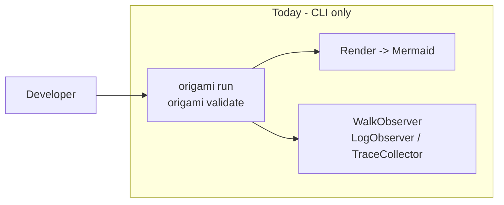
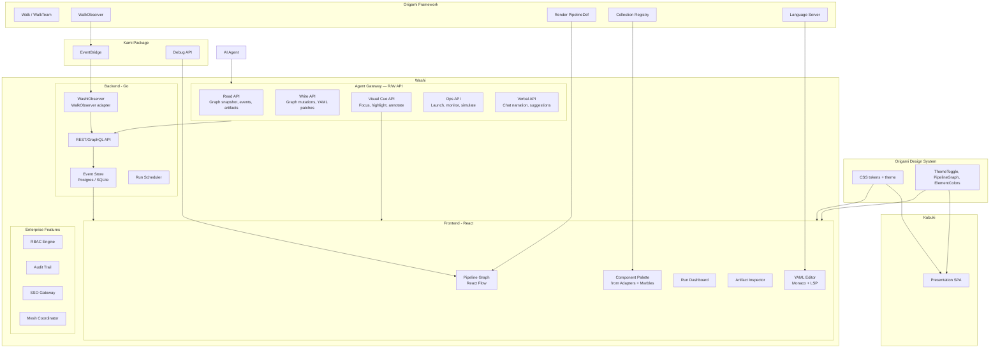

# Contract — washi

**Status:** draft  
**Goal:** Ship Washi — the Origami enterprise pipeline management UI — with drag-and-drop graph builder, bidirectional YAML sync, run management dashboard, Community (open source) and Enterprise (commercial) editions following the Ansible open-core model. Kabuki and Washi share the same Origami Design System (ODS).  
**Serves:** Polishing & Presentation (vision)

## Contract rules

Global rules only, plus:

- **Separate product.** Washi is NOT part of the Origami framework. It consumes Origami's structured output (WalkObserver events, Artifact data, Mermaid diagrams, PipelineDef). The framework has no dependency on Washi.
- **Red border respected.** "No web UI" remains true for the framework itself. This is a separate product built on the framework's output.
- **Two editions, one codebase.** Community and Enterprise editions share the same codebase. Enterprise features are gated by license, not by separate repositories.
- **AWX model for Community Edition.** The Community Edition is fully functional for single-user use — not a crippled trial. Enterprise features (RBAC, multi-tenancy, audit, SSO) only activate with an enterprise license.
- **Kami integration, not replacement.** Washi embeds Kami's graph visualization and event streaming. Kami remains the developer debugger; Washi is the operational management plane.
- **Red Hat brand compliance.** All UI colors must use the RH color system defined in `docs/rh-presentation-dna.md`. Element-to-color mapping per Section 2. Enterprise Edition must use [PatternFly](https://www.patternfly.org/) (Red Hat's open-source design system) for all UI components. Community Edition: PatternFly recommended, RH color collections required.
- **Shared DNA with Kabuki.** Kabuki (demo presentation) and Washi (enterprise UI) consume the same Origami Design System (ODS): shared design tokens, color palette, typography, element colors, light/dark theme, and interaction patterns. Visual consistency between demo and product is non-negotiable. When a user sees a Kabuki demo and then opens Washi, they must feel like the same product family.
- **Agent-first R/W API.** Washi exposes a full read/write API for AI agents — the same API that powers the human UI. Agents are first-class consumers, not afterthoughts bolted onto a human-only interface. The Agent Gateway supports verbal guidance (chat narration), visual cues (focus, highlight, annotate), simulation (dry-run, what-if), and observation (live pipeline ops). This is Origami's fourth interaction layer. The R/W API ships alongside every phase, not as a late addition.

## Context

- `strategy/origami-vision.mdc` — Product Topology: "Future UI product — pipeline definitions, run history, artifact inspection, visualization."
- `contracts/completed/framework/origami-pipeline-studio.md` — Completed design-only contract. Architecture sketch, API contract, data model. This contract supersedes Pipeline Studio with implementation scope.
- `contracts/completed/framework/kami-live-debugger.md` — EventBridge, KamiServer (triple-homed), Debug API, React frontend. Washi shares Kami's React Flow graph component and EventBridge data source.
- `contracts/completed/framework/kabuki-presentation-engine.md` — Kabuki data-driven presentation SPA: KabukiConfig, section components, element selector. **Washi and Kabuki share the Origami Design System (ODS) extracted in Phase 0.**
- `contracts/draft/origami-lsp.md` — Language Server for pipeline YAML. Washi embeds Monaco + LSP for the YAML editing pane.
- `docs/case-studies/visual-editor-landscape.md` — Case study of Excalidraw, Mermaid, and Ansible Automation Controller. Business model analysis recommending the Ansible open-core model.
- `docs/case-studies/ansible-collections.md` — Ansible Collections and Automation Hub as second revenue stream (certified content).
- `docs/rh-presentation-dna.md` — Red Hat brand color system, element-to-color mapping, accessibility constraints. All Washi UI must comply.

### Naming lineage

All Origami product names follow a Japanese paper/art tradition:

| Name | Meaning | Role |
|------|---------|------|
| **Origami** | Paper folding | The framework |
| **Kami** | Spirits / the paper itself | MCP debugger |
| **Kabuki** | Theatrical performance | Demo presentation layer |
| **Washi** | Traditional handmade paper (UNESCO heritage) | Enterprise pipeline management UI |

Washi (和紙) is the material that makes everything else possible — durable, beautiful, functional. The enterprise surface.

### Four Layers of Pipeline Interaction

Origami pipelines are accessible through four interaction layers. Each layer serves a different audience and modality, but all four are first-class citizens — none is a wrapper around another.

| Layer | Modality | Interface | Audience |
|-------|----------|-----------|----------|
| **Agent** | Verbal | R/W API — guide user verbally + visual cues (focus, highlight, simulate, observe) | AI agents as co-pilots |
| **Washi** | Visual | Drag-and-drop, no-code pipeline builder + ops dashboard | Operators, managers, non-developers |
| **DSL** | Textual | YAML pipeline definitions — human and agent readable | Pipeline developers |
| **Go** | Programmatic | Framework API — Node, Edge, Graph, Walker, Extractor | Framework developers |

The DSL was designed to be ingestible by both humans and agents — YAML is the shared lingua franca. Washi adds a visual programming layer (no-code) on top. The Agent layer completes the stack: a R/W API that lets AI agents guide users verbally and with extended visual cues.

**Agent layer capabilities:**

- **Verbal guidance** — Chat narration: the agent explains what it sees, what it recommends, and why. Natural language in, structured operations out.
- **Focus control** — Move the user's viewport to a specific node, zone, or region. Direct the user's attention programmatically.
- **Highlight** — Emphasize nodes, edges, paths, or zones with color, pulse, or glow. Temporal (fade after N seconds) or persistent.
- **Simulate** — Trigger dry runs, what-if scenarios, path analysis. Show predicted outcomes without executing.
- **Observe (Ops)** — Watch live pipeline execution, health metrics, cost trends, error rates. The agent is an always-on operator.

The Agent Gateway API is not a separate product — it's a surface of Washi. Every human-facing feature has an agent-facing API equivalent. When Phase 1 ships the read-only viewer, the Agent Read API ships alongside it. When Phase 2 ships the pipeline builder, the Agent Write API ships alongside it. When Phase 3 ships run management, the Agent Ops API ships alongside it.

### Current architecture

No visual interface. Pipeline authoring is YAML-only. Run monitoring is terminal output. Artifact inspection requires CLI queries or log parsing. No operational management layer for teams.

### Desired architecture

## FSC artifacts

| Artifact | Target | Compartment |
|----------|--------|-------------|
| Washi product spec | `docs/washi-product.md` | domain |
| WashiObserver adapter design | `docs/washi-observer.md` | domain |
| Business model decision record | `docs/case-studies/visual-editor-landscape.md` | domain |
| Edition feature matrix | `docs/washi-editions.md` | domain |
| Origami Design System spec | `docs/origami-design-system.md` | domain |
| Agent Gateway API spec (OpenAPI) | `docs/washi-agent-gateway.md` | domain |
| Four Layers interaction model | `docs/four-layers.md` | domain |
| `Washi` glossary term | `glossary/` | domain |

## Execution strategy

This is the largest product scope in Origami's roadmap. Execution is split into phases that each deliver a usable increment.

**Phase 0 is split into two tracks:** ODS (extract shared design system from Kabuki) and Playwright E2E. ODS must complete first — Washi's frontend scaffold (Phase 1 V4) consumes ODS tokens, not raw CSS. This ensures Kabuki and Washi are visually unified from day one.

**The Agent Gateway R/W API ships alongside every phase**, not as a late addition. Phase 1 ships the Agent Read API (AG1-AG3) alongside the human viewer. Phase 2 ships the Agent Write API (AG4-AG6) alongside the pipeline builder. Phase 3 ships the Agent Ops API (AG7-AG9) alongside run management. Phase 3.5 adds the verbal/chat UX on top of the already-complete Agent API — intent decomposition and proactive narration.

Phase 1 delivers a read-only viewer (graph + run history) + Agent Read API. Phase 2 adds the pipeline builder (drag-and-drop + bidirectional YAML) + Agent Write API. Phase 2.5 adds subgraph fold/unfold. Phase 2.7 adds diagnostic overlays (heatmaps, traces, diffs). Phase 3 adds run management (launch, schedule, monitor) + Agent Ops API. Phase 3.5 adds the Agentic Editor verbal layer (natural language intent on top of the Agent Gateway). Phase 4 adds enterprise features (RBAC, multi-tenancy, audit, SSO, collaboration cursors, alert rules). Phase 5 adds the adapters + marbles palette and certified content integration. Phase 5.5 adds product polish (themes, analytics, export, templates, onboarding).

Dependencies are strict: ODS must ship before Phase 1. Kami (EventBridge + React Flow) must ship before Phase 1. LSP must ship before Phase 2. Marbles must ship before Phase 2.5, but Phase 2.5 can be developed in parallel using mock nested `PipelineDef` data. Adapters + Marbles must ship before Phase 5. Playwright E2E (Phase 0) gates every subsequent phase — no PR merges without green E2E smoke tests. Agent Gateway API (AG1-AG9) must ship before Phase 3.5 — the verbal layer requires the complete R/W API.

## Feature tiers

Every feature maps to one of three audience tiers. Tiers are cumulative — Tier 2 includes all of Tier 1, Tier 3 includes all of Tier 1+2.

- **Tier 1: PoC Must-Have** — Proves Washi works. Internal team validation. "The graph renders, edits sync, runs animate." Minimum viable product.
- **Tier 2: QE Division Demo Must-Have** — Impresses QE leadership. Agent visibility, run diagnostics, pipeline optimization. "This changes how we do test failure analysis."
- **Tier 3: CEO Matt Hicks Must-Have** — Product-level. Business model viability, enterprise readiness, multi-domain applicability. "This is the next Ansible Automation Controller."

### Tier 1 — PoC Must-Have

| Feature | Phase | Task |
|---------|-------|------|
| Origami Design System (shared Kabuki/Washi tokens) | 0 | ODS1-ODS5 |
| Playwright E2E from day 1 (`window.__origami` bridge) | 0 | PW1-PW6 |
| Kami integration for live debugging | 0 | PW5-PW6 |
| Pipeline graph visualization | 1 | V5 |
| Agent Read API (graph snapshot, events, visual cues) | 1 | AG1-AG3 |
| YAML editor with LSP | 2 | B1 |
| Bidirectional YAML-graph sync | 2 | B2 |
| Agent Write API (graph mutations, YAML patches, simulation) | 2 | AG4-AG6 |
| Live graph animation (node enter/exit) | 3 | R2 |
| Run history dashboard | 1 | V6 |
| Artifact inspector | 1 | V7 |
| Auto-layout (dagre/ELK) | 2 | B10 |
| Dark mode (ODS dark variants) | 2 | B11 |
| Keyboard-first navigation (Tab/Arrow/Enter/Esc) | 2 | B12 |
| Command palette (Ctrl+K) | 2 | B13 |

### Tier 2 — QE Division Demo Must-Have

| Feature | Phase | Task |
|---------|-------|------|
| Subgraph fold/unfold | 2.5 | SV1-SV5 |
| Agent Ops API (run management, health observation, narration) | 3 | AG7-AG9 |
| Run comparison (side-by-side) | 3 | R3 |
| Run replay | 3 | R4 |
| Drag-and-drop node palette | 2 | B3 |
| Edge drawing + condition builder | 2 | B4 |
| Zone editor | 2 | B5 |
| Walker editor | 2 | B6 |
| Heatmap overlay (latency, cost, errors) | 2.7 | DO1 |
| Walker trace overlay (per-walker path) | 2.7 | DO2 |
| Pipeline diff view (visual git diff) | 2.7 | DO3 |
| Persona cards (element + radar chart) | 2.7 | DO4 |
| Dialectic visualizer (thesis/antithesis/synthesis) | 2.7 | DO5 |
| Node health indicator (green/yellow/red badge) | 2.7 | DO6 |
| Cost estimator (pre-run token estimate) | 2.7 | DO7 |
| Pipeline testing mode (dry-run with stubs) | 2.7 | DO8 |
| Edge path explorer (highlight all paths) | 2.7 | DO9 |
| Semantic zoom (detail by zoom level) | 2.7 | DO10 |
| Lasso select + bulk operations | 2.7 | DO11 |
| Contextual node inspector (rich side panel) | 2.7 | DO12 |
| Split view (graph + any panel) | 2.7 | DO13 |

### Tier 3 — CEO Matt Hicks Must-Have

| Feature | Phase | Task |
|---------|-------|------|
| Agentic Editor — verbal layer (intent decomposition, proactive ops agent) | 3.5 | AE1-AE4 |
| RBAC engine | 4 | E1 |
| Audit trail | 4 | E2 |
| SSO gateway | 4 | E3 |
| Multi-tenancy | 4 | E4 |
| Centralized logging | 4 | E5 |
| Topology viewer | 4 | E7 |
| Collaboration cursors (Enterprise real-time) | 4 | E8 |
| Alert rules (PagerDuty, Slack, webhooks) | 4 | E9 |
| Adapters + Marbles palette | 5 | C1-C5 |
| Theme system (domain-specific visual identity) | 5.5 | PP1 |
| Pipeline analytics dashboard (trends, P95, cost) | 5.5 | PP2 |
| Affinity matrix (walker-to-node fit) | 5.5 | PP3 |
| Export to presentation (SVG/PNG/Mermaid) | 5.5 | PP4 |
| Embeddable graph component (npm package) | 5.5 | PP5 |
| Node templates (personal + team library) | 5.5 | PP6 |
| Annotations / sticky notes on graph | 5.5 | PP7 |
| Undo/redo visual timeline | 5.5 | PP8 |
| Onboarding tour (guided first-use) | 5.5 | PP9 |
| Touch/tablet support (iPad demo) | 5.5 | PP10 |

## Coverage matrix

| Layer | Applies | Rationale |
|-------|---------|-----------|
| **Unit** | yes | API handlers, WashiObserver event mapping, RBAC permission checks, audit event recording, ODS token generation, Agent Gateway request validation |
| **Integration** | yes | Full backend startup (API + EventBridge), SSE streaming to frontend, YAML-to-graph bidirectional sync, Agent Gateway R/W API round-trip (agent mutates graph, human sees change) |
| **Contract** | yes | API schema stability (REST/GraphQL), Agent Gateway OpenAPI conformance, WashiObserver event format, RBAC permission model, ODS token contract (Kabuki and Washi render identically for shared components) |
| **E2E** | yes | Playwright from day 1 (Phase 0). Smoke tests: graph renders, YAML round-trip, node drag. Integration: Kami SSE streaming, agentic workflow MCP loop. `window.__origami` bridge for all assertions. |
| **Concurrency** | yes | Multiple SSE clients, concurrent run management, multi-tenant isolation |
| **Security** | yes | Web application security (OWASP full checklist), RBAC enforcement, audit completeness, SSO integration |

## Tasks

### Phase 0a — Origami Design System (ODS)

Extract the shared UI DNA from Kabuki (`kami/frontend/src/index.css`) into a standalone package that both Kabuki and Washi consume. This ensures visual consistency from day one.

- [ ] **ODS1** Extract design tokens — move the `@theme` block and CSS custom properties from `kami/frontend/src/index.css` into a shared `packages/ods/` (or `kami/frontend/src/ods/`) package. Tokens include: RH color palette (`--color-rh-red-*`, `--color-rh-gray-*`, `--color-rh-teal-*`, `--color-rh-purple-*`), semantic surface/text/brand aliases, element colors (`--el-fire`, `--el-water`, `--el-earth`, `--el-air`, `--el-void`), light/dark variants.
- [ ] **ODS2** Typography tokens — extract Red Hat Display / Red Hat Text font stack, heading/body scales, and line-height tokens. Both Kabuki and Washi use the same typographic hierarchy.
- [ ] **ODS3** Shared components — extract `ThemeToggle`, `PipelineGraph` (React Flow wrapper with ODS styling), and element color utilities into the ODS package. These render identically in Kabuki and Washi.
- [ ] **ODS4** Migrate Kabuki — update `kami/frontend/` to consume ODS tokens via `@import` instead of defining them inline. Verify Kabuki renders identically before and after (visual regression test or manual diff).
- [ ] **ODS5** ODS contract test — snapshot test that verifies Kabuki and Washi (once scaffolded) resolve the same CSS custom property values for all ODS tokens. Prevents silent drift.

### Phase 0b — Playwright E2E + Kami integration (day 1)

Testing infrastructure that gates every subsequent phase. Adopts the Demiurge pattern from Hegemony (`/home/dpopsuev/Projects/hegemony`): `window.__origami` bridge for Playwright access, graceful service skip for optional backends, factory separation for test isolation. Every PR must pass Phase 0b smoke tests before merge.

- [ ] **PW1** Playwright config — `playwright.config.ts` with `testDir: ./e2e`, Chromium, `webServer` auto-starts Vite dev server. GPU launch flags for React Flow canvas rendering (`--use-gl=angle`, `--enable-gpu-rasterization`, `--ignore-gpu-blocklist`) — same pattern as Hegemony.
- [ ] **PW2** `window.__origami` bridge — expose runtime API on `window` for Playwright: `snapshot()` (full graph state), `nodeCount()`, `edgeCount()`, `selectedNode()`, `zoomLevel()`, `foldState()`, `yamlContent()`. Mirrors Hegemony's `window.__perf` pattern. TypeScript types for all return shapes.
- [ ] **PW3** Graceful service skip — `requireKami(page)` helper that checks WS on Kami port and `test.skip`s when unreachable. Tests split into standalone (graph render, YAML sync — no backend) and integration (live run, agentic editor — Kami required).
- [ ] **PW4** Smoke tests — graph renders with correct node count, YAML round-trip preserves structure, node drag updates position, edge creation works. These tests gate every PR from day 1.
- [ ] **PW5** Kami integration test fixture — connect to Kami's WS server (EventBridge), verify live node state updates push to `window.__origami`, agent position dots animate on node enter/exit events.
- [ ] **PW6** Agentic workflow E2E — AI sends a command via Kami's MCP tools (e.g. `highlight_nodes`, `zoom_to_zone`), Playwright verifies the graph updates in real-time via `window.__origami`. Tests the full loop: MCP -> Kami -> EventBridge WS -> React Flow -> `window.__origami`.

### Phase 1 — Read-only viewer (depends on: Kami, ODS)

- [ ] **V1** Implement `WashiObserver` — `WalkObserver` adapter that sends KamiEvents to the Washi API
- [ ] **V2** Implement Event Store schema (runs, events, artifacts) with SQLite for Community and Postgres for Enterprise
- [ ] **V3** REST API: `GET /pipelines`, `GET /runs`, `GET /runs/:id/events` (SSE stream), `GET /runs/:id/artifacts/:node`
- [ ] **V4** React scaffold: Vite + TypeScript + Tailwind 4 + React Flow. Import ODS tokens from `packages/ods/`. PatternFly layered on top for Enterprise Edition components. Stack matches Kabuki (React 19, Tailwind 4, `@theme` CSS).
- [ ] **V5** Pipeline graph component — render PipelineDef as interactive React Flow graph with zone backgrounds, element colors (from ODS), and node status indicators
- [ ] **V6** Run history dashboard — list past runs with status, duration, pipeline name, walker count
- [ ] **V7** Artifact inspector — click a node in a completed run to see its input/output artifacts
- [ ] **V8** `go:embed frontend/dist/*` — single binary with embedded SPA
- [ ] **V9** `origami washi --port 8080` CLI command
- [ ] **V10** Integration test: start WashiObserver, walk a pipeline, verify events appear in Event Store, verify SSE stream delivers to frontend

#### Agent Read API (ships with Phase 1)

The agent can see everything the human viewer shows. Every read-only feature has an API equivalent.

- [ ] **AG1** Agent Gateway scaffold — `/api/agent/` REST surface with API key auth (Community) and SSO token auth (Enterprise). OpenAPI spec published. Rate limiting. Versioned (`/v1/`). Same backend services as the human UI — no separate data path.
- [ ] **AG2** Graph observation API — `GET /api/agent/graph/snapshot` (full graph state: nodes, edges, zones, positions, fold state), `GET /api/agent/graph/node/:id` (node detail + latest artifacts), `WS /api/agent/events` (live stream of walk events). The agent can "see" the pipeline exactly as the human viewer renders it.
- [ ] **AG3** Visual cue API — `POST /api/agent/focus {:node_id}` (move viewport to node/zone), `POST /api/agent/highlight {:nodes, :color, :duration_ms}` (highlight nodes/edges with color + optional fade), `POST /api/agent/annotate {:node_id, :text, :style}` (place temporary annotation visible to the human). These are the "extended visual cues" — the agent directs the user's eye.

### Phase 2 — Pipeline builder (depends on: LSP)

- [ ] **B1** YAML editor pane — Monaco editor connected to Origami LSP via WebSocket
- [ ] **B2** Bidirectional sync engine: graph changes generate YAML diffs; YAML changes update graph model
- [ ] **B3** Drag-and-drop node palette — built-in node families (generic, transformer types) plus registered transformers
- [ ] **B4** Edge drawing — click source node, click target node, configure `when:` condition via expression builder
- [ ] **B5** Zone editor — create/resize/recolor zones, assign nodes, configure stickiness
- [ ] **B6** Walker editor — define WalkerDefs (name, element, persona, preamble, step affinity) via form UI
- [ ] **B7** Pipeline validation — call `origami validate` on every change, show diagnostics inline on graph and in YAML pane
- [ ] **B8** Export — download pipeline as `.yaml` file, copy Mermaid diagram to clipboard
- [ ] **B9** Unit tests: bidirectional sync (graph -> YAML -> graph roundtrip preserves structure)
- [ ] **B10** Auto-layout — integrate dagre (fast) and ELK (high-quality) layout engines. "Auto-arrange" button in toolbar. Layout respects zone boundaries — nodes stay within their assigned zone. User can lock node positions to prevent auto-layout from moving them.
- [ ] **B11** Dark mode — ODS dark variants for all components. Automatic detection via `prefers-color-scheme`. Manual toggle in toolbar (shared `ThemeToggle` from ODS). All tokens have dark-mode counterparts. Contrast ratios meet WCAG AA.
- [ ] **B12** Keyboard-first navigation — Tab cycles through nodes, Arrow keys move between connected nodes, Enter opens inspector, Esc closes panels. Focus ring visible on active node. All mouse interactions have keyboard equivalents.
- [ ] **B13** Command palette — Ctrl+K opens fuzzy search over: nodes (by name/type), edges, zones, walkers, recent runs, actions (add node, export, validate). Same UX as VS Code command palette.

#### Agent Write API (ships with Phase 2)

The agent can modify the pipeline exactly as a human can via drag-and-drop. Every mutation is animated on the human's screen in real-time.

- [ ] **AG4** Graph mutation API — `POST /api/agent/graph/node` (add node), `DELETE /api/agent/graph/node/:id` (remove node), `POST /api/agent/graph/edge` (add edge with `when:` condition), `DELETE /api/agent/graph/edge/:id`, `PATCH /api/agent/graph/node/:id` (modify node config, zone assignment). Every mutation fires the bidirectional sync engine (B2) — the YAML pane updates, the graph animates, and the human sees the change happen live.
- [ ] **AG5** Pipeline YAML API — `PUT /api/agent/pipeline/yaml` (upload full YAML), `PATCH /api/agent/pipeline/yaml` (apply diff). Bidirectional sync fires: graph updates when agent modifies YAML. Validation runs automatically (B7). Agent receives diagnostics in the response.
- [ ] **AG6** Simulation API — `POST /api/agent/simulate {:pipeline_id, :scenario}` (dry-run with stub extractors, no LLM calls). Returns predicted path, edge evaluations, zone transitions. The agent can answer "what would happen if..." without spending tokens. Results optionally rendered as an overlay on the human's graph (links to DO8).

### Phase 2.5 — Subgraph fold/unfold (depends on: Marbles)

Subgraph visualization with IDE-like collapse/expand. Can be developed in parallel with Marbles using mock nested `PipelineDef` data. Applies to both the read-only viewer (Phase 1) and the pipeline builder (Phase 2) — placed here because the graph model extension is needed before run management.

- [ ] **SV1** Hierarchical graph model — extend the React Flow graph data model to represent composite `Marble`s as collapsible group nodes. When collapsed, show as a single node with a fold indicator (chevron or depth badge, like IDE code folding). When expanded, reveal the subgraph's internal nodes/edges inline, visually nested inside a container with a subtle border and indented background.
- [ ] **SV2** Fold/unfold interaction — click the fold indicator to toggle. Keyboard shortcut (Ctrl+Shift+[ / Ctrl+Shift+]) for fold/unfold, matching IDE conventions. "Fold All" / "Unfold All" toolbar buttons. Depth-aware: folding a parent also folds all children. Unfolding only reveals one level at a time (like IDE indent folding).
- [ ] **SV3** Edge routing across levels — edges that cross subgraph boundaries render as dashed lines entering/exiting the collapsed node. When expanded, edges connect to the actual internal source/target nodes. Animated transition on fold/unfold so the user doesn't lose spatial context.
- [ ] **SV4** Breadcrumb navigation — when zoomed deep into a nested subgraph (2+ levels), show a breadcrumb trail at the top: `Root > Investigation > Correlation`. Clicking a breadcrumb folds everything below that level and zooms to fit.
- [ ] **SV5** Minimap depth — the React Flow minimap shows collapsed subgraphs as single rectangles, expanded ones as grouped rectangles. Matches the current fold state.

### Phase 2.7 — Diagnostic overlays

Overlays that turn the graph from a static diagram into an operational dashboard. Each overlay is independently toggleable. Data sources: completed run artifacts, live SSE events, and `PipelineDef` metadata.

- [ ] **DO1** Heatmap overlay — color nodes by latency (green-yellow-red gradient), token cost (blue gradient), or error rate (orange gradient). Toggle between metrics in overlay toolbar. Legend with scale.
- [ ] **DO2** Walker trace overlay — select a walker from a completed run, highlight the exact path it took through the graph. Multiple traces can be shown simultaneously with distinct colors. Dim non-traversed nodes.
- [ ] **DO3** Pipeline diff view — select two pipeline YAML versions (from git or run history), render both graphs side-by-side with added/removed/changed nodes highlighted (green/red/yellow). Like a visual `git diff` for pipelines.
- [ ] **DO4** Persona cards — click an agent in a run to see its persona: element affinity radar chart (6 axes), personality traits, model profile, step affinity heatmap. Uses ODS element colors.
- [ ] **DO5** Dialectic visualizer — for nodes using Adversarial Dialectic, show thesis/antithesis/synthesis flow as a three-column panel. Animate the progression. Show confidence scores at each stage.
- [ ] **DO6** Node health indicator — badge on each node showing aggregate health: green (>95% success rate), yellow (80-95%), red (<80%). Based on last N runs. Tooltip shows exact stats.
- [ ] **DO7** Cost estimator — before launching a run, estimate total token cost per node based on historical averages. Show as node badges and a total in the launch dialog. Warn if estimate exceeds configurable threshold.
- [ ] **DO8** Pipeline testing mode — "Dry Run" button that executes the pipeline with stub extractors returning canned data. Validates flow, edge conditions, and zone transitions without LLM calls. Results shown as a test report overlay.
- [ ] **DO9** Edge path explorer — click any node, highlight all reachable paths from that node (forward) or all paths leading to it (backward). Show path probabilities based on edge conditions and historical data.
- [ ] **DO10** Semantic zoom — at low zoom: nodes show only name and health badge. At medium zoom: add type, zone, last run status. At high zoom: show full configuration, recent artifacts, metrics. Transitions are smooth.
- [ ] **DO11** Lasso select + bulk operations — draw a selection rectangle to select multiple nodes. Bulk actions: move to zone, delete, set breakpoint, export subgraph, apply tag. Shift+click to add/remove from selection.
- [ ] **DO12** Contextual node inspector — rich side panel that appears on node click. Tabs: Config (YAML source), Runs (history for this node), Artifacts (latest input/output), Metrics (latency, cost, errors over time), Code (extractor source if available).
- [ ] **DO13** Split view — drag-to-resize split between graph and any panel (YAML, inspector, run history, artifacts). Supports horizontal and vertical splits. Remembers layout per pipeline.

### Phase 3 — Run management

- [ ] **R1** Launch button — select pipeline, configure vars, choose walkers, start run
- [ ] **R2** Live graph animation — nodes light up on enter/exit, edges animate on transition, artifacts appear as badges
- [ ] **R3** Run comparison — side-by-side view of two runs of the same pipeline (diff artifacts, diff timing)
- [ ] **R4** Run replay — load recorded JSONL, play back through the graph visualization (reuse Kami Replayer)
- [ ] **R5** Run scheduling — cron-style schedules for recurring pipeline runs (Enterprise only)
- [ ] **R6** Run notifications — webhook on completion/failure (Enterprise only)

#### Agent Ops API (ships with Phase 3)

The agent can launch, monitor, and manage runs — an always-on operator.

- [ ] **AG7** Run management API — `POST /api/agent/run {:pipeline_id, :vars, :walkers}` (launch run), `GET /api/agent/run/:id/status` (run state + per-node progress), `POST /api/agent/run/:id/abort` (cancel run), `GET /api/agent/run/:id/artifacts` (all artifacts from completed run). The agent is a full operator.
- [ ] **AG8** Observation API — `GET /api/agent/health` (aggregate pipeline health: error rates, latency P95, cost trends across recent runs), `GET /api/agent/node/:id/health` (per-node health over last N runs), `WS /api/agent/run/:id/stream` (real-time run events). The agent watches the ops dashboard and can alert or intervene proactively.
- [ ] **AG9** Agent-to-human narration — `POST /api/agent/narrate {:message, :severity, :context}` (push a verbal message to the human's chat panel). The agent explains what it sees: "Node triage has a 12s P95 — I recommend adding a cache node before it." Messages appear in a persistent chat sidebar. Severity levels: info, suggestion, warning, action-required.

### Phase 3.5 — Agentic Editor (Verbal Layer)

The verbal interaction layer. By Phase 3.5, the Agent Gateway R/W API already exists (AG1-AG9 shipped with Phases 1-3). Phase 3.5 adds the natural language UX on top: the user speaks intent, the agent decomposes it into Agent Gateway API calls, and the graph responds live. This is the top of the Four Layers stack.

- [ ] **AE1** Agentic Editor mode — toggle in toolbar switches to "AI Assistant" mode. Chat panel in sidebar (reuses AG9 narration channel). AI agent (connected via Agent Gateway + Kami MCP) can: add/remove nodes (AG4), create/delete edges (AG4), configure zone assignments (AG4), set edge conditions (AG5), modify walker definitions (AG5), highlight relevant areas (AG3), focus the user's view (AG3). Each AI action is animated on the graph in real-time.
- [ ] **AE2** Intent-to-graph pipeline — user types natural language (e.g. "Add a retry loop around the triage node with max 3 attempts"), the AI decomposes into Agent Gateway API calls (AG4/AG5), executes them sequentially, and the graph updates live. Undo button reverts the entire AI action sequence as one unit. The decomposition is visible in the chat panel: the user sees each step the agent takes.
- [ ] **AE3** Optimization suggestions — the agent uses the Observation API (AG8) to analyze bottlenecks and suggest graph modifications via narration (AG9): "Node X has P95 latency of 12s — I recommend adding a cache node before it" with a highlight (AG3) on the bottleneck node. User accepts/rejects each suggestion. Accepted suggestions execute via AG4/AG5.
- [ ] **AE4** Proactive ops agent — background agent that monitors pipeline health via AG8 and proactively narrates (AG9) when anomalies are detected: error rate spikes, cost budget approaching threshold, latency regression. The agent is an always-on co-pilot, not just a reactive chatbot. Optionally auto-acts on pre-approved rules (e.g. "abort runs exceeding $5").

### Phase 4 — Enterprise features

- [ ] **E1** RBAC engine — roles (admin, operator, viewer), teams, org-scoped permissions on pipelines, runs, adapters, marbles
- [ ] **E2** Audit trail — every action (create pipeline, launch run, modify RBAC, install adapter/marble) logged with actor, timestamp, diff
- [ ] **E3** SSO gateway — LDAP, SAML 2.0, OIDC integration for enterprise authentication
- [ ] **E4** Multi-tenancy — organization isolation (separate namespaces, credentials, pipelines, run history)
- [ ] **E5** Centralized logging — aggregated run logs with search, filtering, and export
- [ ] **E6** License gate — enterprise features activate only with valid license key; Community runs fully without one
- [ ] **E7** Topology viewer — visualize execution topology (workers, zones, providers, mesh nodes)
- [ ] **E8** Collaboration cursors — real-time multi-user presence on the graph. Each user gets a colored cursor (based on their persona element color). See who is editing which node. Requires WebSocket presence channel. Enterprise only.
- [ ] **E9** Alert rules — configure alerts on pipeline events: run failure, latency threshold exceeded, cost budget exceeded, node error rate spike. Delivery: PagerDuty, Slack webhook, email, generic webhook. Enterprise only.

### Phase 5 — Adapters + Marbles integration (depends on: Adapters + Marbles)

- [ ] **C1** Component palette integration — browse installed adapters and marbles, show available transformers, extractors, hooks, nodes
- [ ] **C2** Adapter/Marble installer — `Install` button wraps `origami adapter install` with progress feedback
- [ ] **C3** FQCN autocomplete in YAML editor — LSP provides adapter/marble-aware completion
- [ ] **C4** Certified badge — visual indicator for enterprise-certified adapters and marbles (from registry)
- [ ] **C5** Dependency viewer — show which adapters and marbles a pipeline uses, their versions, and update availability

### Phase 5.5 — Product polish

Features that elevate Washi from a tool to a product. Each is independently valuable; none blocks the others.

- [ ] **PP1** Theme system — domain-specific visual identity beyond ODS defaults. Consumers register a theme (icon set, node shapes, color overrides, logo) that reskins Washi. Default theme uses RH branding. Achilles theme uses security-oriented iconography. Custom themes loadable from Adapters.
- [ ] **PP2** Pipeline analytics dashboard — aggregate metrics across runs: P50/P95/P99 latency per node, total token cost trends, error rate over time, walker efficiency (nodes visited vs total). Filterable by date range, pipeline version, walker. Charts via lightweight library (e.g. Recharts).
- [ ] **PP3** Affinity matrix — heatmap showing walker-to-node fit scores based on Ouroboros profiling data. Rows = walkers (personas), columns = nodes, cells = affinity score. Helps users assign the right persona to each pipeline step.
- [ ] **PP4** Export to presentation — one-click export of the current graph view as SVG, PNG, or Mermaid code. Includes zone backgrounds, node labels, edge conditions. SVG is editable in design tools. Mermaid is pasteable into docs. PNG includes the current overlay state (heatmap, traces).
- [ ] **PP5** Embeddable graph component — publish the React Flow pipeline viewer as a standalone npm package. Consumers can embed pipeline visualizations in their own apps (dashboards, docs, Storybook). Minimal dependencies. Configurable theme via ODS tokens.
- [ ] **PP6** Node templates — personal and team-scoped template library. Save a node configuration (type, extractor, zone, common settings) as a template. Drag from template palette to create pre-configured nodes. Enterprise: team-shared template library with approval workflow.
- [ ] **PP7** Annotations / sticky notes — place text annotations anywhere on the graph canvas. Markdown-supported. Attach annotations to specific nodes or edges, or float freely. Useful for documenting design decisions, known issues, or review comments.
- [ ] **PP8** Undo/redo visual timeline — sidebar showing a chronological list of all graph mutations. Click any point to jump to that state. Branching: undo, make a different change, and the timeline forks. Persistent across sessions (stored in Event Store).
- [ ] **PP9** Onboarding tour — guided first-use walkthrough. Highlights key UI areas (graph, YAML pane, run dashboard, command palette) with tooltips. Skippable. Restartable from settings. Adapts to edition (Community vs Enterprise).
- [ ] **PP10** Touch/tablet support — responsive layout that works on iPad-sized screens. Touch gestures: pinch-to-zoom, two-finger pan, long-press for context menu, tap-and-hold for drag. Useful for CEO demos on tablets and conference presentations.

### Phase 6 — Validate and tune

- [ ] **T1** Validate (green) — `go build ./...`, `go test ./...`, all E2E tests pass. Washi starts, graph renders, runs stream, YAML syncs.
- [ ] **T2** Tune (blue) — performance (virtualized React Flow for 100+ node pipelines), UX polish (keyboard shortcuts, responsive layout), accessibility (ARIA labels, screen reader support).
- [ ] **T3** Validate (green) — all tests still pass after tuning.

## Acceptance criteria

**Given** a pipeline YAML with 5+ nodes across 2 zones,  
**When** loaded in Washi,  
**Then** the graph renders with correct topology, zone backgrounds, element colors (from ODS), and node labels. Clicking a node shows its configuration. The YAML pane shows the source YAML with LSP diagnostics.

**Given** a Kabuki demo and a Washi session showing the same pipeline,  
**When** a user views both side by side,  
**Then** the color palette, typography, element colors, and graph node styling are visually consistent. The same ODS tokens resolve to the same CSS values in both products.

**Given** a user drags a new node onto the graph and connects it with an edge,  
**When** the edge `when:` condition is configured,  
**Then** the YAML pane updates in real-time with the new node and edge definition. Saving produces a valid pipeline YAML that passes `origami validate`.

**Given** a pipeline run in progress,  
**When** viewed in Washi,  
**Then** the graph animates node enter/exit events in real-time via SSE. Completed nodes show artifact badges. Clicking a completed node shows the artifact inspector with input/output data.

**Given** an Enterprise Edition with RBAC configured,  
**When** a user with "viewer" role attempts to launch a run,  
**Then** the launch button is disabled. The audit trail records the denied action. Only users with "operator" or "admin" role can launch runs.

**Given** a pipeline with a SubgraphNode containing 3 internal nodes,  
**When** the subgraph node's fold indicator is clicked to expand,  
**Then** the internal graph unfolds inline with animated transition, edges reconnect to internal nodes, and the breadcrumb shows the subgraph name. Clicking the fold indicator collapses it back to a single node. Keyboard shortcut (Ctrl+Shift+[/]) toggles fold state.

**Given** a Washi dev server running,  
**When** `npx playwright test` executes with no Kami backend,  
**Then** standalone smoke tests pass: graph renders with correct node count via `window.__origami.nodeCount()`, YAML round-trip preserves structure via `window.__origami.yamlContent()`, node drag updates position. Integration tests (Kami, agentic) are skipped with clear "Kami unreachable" message.

**Given** Washi with Kami running and a pipeline walk in progress,  
**When** Playwright connects and calls `window.__origami.snapshot()`,  
**Then** the snapshot includes live node states (active/completed/pending), agent positions, and the current fold state of all subgraphs. Kami integration tests pass: SSE events stream to `window.__origami`, agent position dots animate.

**Given** a running Washi instance with a loaded pipeline,  
**When** an AI agent calls `GET /api/agent/graph/snapshot`,  
**Then** the response contains the full graph state (nodes, edges, zones, positions, fold state) matching the human viewer's rendering. The agent can reconstruct the visual layout from the API response alone.

**Given** an AI agent connected to the Agent Gateway,  
**When** the agent calls `POST /api/agent/focus {:node_id: "triage"}` followed by `POST /api/agent/highlight {:nodes: ["triage"], :color: "red", :duration_ms: 3000}`,  
**Then** the human's viewport animates to center on the triage node, which pulses red for 3 seconds. The visual cue is immediate and non-disruptive.

**Given** the Agent Write API is available (Phase 2+),  
**When** an AI agent calls `POST /api/agent/graph/node` to add a cache node and `POST /api/agent/graph/edge` to connect it,  
**Then** the human sees the node appear and the edge draw in real-time on their graph. The YAML pane updates via bidirectional sync. The agent receives the new node ID and validation diagnostics in the response.

**Given** the Agent Ops API is available (Phase 3+),  
**When** an AI agent calls `POST /api/agent/narrate {:message: "Node triage has a 12s P95 — I recommend adding a cache node", :severity: "suggestion"}`,  
**Then** the message appears in the human's chat sidebar with a suggestion icon. The human can accept (triggering an AG4 mutation) or dismiss.

**Given** the Agentic Editor mode is active,  
**When** the user types "Add a validation node after triage with a confidence threshold of 0.8",  
**Then** the AI agent decomposes the intent into Agent Gateway API calls (AG4/AG5), executes them sequentially, and the graph animates each change in real-time. The chat panel shows each step. `window.__origami.nodeCount()` increases by 1. Undo reverts all changes as one unit.

**Given** the Community Edition without an enterprise license,  
**When** Washi starts,  
**Then** all Phase 1-3 features work fully. Enterprise feature menus (RBAC, audit, SSO, mesh) show "Enterprise Edition" badges but do not block any single-user functionality.

## Security assessment

| OWASP | Finding | Mitigation |
|-------|---------|------------|
| A01 Access Control | Web UI and Agent Gateway expose pipeline state, run history, execution controls, and graph mutation. | Community: localhost-only by default, API key for Agent Gateway. Enterprise: RBAC on every API endpoint including Agent Gateway. `--bind` flag for explicit network exposure. Agent actions logged in audit trail. |
| A02 Cryptographic Failures | Run artifacts may contain sensitive data. | Encrypt Event Store at rest (Enterprise). TLS for all API traffic. No secrets in artifact display without credential masking. |
| A03 Injection | YAML editor content displayed in graph, artifact data rendered in inspector. | Sanitize all display content. CSP headers. No `dangerouslySetInnerHTML`. Monaco sandboxed editor. |
| A05 Misconfiguration | Default deployment could expose Washi without auth. | Community: localhost-only, no auth needed. Enterprise: auth required by default, no anonymous access. |
| A07 Authentication | Enterprise SSO integration, session management. | Standard session handling. CSRF tokens. Secure cookies. HttpOnly, SameSite=Strict. |
| A09 Logging & Monitoring | Audit trail completeness. | Enterprise audit logs every API mutation. Structured logging with correlation IDs. Log rotation and retention policies. |

## Notes

2026-02-25 — Contract created as `visual-editor.md` from case study `visual-editor-landscape.md`. Business model: Ansible open-core (free Community Edition, paid Enterprise Edition). Supersedes the design-only `origami-pipeline-studio` contract. Dependencies: Kami (Phase 1), LSP (Phase 2), Adapters + Marbles (Phase 5).

2026-02-25 — Feature tier matrix added. Playwright pattern adopted from Hegemony's Demiurge: `window.__origami` bridge, graceful service skip, factory separation.

2026-02-27 — Renamed from `visual-editor` to `washi`. Added Origami Design System (ODS) as Phase 0a — shared design tokens, typography, and components between Kabuki and Washi. Added "Shared DNA with Kabuki" contract rule. Renamed `StudioObserver` to `WashiObserver`, `origami studio` to `origami washi`. Added ODS contract test (ODS5) and Kabuki/Washi visual consistency acceptance criterion.

2026-02-27 — Added "Four Layers of Pipeline Interaction" as foundational concept: Agent (verbal) > Washi (visual) > DSL (textual) > Go (programmatic). Added "Agent-first R/W API" contract rule. Agent Gateway R/W API (AG1-AG9) ships alongside every phase: Read API with Phase 1, Write API with Phase 2, Ops API with Phase 3. Phase 3.5 Agentic Editor reframed as the verbal layer on top of the already-complete Agent Gateway — intent decomposition, proactive narration (AE4), not the API itself. Added Agent Gateway to architecture diagram, feature tiers, coverage matrix, security assessment, and acceptance criteria.
