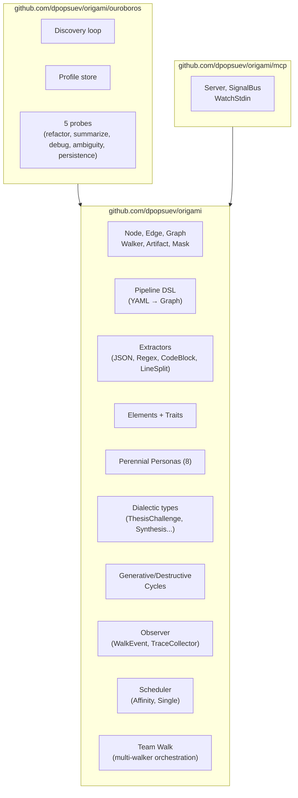

# Origami Architecture

## Overview

Origami (`github.com/dpopsuev/origami`) is a graph-based agentic pipeline framework. It provides typed interfaces and a YAML DSL for defining, walking, and observing agent pipelines. Zero domain imports — all domain logic lives in consumer tools.

## Layer diagram

## Package inventory

| Package | LOC (prod) | LOC (test) | Purpose |
|---------|-----------|-----------|---------|
| `github.com/dpopsuev/origami` | 2660 | 3797 | Core: Node, Edge, Graph, Walker, DSL, Extractors, Elements, Personas, Masks, Dialectic, Cycles |
| `origami/mcp/` | 124 | 123 | MCP server, signal bus, stdin watcher |
| `origami/ouroboros/` | 1103 | 1780 | Ouroboros (metacalibration): discovery, normalization, profiling |
| `origami/ouroboros/probes/` | 602 | 445 | 5 behavioral probes for LLM model fingerprinting |
| **Total** | **4489** | **6145** | |

## Key design invariants

1. **Zero domain imports.** Origami never imports from consumer tools (Asterisk, Achilles, etc.).
2. **Interface-driven.** Consumers implement `Node`, `Edge`, `Walker`, `Extractor` — the framework provides the orchestration.
3. **DSL-first.** Pipelines are declared in YAML and compiled to executable graphs via `BuildGraph`.
4. **Progressive disclosure.** A 10-line pipeline YAML is valid. Advanced features (zones, elements, extractors, masks) are opt-in.
5. **Reviewable formats.** All configuration and pipeline definitions are git-diffable text.

## Reference implementations

| Tool | Repository | Domain | Uses |
|------|-----------|--------|------|
| Asterisk | `github.com/dpopsuev/asterisk` | Test CI root-cause analysis | Full framework: DSL, Graph, Extractors, Elements, Personas, Masks, Dialectic, Ouroboros, MCP |
| Achilles | `github.com/dpopsuev/achilles` | AI-driven vulnerability discovery via meta-pattern recognition (initial targets: RHEL, OCP) | Core: DSL, Graph, Extractors, Elements, Observer |

## What Origami does NOT do

- **No I/O**: Never reads files, calls APIs, or touches the network. All I/O happens in consumer code.
- **No domain knowledge**: Doesn't know what "defect type" or "vulnerability" means. Knows nodes, edges, artifacts, walkers.
- **No LLM calls**: Model-agnostic. Adapters (stub, basic, cursor) live in consumer code.
