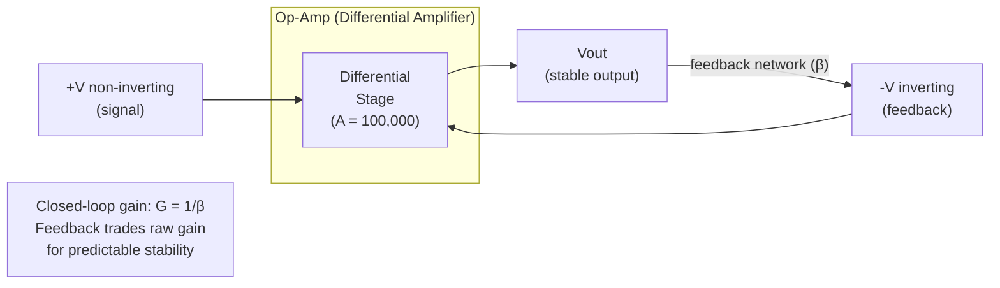
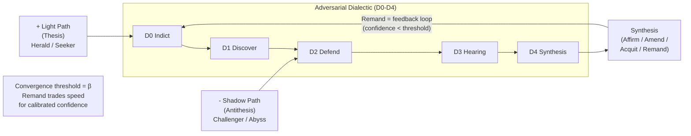

# Case Study: Electronic Circuit Theory — Signal Processing as Pipeline Orchestration

**Date:** 2026-03-01
**Subject:** Electronic circuit theory — analog, digital, and mixed-signal design principles
**Source:** `en.wikipedia.org/wiki/Electronic_circuit`, classical EE textbooks (Jaeger, Horowitz & Hill, Sedra & Smith)
**Purpose:** Cross-domain pattern study. Electronic circuits and agentic pipelines solve the same fundamental problem: transforming, routing, and conditioning signals through a graph of processing elements. Map circuit theory onto Origami's architecture. Identify patterns the framework could formalize or adapt. The central analogy — analog-to-digital conversion mirrors unstructured-to-structured extraction — opens into a deeper structural isomorphism.

---

## 1. What Electronic Circuits Are

An electronic circuit is a graph of components connected by conductive paths through which electric current flows. Components transform signals: amplify, filter, modulate, convert, store, route. The graph topology determines what the circuit does.

Circuits fall into three categories:

**Analog circuits** process continuous signals — voltage and current vary smoothly over time. Components: resistors (limit current), capacitors (store charge), inductors (resist change), transistors (amplify/switch), diodes (one-way flow). Design concerns: gain, bandwidth, noise, impedance matching. Analysis tools: Kirchhoff's laws (conservation of current and voltage), Ohm's law, transfer functions.

**Digital circuits** process discrete signals — voltages represent binary 0 or 1. Built from transistors wired as logic gates (AND, OR, NOT, XOR). Logic gates compose into arbitrarily complex computational functions. Design concerns: timing, propagation delay, power dissipation, race conditions. The key property: each gate **regenerates** the binary signal, so noise accumulated in one stage does not propagate to the next.

**Mixed-signal circuits** contain both analog and digital sections connected by converters. An **ADC** (analog-to-digital converter) samples a continuous signal and quantizes it into discrete values. A **DAC** (digital-to-analog converter) reconstructs a continuous signal from discrete values. Most real-world systems are mixed-signal: sensors produce analog data, processors work digitally, actuators need analog output.

---

## 2. The Core Analogy: ADC/DAC as Extraction/Rendering

The deepest structural parallel between circuit theory and Origami is at the analog-digital boundary.

### The ADC side: Extractor

An ADC takes a continuous, noisy, information-rich analog signal and converts it into a discrete, clean, machine-processable digital representation. An Origami `Extractor` does the same: it takes unstructured LLM output (natural language, free-form JSON, log fragments) and converts it into a typed Go struct implementing `Artifact`.

The ADC parameters map precisely:

| ADC Parameter | Origami Equivalent | Implication |
|---|---|---|
| **Sampling rate** (samples/sec) | Extraction attempts / retries | Too few samples = missed information. Too many = wasted compute. The Nyquist rate sets the minimum: sample at least 2x the highest-frequency component to avoid aliasing. In pipeline terms: the extraction schema must capture at least the essential structure of the LLM output, or the result is a distorted representation. |
| **Resolution** (bit depth) | Schema granularity | 8-bit ADC captures 256 levels; 16-bit captures 65,536. A coarse schema (`{category: string, confidence: float}`) is 8-bit. A fine schema (`{category, subcategory, evidence[], confidence, reasoning, alternatives[], caveats[]}`) is 16-bit. More resolution = more faithful representation = more downstream utility. |
| **Quantization error** | Information loss during extraction | The irreducible gap between the continuous input and its discrete representation. A 3-paragraph LLM analysis reduced to `{confidence: 0.72}` has high quantization error. The `Raw()` method on `Artifact` is Origami's way of preserving the original signal alongside the quantized version — analogous to storing both the digital samples and the original analog waveform. |
| **Anti-aliasing filter** | Prompt engineering / persona preamble | Before an ADC samples, an anti-aliasing low-pass filter removes frequencies above Nyquist to prevent aliasing (high-frequency content masquerading as low-frequency). In pipelines, the prompt preamble and persona instructions shape the LLM output *before* extraction, ensuring it falls within the extractor's "bandwidth." A poorly prompted LLM produces output the extractor cannot faithfully represent — aliasing. |
| **Oversampling** | Multiple extraction with voting | Some ADCs sample at many times the Nyquist rate, then downsample with digital filtering for better effective resolution. A pipeline could extract multiple times from the same LLM output using different schema projections, then merge — trading compute for fidelity. |

### The DAC side: Prompt Renderer

A DAC converts discrete digital values back into a continuous analog signal. In Origami, `RenderPrompt` converts structured context (variables, prior outputs, walker state) back into natural language prompts that LLMs consume.

| DAC Parameter | Origami Equivalent | Implication |
|---|---|---|
| **Reconstruction filter** | Prompt template smoothing | Raw DAC output is a staircase waveform (discrete steps). A reconstruction filter interpolates between steps to produce a smooth signal. A raw template (`Category: {{.category}}, Confidence: {{.confidence}}`) is a staircase. A well-crafted prompt that weaves structured data into natural narrative is a smooth reconstruction. |
| **Dynamic range** | Prompt expressiveness | The range of output voltages a DAC can produce. A rigid template has low dynamic range. A template system with conditionals, loops, and context-aware sections has high dynamic range — it can express a wider variety of structured inputs as coherent prompts. |
| **Glitch energy** | Prompt artifacts | When a DAC transitions between values, brief voltage spikes (glitches) appear. In prompts, poorly interpolated structured data creates artifacts: dangling references, contradictory instructions, formatting breaks. A deglitcher (sample-and-hold) in circuits; prompt validation in pipelines. |

### The symmetry insight

In circuit design, ADC and DAC are treated as **symmetric, equally important** conversions. Neither is an afterthought. They have dedicated components, specifications, and design attention.

In Origami today, the `Extractor` interface is first-class: named, registered, DSL-wirable, with built-in implementations (`JSONExtractor[T]`, `RegexExtractor`, `CodeBlockExtractor`). The prompt renderer (`RenderPrompt`) is a utility function — unregistered, not DSL-wirable, no named implementations.

Circuit theory says this asymmetry is a design smell. The structured-to-unstructured conversion (DAC) deserves the same architectural weight as the unstructured-to-structured conversion (ADC). A `Renderer` interface symmetric to `Extractor` — with named implementations, a registry, and DSL integration — would close this gap.

---

## 3. Concept Mapping: Circuit Theory to Origami

| Circuit Concept | Origami Equivalent | Mapping Rationale |
|---|---|---|
| **Transistor** (active element) | `Node` | The fundamental active processing unit. Transistors amplify or switch signals; nodes process artifacts. Both are the building blocks everything else composes from. |
| **Wire / trace** | `Edge` | Passive signal path between active elements. Wires carry current; edges carry artifacts and transitions. Both are defined by their endpoints and their properties (impedance / conditions). |
| **Resistor** (limits current) | Edge `when:` condition | Controls and limits signal flow. A resistor drops voltage proportional to current; a `when:` expression gates transitions proportional to artifact properties. Both prevent uncontrolled flow. |
| **Capacitor** (stores charge) | `WalkerState.Context` | Accumulates energy (charge / context) over time and releases it when needed. A capacitor integrates current into voltage; walker context integrates node outputs into accumulated state. Both have memory — they remember what happened before. |
| **Inductor** (resists change) | `Mask` (pre/post hooks) | Opposes sudden changes in current / processing behavior. An inductor smooths transients; a mask's pre-hook normalizes input and post-hook validates output, smoothing the signal around the node. Both add stability at the cost of latency. |
| **Diode** (one-way valve) | Shortcut edge | Allows current in one direction only, with a threshold voltage. A shortcut edge allows traversal only when confidence exceeds a threshold. Both implement conditional, one-directional flow. |
| **Op-amp** (differential amplifier) | Adversarial Dialectic | Takes two inputs (inverting and non-inverting), amplifies the difference. The Dialectic takes thesis and antithesis, amplifies their disagreement into a resolved synthesis. Both produce a single output from two competing inputs. High open-loop gain (unchecked dialectic) causes saturation; negative feedback (convergence criteria) stabilizes the output. |
| **Ground** (reference / sink) | `_done` node | The universal reference point and signal sink. All circuits reference to ground; all pipeline walks terminate at `_done`. |
| **Power supply** (VCC/VDD) | Input context + Walker identity | The energy source that powers every component. Without VCC, nothing operates. Without input context and a walker, no node can process. |
| **Bus** (data + address + control) | Papercup signal bus | Shared communication channel with structured protocol. A data bus carries payloads (artifacts), an address bus carries routing (dispatch IDs), a control bus carries status signals (waiting/processing/done). Papercup's three-part protocol mirrors this exactly. |
| **Clock signal** | Scheduler tick / dispatch cycle | Synchronization pulse for sequential operations. Digital circuits advance on clock edges; the dispatcher advances on poll cycles. Both ensure orderly, synchronized progression. |
| **Test point** | `WalkObserver` | Designated measurement insertion point. A test point lets an oscilloscope probe the signal without affecting it; `WalkObserver` lets Kami observe walk events without affecting execution. Both are designed-in observability. |
| **PCB / schematic** | Pipeline YAML (DSL) | Declarative design artifact describing the circuit topology. A schematic shows components and connections; pipeline YAML shows nodes and edges. Both are the source of truth that gets "compiled" into an executable form (fabricated PCB / `BuildGraph`). |
| **Breadboard** | Stub calibration | Rapid prototyping platform. A breadboard lets you wire components without soldering for quick verification; stub calibration lets you verify pipeline machinery without LLM calls. Both validate structure before committing to production. |
| **Production PCB** | `origami fold` | The final, optimized, manufactured form. A PCB is the breadboard prototype compiled into a production artifact. `origami fold` is the YAML pipeline compiled into a standalone binary. |
| **Component library** | Registries (`NodeRegistry`, `ExtractorRegistry`, `TransformerRegistry`) | Catalog of reusable, characterized parts. Component libraries specify every part's parameters; registries map names to implementations. Both enable design by composition from known building blocks. |

---

## Visual: Op-Amp as Adversarial Dialectic

The op-amp is the most instructive single-component analogy in this study. Its two-input, one-output, feedback-stabilized architecture maps directly onto Origami's Adversarial Dialectic.

### Op-Amp with Negative Feedback



The non-inverting input (+V) carries the signal. The inverting input (-V) carries a fraction of the output fed back through the feedback network (β). The differential stage amplifies the difference. Without feedback, the enormous open-loop gain (100,000x) drives the output to saturation on any tiny input difference. With feedback, the system self-corrects: output too high -> feedback increases inverting input -> difference shrinks -> output stabilizes.

### Origami Adversarial Dialectic (same topology)



### Reading the parallel

| Op-Amp | Adversarial Dialectic |
|---|---|
| Non-inverting input (+V) | Light Path thesis (Herald, Seeker analyze the case) |
| Inverting input (-V) | Shadow Path antithesis (Challenger, Abyss contest the thesis) |
| Differential stage | D0-D3: structured debate amplifying the disagreement |
| Output (Vout) | D4 Synthesis: reconciled verdict with calibrated confidence |
| Feedback network (β) | Remand loop: if confidence < threshold, feed output back as new thesis |
| Open-loop saturation | Unchecked dialectic: thesis or antithesis dominates without moderation |
| Closed-loop stability | Convergence: β limits gain so the system settles on a defensible answer |
| Gain-bandwidth tradeoff | Accuracy-speed tradeoff: more feedback (stricter threshold) = more stable but slower convergence |

The critical insight: an op-amp without feedback is useless (saturates instantly). A dialectic without convergence criteria is equally useless (loops forever or commits to the first strong argument). The feedback network / convergence threshold is not optional — it is the mechanism that transforms raw amplification into controlled, useful output.

---

## 4. Six Transferable Patterns

### Pattern 1: Signal Conditioning Chain

**Circuit principle:** Raw analog signals are never fed directly into an ADC. A signal conditioning chain — filter (remove noise), amplify (boost weak signals), level-shift (match voltage range) — prepares the signal for faithful conversion.

**Origami mapping:** The Mask pipeline (`MaskA.pre -> MaskB.pre -> Node.Process -> MaskB.post -> MaskA.post`) already implements signal conditioning. Masks before an extraction node are **anti-aliasing filters**: they shape the input to fall within the extractor's representable range.

**Insight:** This vocabulary helps pipeline designers reason about *why* certain masks exist. A `RecallMask` on an investigation node isn't just "adding context" — it's **amplifying a weak signal** so the extractor downstream can resolve it. A `CorrelationMask` isn't just "cross-referencing" — it's **filtering noise** by removing uncorrelated evidence. The signal conditioning metaphor makes mask placement a principled design decision rather than ad-hoc attachment.

**Possible adaptation:** Document mask placement guidelines using signal conditioning vocabulary. A pipeline design checklist: "Before every extraction boundary, verify the signal conditioning chain: noise filtered? signal amplified? level-shifted to match schema range?"

### Pattern 2: Mixed-Signal Architecture

**Circuit principle:** Real-world systems are almost never pure analog or pure digital. They are **mixed-signal**: analog sections for interfacing with the physical world, digital sections for computation, and converters (ADC/DAC) at the boundaries. Each domain has different design rules. Analog design cares about noise, bandwidth, impedance. Digital design cares about timing, logic correctness, propagation delay. The boundary between domains is the most critical design point.

**Origami mapping:** Origami pipelines are mixed-signal systems. Early pipeline stages (recall, investigation) operate in the "analog domain" — they deal with unstructured data, natural language, noisy LLM output. Later stages (judgment, synthesis) operate in the "digital domain" — they work with structured artifacts, typed fields, boolean decisions. The `Extractor` sits at the ADC boundary; `RenderPrompt` sits at the DAC boundary.

**Zones** map naturally to signal domains:
- **Analog zones** — Nodes that primarily consume and produce unstructured data (backcourt / intake)
- **Digital zones** — Nodes that primarily consume and produce structured artifacts (frontcourt / synthesis)
- **Mixed zones** — Nodes that convert between domains (the ADC/DAC boundary)

**Insight:** Treating zones as signal domains changes how pipeline designers think about node placement. Moving a structured-output node into an analog zone is like putting a digital IC on an analog board without proper decoupling — it will work, but suboptimally. The framework could warn when a node with `schema:` (digital) is placed in a zone dominated by unstructured processing (analog), or vice versa.

**Possible adaptation:** An optional `domain:` annotation on zones (`analog`, `digital`, `mixed`) that feeds into pipeline linting. The linter checks that extraction nodes sit at analog-to-digital zone boundaries, and prompt rendering happens at digital-to-analog boundaries.

### Pattern 3: Impedance Matching

**Circuit principle:** Maximum power transfer between a source and load occurs when their impedances are conjugate-matched. Mismatched impedance causes signal reflection — energy bounces back instead of being absorbed. In RF design, impedance mismatch is measured as VSWR (voltage standing wave ratio): 1:1 is perfect, higher ratios mean more reflection and less useful power transfer.

**Origami mapping:** The `AffinityScheduler` already implements impedance matching: it selects walkers whose `Element` best matches a node's `ElementAffinity`. Fire walkers on Fire nodes = matched impedance = maximum "power transfer" (processing effectiveness). A Water walker on a Lightning node = mismatched impedance = signal reflection (the walker's deep, methodical nature fights the node's need for speed).

**Insight:** Circuit theory quantifies mismatch as a ratio, not a boolean. The `AffinityScheduler` currently picks the "best" match, but doesn't quantify *how much* quality degrades from a suboptimal match. An **impedance mismatch score** (0.0 = perfect match, 1.0 = total mismatch) on each walker-node assignment would let the framework:
- Log mismatch warnings when assignments exceed a threshold
- Feed mismatch data into calibration metrics (does high mismatch correlate with lower M1?)
- Let pipeline designers tune `stickiness` based on empirical mismatch data

**Possible adaptation:** Add a `Mismatch(walker, node) float64` method to `AffinityScheduler` that returns a quantified impedance ratio. Expose it via `WalkObserver` events so Kami can visualize mismatched assignments in the graph.

### Pattern 4: Negative Feedback for Stability

**Circuit principle:** An op-amp without feedback has open-loop gain of ~100,000. Any tiny input difference drives the output to the supply rails (saturation). **Negative feedback** — feeding a fraction of the output back to the inverting input — trades gain for stability. The closed-loop gain becomes predictable: `G = 1/β` where β is the feedback fraction. The system self-corrects: if the output drifts high, the feedback drives it back down.

**Origami mapping:** Loop edges with convergence thresholds are negative feedback circuits. Each iteration through the loop compares the current output (confidence, completeness) against a target. If the output hasn't converged, the loop iterates again with corrective input. `Element.ConvergenceThreshold` is the feedback fraction β: it determines how much "error" (distance from target) is tolerable before the loop exits.

**Insight:** Circuit theory provides precise vocabulary for loop tuning:
- **Underdamped** (β too low, gain too high): the loop oscillates — successive iterations swing between overconfident and underconfident without converging. This is a pipeline that loops 3 times and produces wildly different answers each time.
- **Overdamped** (β too high, gain too low): the loop converges too slowly — it takes many iterations to reach an adequate answer, wasting compute. This is a pipeline with overly strict convergence criteria.
- **Critically damped** (β optimal): the loop converges in the minimum number of iterations without oscillation. This is the calibration target.
- **Instability** (positive feedback): if the loop amplifies rather than corrects errors, the system runs away. This is a pipeline where each iteration makes the output *worse* — a signal to break the loop and escalate to the Dialectic.

**Possible adaptation:** Track convergence trajectory across loop iterations. If confidence oscillates (increases then decreases then increases), flag as underdamped. If confidence barely changes per iteration, flag as overdamped. Log these as calibration signals.

### Pattern 5: Kirchhoff's Current Law — Data Conservation

**Circuit principle:** At every node in a circuit, the sum of currents entering equals the sum of currents leaving (KCL). No charge is created or destroyed. This is a conservation law — it holds unconditionally and is the basis of all circuit analysis.

**Origami mapping:** Every piece of evidence entering a node should be accounted for in the output — preserved, transformed, or explicitly discarded with justification. If a recall node surfaces 5 evidence items and the investigation node's artifact references only 2, what happened to the other 3? Were they irrelevant (legitimate filtering) or were they lost (information leak)?

**Insight:** KCL is not enforced in Origami today. A node can silently drop evidence. The `ArtifactSchema` validates output structure but not output completeness relative to input. Circuit theory says this is a fundamental gap: every junction must conserve current.

The pipeline equivalent of KCL: for every evidence item in a node's input, the output artifact must either (a) reference it, (b) transform it into a new form, or (c) explicitly declare it irrelevant with rationale. Option (c) is the "evidence drain" — current flowing to ground. It's legitimate, but it must be explicit.

**Possible adaptation:** An optional `evidence_conservation: strict` flag on nodes that activates input/output evidence tracking. The framework counts evidence items in and evidence items out (referenced + transformed + explicitly drained). A conservation violation triggers a warning via `WalkObserver`. Not a hard gate (too rigid for early pipeline stages), but a measurable signal for calibration tuning.

### Pattern 6: Decoupling Capacitors — Context Isolation

**Circuit principle:** Every IC has decoupling capacitors (typically 100nF ceramic) placed physically close to its power pins. Their purpose: prevent high-frequency noise generated by one chip from propagating through the power rail to affect other chips. They act as local energy reservoirs that absorb transient current demands, keeping the power supply clean for neighboring components.

**Origami mapping:** `WalkerState.Context` is a shared power rail — context accumulated at one node is available at all subsequent nodes. This is powerful (any node can access any prior context) but dangerous (noise from one node can pollute another's processing). A node that adds verbose, partially-relevant context to the walker state is injecting noise onto the shared rail.

**Insight:** Zone boundaries should act as decoupling capacitors. When a walker crosses from one zone to another, the context should be filtered: persistent, validated context (DC component — stable, always-relevant facts) passes through, while transient, speculative context (AC component — intermediate hypotheses, raw LLM fragments) is blocked or attenuated.

**Possible adaptation:** A `context_filter` field on zone definitions that specifies which context keys propagate across the zone boundary. Keys not listed are available within the zone but stripped when the walker exits. This prevents investigation-phase speculation from leaking into judgment-phase processing.

```yaml
zones:
  investigation:
    nodes: [recall, investigate, correlate]
    context_filter:
      pass: [evidence, artifacts, timeline]
      block: [raw_llm_output, intermediate_hypotheses]
  judgment:
    nodes: [judge, synthesize]
```

---

## 5. Gaps Illuminated by the Analogy

### Gap 1: DAC is not first-class

`RenderPrompt` is a utility function. `Extractor` is a registered, named, DSL-wirable interface with built-in implementations. In circuit design, treating the DAC as less important than the ADC would be a fundamental engineering error — both conversions are critical to system performance.

A `Renderer` interface symmetric to `Extractor` would:
- Be named and registered (`RendererRegistry`)
- Be DSL-wirable (`renderer: narrative-v1` on node definitions)
- Have built-in implementations (`TemplateRenderer`, `StructuredRenderer`, `NarrativeRenderer`)
- Participate in pipeline validation (`Validate()` checks renderer references)

This closes the ADC/DAC symmetry gap and elevates prompt construction from ad-hoc string formatting to a principled, testable, swappable pipeline component.

### Gap 2: No signal integrity metric

Circuits measure **signal-to-noise ratio** (SNR) at every stage. A signal chain with 60dB SNR at the input and 20dB SNR at the output has lost 40dB of signal quality — something is wrong.

Origami has `Confidence()` on artifacts, but no measure of **evidence preservation** through the pipeline. A node might output high confidence while silently discarding half the input evidence. Confidence measures the node's self-assessed certainty; SNR would measure how much of the input signal survived processing.

A pipeline-level evidence SNR metric would track: (evidence items referenced in output) / (evidence items available in input). Monotonically decreasing SNR across the pipeline is expected (each stage focuses the signal). A sudden drop at a specific node flags it as a lossy stage worth investigating.

### Gap 3: No power budget equivalent

Circuits have strict power budgets. Each component's power consumption is specified, and the total must not exceed the supply's capacity. Thermal analysis ensures no component overheats.

Origami has the `Safety > Speed` principle and the 50,000x ROI argument, but no per-node cost tracking. A `token_budget` or `cost_ceiling` on nodes would not gate execution (accuracy wins unconditionally) but would provide visibility: "This node consumed 15,000 tokens — 3x its typical budget. Is the prompt too verbose, or is the input unusually complex?"

This is an observability feature, not a throttling feature — consistent with `Safety > Speed` while adding cost awareness.

### Gap 4: No thermal throttling / backpressure

When a circuit's junction temperature exceeds its rating, thermal protection kicks in: the component reduces its operating frequency or shuts down to prevent damage. This is **backpressure** — the system protects itself from overload.

When an LLM API rate-limits or a dispatcher queue fills up, Origami has no backpressure mechanism. The framework could formalize:
- **Rate limiting** — maximum dispatch frequency per node or zone
- **Circuit breaker** — after N consecutive failures at a node, pause and escalate rather than retry indefinitely
- **Thermal budget** — track cumulative latency per walk; if it exceeds a threshold, the walk signals distress via `WalkObserver`

These patterns are standard in distributed systems (Hystrix, resilience4j) and universal in circuit design. They would complement the existing timeout SLAs in `agent-operations.mdc`.

---

## 6. Architectural Reflection

Electronic circuits and agentic pipelines are different instances of the same abstract architecture: **signal processing graphs**. Both route signals through active processing elements connected by conditional paths, with feedback loops for stability and converters at domain boundaries.

The key differences:

| Dimension | Electronic Circuit | Origami Pipeline |
|---|---|---|
| Signal type | Electrical (voltage/current) | Informational (artifacts/context) |
| Processing | Deterministic (physics) | Stochastic (LLM) |
| Noise source | Thermal, electromagnetic | Hallucination, ambiguity, prompt sensitivity |
| Feedback speed | Nanoseconds | Seconds to minutes |
| Design tool | SPICE simulation | Stub/dry/wet calibration |
| Failure mode | Smoke, shorts, oscillation | Wrong answers, loops, confidence collapse |

The stochastic nature of LLM processing is the fundamental difference. A resistor always obeys Ohm's law. An LLM node might produce different output for identical input. This means circuit-inspired patterns must be adapted with tolerance for non-determinism:
- Impedance matching becomes probabilistic affinity, not exact conjugate match
- KCL becomes evidence accounting, not exact conservation
- Convergence becomes statistical trend, not monotonic decrease
- Signal conditioning becomes prompt shaping, not precise filtering

Despite this, the structural patterns transfer remarkably well. The mixed-signal architecture pattern in particular reframes pipeline design: stop thinking of pipelines as uniform processing chains and start thinking of them as systems with distinct signal domains, critical conversion boundaries, and domain-specific design rules.

---

## 7. Actionable Takeaways

1. **Renderer interface (DAC symmetry)** — Define a `Renderer` interface symmetric to `Extractor`: `Name() string`, `Render(ctx context.Context, data any) (string, error)`. Add `RendererRegistry`. Wire into DSL via `renderer:` field on nodes. This closes the most significant gap the analogy reveals — the asymmetric treatment of the two conversion directions.

2. **Mixed-signal zone annotations** — Add an optional `domain:` field to `ZoneDef` (`analog`, `digital`, `mixed`). Feed into `origami lint` to warn about extraction nodes outside analog-digital boundaries and structured nodes in analog zones. Low-cost DSL addition with design-time value.

3. **Context filter on zone boundaries** — Add `context_filter:` to `ZoneDef` with `pass` and `block` lists. When a walker crosses a zone boundary, strip blocked keys from `WalkerState.Context`. This is the decoupling capacitor pattern — prevents context noise from propagating across domain boundaries.

4. **Impedance mismatch scoring** — Add `Mismatch(walkerElement, nodeElement) float64` to the affinity calculation. Expose via `WalkObserver` so Kami can visualize mismatched assignments. Feed into calibration metrics to correlate mismatch with outcome quality.

5. **Convergence trajectory tracking** — Track confidence values across loop iterations. Classify as underdamped (oscillating), overdamped (stagnant), critically damped (optimal), or unstable (diverging). Log classification via `WalkObserver`. Use as a calibration signal for tuning `Element.ConvergenceThreshold`.

6. **Evidence SNR metric** — Track evidence item counts at node input and output boundaries. Compute per-node and per-walk SNR. Surface in calibration reports alongside confidence scores. This makes evidence preservation measurable rather than assumed.

7. **Signal conditioning vocabulary in docs** — Adopt circuit conditioning vocabulary (anti-aliasing, amplification, level-shifting, impedance matching) in mask and pipeline design documentation. No code change needed — purely a conceptual framework that helps pipeline designers make principled mask placement decisions.

---

## References

- Electronic circuit fundamentals: `en.wikipedia.org/wiki/Electronic_circuit`
- ADC principles: `en.wikipedia.org/wiki/Analog-to-digital_converter`
- DAC principles: `en.wikipedia.org/wiki/Digital-to-analog_converter`
- Kirchhoff's circuit laws: `en.wikipedia.org/wiki/Kirchhoff%27s_circuit_laws`
- Impedance matching: `en.wikipedia.org/wiki/Impedance_matching`
- Negative feedback: `en.wikipedia.org/wiki/Negative_feedback`
- Signal conditioning: `en.wikipedia.org/wiki/Signal_conditioning`
- Mixed-signal IC design: `en.wikipedia.org/wiki/Mixed-signal_integrated_circuit`
- Origami Extractor: `extractor.go` (Extractor interface, ExtractorRegistry, built-in extractors)
- Origami Prompt Rendering: `render.go` (RenderPrompt utility)
- Origami Elements: `element.go` (6 elements, quantified traits, ConvergenceThreshold)
- Origami Masks: `mask.go` (composable behavioral middleware, pre/post hooks)
- Origami Zones: `dsl.go` (ZoneDef, stickiness, element affinity)
- Origami Artifact: `node.go` (Artifact interface, Confidence, Raw)
- Origami AffinityScheduler: `scheduler.go` (walker-node matching)
- Origami WalkObserver: `observer.go` (observability events)
- Origami Adversarial Dialectic: `dialectic.go` (D0-D4, thesis-antithesis-synthesis)
- Related case studies: `langgraph-graph-duality.md` (graph philosophy), `cloud-native-pipeline-tools.md` (infrastructure patterns)
