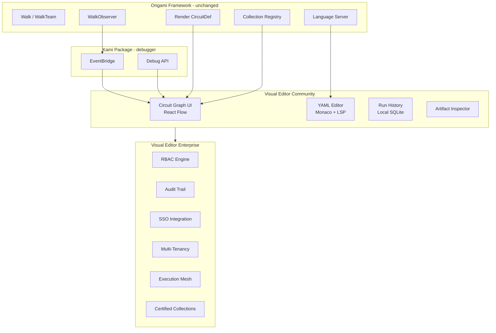
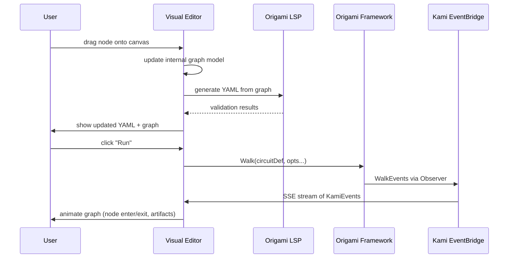

# Case Study: Visual Editor Landscape — Excalidraw, Mermaid, Ansible Automation Controller

**Date:** 2026-02-25  
**Subject:** Three visual editor products with distinct business models — Excalidraw (open-source canvas + SaaS), Mermaid (text-to-diagram + SaaS), Ansible Automation Controller (open-core control plane)  
**Source:** `github.com/excalidraw/excalidraw`, `github.com/mermaid-js/mermaid`, `redhat.com/en/technologies/management/ansible/automation-controller`  
**Purpose:** Analyze three business models for visual editor products. Determine the optimal monetization strategy for Origami's Visual Editor. Answer: is the UI the money maker, or a freemium community tool?

---

## 1. Three Products, Three Models

Each product separates a free engine from a paid experience layer, but the boundary between free and paid — and what customers actually pay for — differs fundamentally.

| Dimension | Excalidraw | Mermaid | Ansible Automation Controller |
|-----------|-----------|---------|-------------------------------|
| **Engine** | Canvas renderer (React, MIT, npm package) | Text-to-diagram parser (JS, MIT, npm/CDN) | Ansible engine (Python, GPL) |
| **Free UI** | excalidraw.com — local-first, PWA, single-user | Mermaid Live Editor — browser-based rendering | AWX — upstream open-source control plane |
| **Paid product** | Excalidraw+ — collaboration, E2E encryption, shared workspaces | Mermaid Chart — team collaboration, version history, enterprise SSO | Automation Controller — RBAC, audit, workflow viz, multi-tenancy, mesh |
| **Revenue model** | SaaS subscription (individual/team) | SaaS subscription + sponsorships | Enterprise subscription (annual, per-node) |
| **What customers pay for** | Real-time collaboration + persistence | Team features + enterprise auth | Governance + scale + support |
| **Stars** | 117k | 86k | N/A (closed source; AWX: 14k) |
| **License** | MIT | MIT | Proprietary (AWX: Apache 2.0) |

---

## 2. Excalidraw: Open Source + SaaS (Collaboration Layer)

### 2.1 Architecture

Excalidraw is a React component library that renders a hand-drawn-style infinite canvas. The core editor is an npm package (`@excalidraw/excalidraw`) that anyone can embed in their application.

- **Core** (free): Canvas renderer, shape tools, export (PNG/SVG/clipboard), open `.excalidraw` JSON format, dark mode, shape libraries, i18n, zoom/pan.
- **excalidraw.com** (free): Minimal showcase app. Local-first (autosaves to browser). PWA (works offline). Shareable readonly links.
- **Excalidraw+** (paid): Real-time collaboration, E2E encryption, persistent workspaces, team management, library sharing.

### 2.2 Business model

The npm package is the distribution engine — it creates a massive embed ecosystem (VS Code extension, Obsidian plugin, Notion integration, Google Cloud, Meta, CodeSandbox). Each embed drives awareness back to Excalidraw+.

The free product is genuinely useful as a standalone tool. The paid boundary is **collaboration** — the moment you need to work with others in real-time or persist across devices, you upgrade.

### 2.3 Relevance to Origami

Excalidraw's **embeddable component model** is relevant. The canvas renderer is a reusable building block that third parties embed. For Origami, the circuit graph renderer (React Flow) could similarly be distributed as an embeddable component — any tool built on Origami could embed the graph visualization without building their own.

The **collaboration-as-premium** boundary is less relevant. Circuit authoring is primarily a developer activity (YAML-first, AI-first authoring per the vision), not a collaborative whiteboard activity. Real-time co-editing of circuit YAML is handled by existing tools (VS Code Live Share, IDE collaboration).

---

## 3. Mermaid: Open Source + SaaS (Team Layer)

### 3.1 Architecture

Mermaid is a JavaScript text-to-diagram renderer. Users write markdown-like syntax; Mermaid produces SVG diagrams (flowcharts, sequence diagrams, Gantt charts, class diagrams, state diagrams, Git graphs, pie charts, C4, and more).

- **Core** (free): Text parser + SVG renderer. Markdown integration (GitHub, GitLab, Notion). CDN delivery. CLI (`mermaid-cli`). 13 diagram types.
- **Mermaid Live Editor** (free): Browser-based editor with instant preview. Export to SVG/PNG/Mermaid URL. No account needed.
- **Mermaid Chart** (paid): Team collaboration, version history, enterprise SSO, integrations (Confluence, Slack, VS Code), presentation mode, AI diagram generation.

### 3.2 Business model

Mermaid's moat is **ubiquity** — it's embedded in GitHub markdown, GitLab, Notion, Obsidian, and dozens of documentation tools. The text-to-diagram format is the standard. Mermaid Chart monetizes the team/enterprise audience that needs governance, collaboration, and integrations beyond what markdown embedding provides.

Revenue combines SaaS subscriptions with community sponsorships. The 86k-star community creates a flywheel: more integrations attract more users, which attract more sponsorships and enterprise customers.

### 3.3 Relevance to Origami

Mermaid's approach is directly relevant because **Origami already uses Mermaid** — `Render(def)` produces Mermaid flowcharts from `CircuitDef`. The circuit visualization in Kami and the Visual Editor should leverage Mermaid as the text-based representation while adding interactive capabilities on top.

The **text-to-diagram as lingua franca** lesson matters: Origami's circuit YAML is already a text representation that can generate diagrams. The Visual Editor should be bidirectional — edit the graph visually, see the YAML update; edit the YAML, see the graph update. Like Mermaid Live Editor but for circuit graphs with execution state.

---

## 4. Ansible Automation Controller: Open Core (Control Plane)

### 4.1 Architecture

Ansible Automation Controller (formerly Ansible Tower) is the web-based management layer for Red Hat Ansible Automation Platform. The open-source upstream is AWX.

- **Ansible engine** (free): Python automation engine. Playbooks, roles, modules, inventory. GPL licensed.
- **AWX** (free): Open-source control plane. Web UI, REST API, RBAC, job templates, inventories, credentials, scheduling. Apache 2.0 licensed.
- **Automation Controller** (paid): Enterprise-hardened AWX. Part of Ansible Automation Platform subscription. Adds:
  - **Automation mesh** — distributed, modular architecture for scaling execution across sites
  - **Execution environments** — containerized, portable automation runtimes
  - **Certified content** (Automation Hub) — Red Hat-certified, enterprise-grade collections
  - **Enterprise SSO** — LDAP, SAML, OIDC integration
  - **Audit and compliance** — centralized logging, activity streams, change tracking
  - **Support** — 24/7 enterprise SLA
  - **Topology viewer** — visual representation of automation mesh nodes

### 4.2 Business model

This is Red Hat's proven open-core playbook:

1. **The engine is free** — Ansible is the most widely used automation tool in IT. Free distribution builds community, mindshare, talent pool, and ecosystem (4,200+ collections on Galaxy).
2. **The control plane is the product** — Enterprises don't pay for `ansible-playbook`. They pay for the ability to "define, operate, scale, and delegate automation across your enterprise." That's the Automation Controller value proposition.
3. **Certified content is a second revenue stream** — Automation Hub provides curated, tested, supported collections. This is content-as-a-service alongside platform-as-a-service.
4. **Support is the third pillar** — 24/7 SLA, security patches, lifecycle management.

The key insight is **audience segmentation**: developers use the engine (free). Operations teams, team leads, and enterprise architects use the controller (paid). The paid product serves a different persona than the free product.

### 4.3 Why enterprises pay

Enterprises pay for Automation Controller because of four needs the engine cannot satisfy:

| Need | Engine (free) | Controller (paid) |
|------|---------------|-------------------|
| **Governance** | SSH keys on laptops | RBAC, credential vaulting, audit trails |
| **Scale** | One operator runs playbooks | Automation mesh distributes across sites |
| **Delegation** | DevOps runs everything | Job templates let non-experts trigger automation safely |
| **Visibility** | Terminal output | Dashboard, run history, centralized logging |

These four needs — governance, scale, delegation, visibility — are the pillars of the enterprise value proposition. They apply to any domain, including agentic circuit orchestration.

### 4.4 The AWX upstream model

AWX is the community edition of Automation Controller. It provides the core web UI, API, RBAC, and job management — but without enterprise support, certification, mesh, or lifecycle guarantees. AWX users accept community-supported quality in exchange for zero cost.

This dual-track model is critical: it demonstrates that the control plane can be open source without cannibalizing the commercial product. Enterprise customers pay for hardening, support, and certification — not for the code itself. Red Hat has proven this model across RHEL (Fedora upstream), OpenShift (OKD upstream), and Ansible (AWX upstream).

---

## 5. Business Model Recommendation: Open Core (Ansible Model)

### 5.1 The mapping

| Ansible | Origami | Role |
|---------|---------|------|
| Ansible engine | Origami framework | Free, open source. Builds community and ecosystem. |
| AWX | Visual Editor Community Edition | Free, open-source control plane. Proves the product, builds trust. |
| Automation Controller | Visual Editor Enterprise Edition | Paid subscription. RBAC, multi-tenancy, audit, SSO, mesh, support. |
| Automation Hub | Collections Registry | Paid certified content. Curated, tested, supported collections. |
| Ansible Galaxy | Collections Community Registry | Free community content. User-contributed collections. |

### 5.2 Why the Ansible model fits

**Audience segmentation is natural.** Origami already has two distinct audiences:

- **Circuit developers** (CLI, YAML, Go API) — they write circuits, build collections, tune prompts. They are the community. They use the framework directly.
- **Circuit operators** (visual builder, run management, team coordination) — they deploy, monitor, delegate, and audit circuits. They are the enterprise customers. They use the Visual Editor.

This matches Ansible's developer/operator split exactly.

**Red Hat alignment.** Origami is a Red Hat telco QE tool. Red Hat invented and perfected the open-core model. The Visual Editor as an enterprise product follows the same playbook as every successful Red Hat product: open engine + commercial control plane.

**The control plane is genuinely worth paying for.** The four enterprise needs (governance, scale, delegation, visibility) are not artificial feature gates — they are real requirements that appear the moment automation moves from one developer's laptop to a team, department, or organization.

### 5.3 What goes in each edition

| Feature | Community (free) | Enterprise (paid) |
|---------|-----------------|-------------------|
| Circuit graph visualization | Yes | Yes |
| Drag-and-drop circuit builder | Yes | Yes |
| Mermaid rendering | Yes | Yes |
| Run history (local) | Yes | Yes |
| Artifact inspection | Yes | Yes |
| Kami live debugger integration | Yes | Yes |
| YAML editor with LSP | Yes | Yes |
| Single-user, localhost | Yes | Yes |
| **RBAC** (roles, permissions, teams) | — | Yes |
| **Multi-tenancy** (org isolation) | — | Yes |
| **Audit trail** (who ran what, when) | — | Yes |
| **Enterprise SSO** (LDAP, SAML, OIDC) | — | Yes |
| **Certified collections** (from registry) | — | Yes |
| **Automation mesh** (distributed execution) | — | Yes |
| **Centralized logging** (aggregation, search) | — | Yes |
| **Scheduled runs** (cron, event-triggered) | — | Yes |
| **Enterprise support** (SLA, patches) | — | Yes |
| **Topology viewer** (multi-site visualization) | — | Yes |

The boundary is clear: **single user with full functionality is free. Team, governance, and scale features are enterprise.** This ensures the free product is genuinely useful (not crippled), while enterprise features address needs that only appear at organizational scale.

### 5.4 Why NOT SaaS-only (Excalidraw/Mermaid model)

The Excalidraw/Mermaid SaaS model works for lightweight tools where the value is convenience and collaboration. For enterprise infrastructure automation — where circuits process sensitive data, access internal systems, and run inside corporate networks — customers need on-premise deployment, not cloud-hosted SaaS. Red Hat's subscription model (deploy on your infrastructure, we support it) is the right fit.

SaaS could be a supplementary offering (hosted Visual Editor for evaluation, small teams, CI/CD integration), but the primary revenue model should be on-premise subscription, consistent with Red Hat's portfolio.

---

## 6. Feature Mapping: What to Take from Each Product

### 6.1 From Excalidraw

| Feature | Relevance | Priority |
|---------|-----------|----------|
| **Embeddable component** (npm package) | High — circuit graph renderer as a reusable React component. Consumers embed in their own UIs. | Should |
| **Hand-drawn aesthetic** | Low — circuits need clarity, not charm | — |
| **Infinite canvas** | Medium — large circuits with many zones benefit from pan/zoom/canvas | Nice |
| **Shape libraries** | Medium — reusable node families, transformer icons, element symbols | Nice |
| **Local-first / PWA** | High — developers want offline access, instant startup, no server dependency | Should |
| **Open export format** (.excalidraw JSON) | High — circuit state as JSON/YAML, importable/exportable | Must |

### 6.2 From Mermaid

| Feature | Relevance | Priority |
|---------|-----------|----------|
| **Text-to-diagram** (bidirectional) | Critical — edit YAML, see graph update; edit graph, see YAML update | Must |
| **Markdown embedding** | High — embed circuit diagrams in documentation, PRs, readmes | Should |
| **Multiple diagram types** | Medium — circuit graph is primary, but run timeline (Gantt), agent relationships (sequence), zone topology (state) add value | Nice |
| **Live preview** | Critical — instant rendering as YAML changes. Already proven in Mermaid Live Editor. | Must |
| **CLI rendering** | High — `origami render circuit.yaml --format svg` for CI circuits, documentation generation | Should |
| **AI diagram generation** | Medium — generate circuit YAML from natural language description (AI-first authoring from vision) | Nice |

### 6.3 From Ansible Automation Controller

| Feature | Relevance | Priority |
|---------|-----------|----------|
| **Job templates** | Critical — reusable circuit run configurations with pinned vars, credentials, inventories | Must |
| **Workflow visualizer** | Critical — multi-circuit orchestration with conditional branching. Maps directly to Origami's graph. | Must |
| **RBAC** | Critical — enterprise gate. Roles, teams, org permissions. | Must (enterprise) |
| **Credential management** | High — BYOA pattern implemented in UI. Credential injection without exposure. | Must (enterprise) |
| **Inventory management** | High — target environments, knowledge sources, data sources managed centrally | Should (enterprise) |
| **Automation mesh** | High — distributed execution across sites. Maps to MuxDispatcher + network dispatch. | Should (enterprise) |
| **Topology viewer** | Medium — visualize execution topology (workers, zones, providers) | Nice (enterprise) |
| **Centralized logging** | High — aggregated run logs, searchable, filterable | Must (enterprise) |
| **Activity streams** | High — audit trail of every action (who changed what, when) | Must (enterprise) |
| **Scheduled/event runs** | Medium — cron-triggered circuit runs, webhook-triggered runs | Should (enterprise) |

---

## 7. Architecture Sketch

### 7.1 Component boundary

The Visual Editor is a **separate product** consuming Origami's structured output. The framework has no dependency on the editor.

### 7.2 Data flow

---

## 8. Competitive Landscape Summary

| Dimension | Excalidraw | Mermaid | Ansible Controller | Origami Visual Editor |
|-----------|-----------|---------|--------------------|-----------------------|
| **Core strength** | Canvas UX | Text-to-diagram ubiquity | Enterprise governance | Circuit orchestration + AI agents |
| **Free boundary** | Full editor, single-user | Full renderer + live editor | AWX (full UI, community support) | Full editor, single-user, local |
| **Paid boundary** | Collaboration | Team features + SSO | RBAC + mesh + support + certified content | RBAC + mesh + audit + SSO + certified collections |
| **Revenue model** | SaaS sub | SaaS sub + sponsors | Enterprise subscription | Enterprise subscription |
| **Deploy model** | Cloud-hosted | Cloud-hosted | On-premise + cloud | On-premise + cloud |
| **Target customer** | Designers, PMs | Developers, tech writers | IT operations, DevOps teams | Circuit operators, QE leads, DevOps |

---

## 9. Actionable Takeaways

1. **Follow the Ansible open-core model.** The framework is the engine (free, community-building). The Visual Editor is the control plane (enterprise product). This is Red Hat's proven playbook across RHEL, OpenShift, and Ansible. The UI is the money maker — not because it gates basic functionality, but because it serves enterprise needs (governance, scale, delegation, visibility) that the CLI/framework cannot.

2. **Ship a genuine Community Edition.** AWX proves that an open-source control plane doesn't cannibalize the commercial product. The Community Edition must be fully functional for single-user use — not a crippled trial. Enterprise features (RBAC, multi-tenancy, audit, SSO) only matter at organizational scale.

3. **Bidirectional YAML-graph editing is the killer feature.** Neither Excalidraw (visual-only) nor Mermaid (text-only in practice) offers true bidirectional editing. Edit the graph, see YAML update. Edit YAML, see graph update. This uniquely serves the Origami audience because circuit developers think in YAML while circuit operators think in graphs.

4. **Embed Kami, don't replace it.** Kami is the debugger. The Visual Editor is the management plane. They share the graph visualization (React Flow) and event source (EventBridge) but serve different use cases. Kami is for development-time debugging. The Visual Editor is for operational management.

5. **Collections Registry as second revenue stream.** Following Ansible's Automation Hub model, a curated registry of certified collections (tested, supported, versioned) creates recurring revenue beyond the platform subscription. Community collections on a free Galaxy-style registry drive ecosystem growth.

6. **Graph renderer as embeddable component.** Following Excalidraw's npm package strategy, the circuit graph renderer should be distributable as a standalone React component. This lets every Origami consumer embed circuit visualization without building their own.

---

## References

- Excalidraw repository: `github.com/excalidraw/excalidraw` (117k stars, MIT license)
- Excalidraw documentation: `docs.excalidraw.com`
- Mermaid repository: `github.com/mermaid-js/mermaid` (86k stars, MIT license)
- Mermaid documentation: `mermaid.js.org/intro/`
- Mermaid Chart: `mermaid.ink` (commercial SaaS)
- Ansible Automation Controller: `redhat.com/en/technologies/management/ansible/automation-controller`
- AWX repository: `github.com/ansible/awx` (14k stars, Apache 2.0)
- Red Hat Ansible Automation Platform pricing: `redhat.com/en/technologies/management/ansible/pricing`
- Origami Circuit Studio spec: `contracts/completed/framework/origami-circuit-studio.md`
- Origami Kami debugger: `contracts/draft/kami-live-debugger.md`
- Origami Collections: `contracts/draft/origami-collections.md`
- Origami LSP: `contracts/draft/origami-lsp.md`
- Origami vision: `strategy/origami-vision.mdc` (Product Topology section)
- Related case studies: `ansible-collections.md` (distribution model), `crewai-crews-and-flows.md` (CrewAI AMP Suite comparison)
