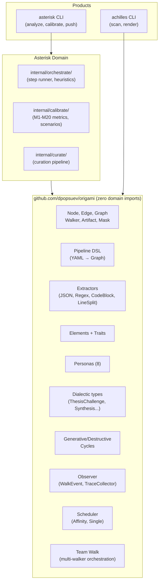

# Origami — Agentic Pipeline Framework

A design document for the graph-based agent orchestration engine. This is not API documentation — it explains *why* the framework exists and *how* it thinks.

**Source:** `github.com/dpopsuev/origami` (~4,500 lines, zero domain imports)  
**Try it:** `go run ./examples/framework/`  
**Second tool:** `achilles scan .` (Achilles at `github.com/dpopsuev/achilles` — vulnerability scanner proving the framework works for any domain)

---

## Table of Contents

1. [The Three CLIs](#the-three-clis)
2. [Extractors](#extractors)
3. [The Metaphor](#the-metaphor)
4. [Elements](#elements)
5. [Personas](#personas)
6. [Pipeline DSL](#pipeline-dsl)
7. [Graph Walk](#graph-walk)
8. [Walk Observability](#walk-observability)
9. [Vocabulary and Narration](#vocabulary-and-narration)
10. [Scheduler](#scheduler)
11. [Team Walk](#team-walk)
12. [Masks](#masks)
13. [Adversarial Dialectic](#adversarial-dialectic)
14. [Cycles](#cycles)
15. [Architecture](#architecture)

---

## The Three CLIs

Every tool built on Origami ships three distinct CLI surfaces, each serving a different persona in the development lifecycle:

| Phase | Persona | CLI Surface | Purpose |
|-------|---------|-------------|---------|
| **1. Dataset Developer** | Builds ground truth | `<tool> dataset` | Fetch, extract, validate, and promote evidence into structured ground truth records |
| **2. Pipeline Developer** | Calibrates the pipeline | `<tool> calibrate` | Measure pipeline accuracy against ground truth, tune the agentic workflow |
| **3. End-User** | Uses the tool in production | `<tool> run` | Execute the domain pipeline and get results |

The dependency chain is strict: `Dataset Developer -> Pipeline Developer -> End-User`. You cannot calibrate without ground truth. You cannot ship without calibration.

### Extractors serve all three personas

- **End-User CLI** uses extractors implicitly — the pipeline parses agent output into structured results.
- **Pipeline Developer CLI** uses extractors to score and compare — extract predicted vs. expected, compute metrics.
- **Dataset Developer CLI** uses extractors explicitly — turn unstructured evidence into structured ground truth records.

### Reference implementations

| Tool | Domain | End-User CLI | Pipeline Dev CLI | Dataset Dev CLI |
|------|--------|-------------|-----------------|-----------------|
| **Asterisk** | Test failure RCA | `asterisk analyze` | `asterisk calibrate` | `asterisk gt` |
| **Achilles** | Go vulnerability scanning | `achilles scan` | (future) | (future) |

Asterisk is the full reference (all three CLIs implemented). Achilles demonstrates that a completely different domain tool can be built on the same framework primitives — same DSL, graph walk, extractors, and elements — with zero shared domain code.

This pattern generalizes. Any future Origami-based tool (code review pipeline, incident responder) grows the same three CLIs because the three personas are inherent to any agentic pipeline that needs empirical grounding.

---

## Extractors

Extractors are Origami's Tome V primitive. They convert unstructured input (agent text, raw JSON, log output) into structured data that deterministic pipeline code can act on.

### The interface

```go
type Extractor interface {
    Name() string
    Extract(ctx context.Context, input any) (any, error)
}
```

Type-erased for registry and DSL integration (same pattern as `Node`). Typed safety comes from generic constructors like `NewJSONExtractor[T]()`.

### Batteries-included (low floor)

| Extractor | In | Out | Use case |
|-----------|----|-----|----------|
| `JSONExtractor[T]` | `[]byte` or `string` | `*T` | Parse JSON into any Go struct |
| `RegexExtractor` | `string` | `map[string]string` | Named capture groups from text |
| `CodeBlockExtractor` | `string` | `string` | Extract fenced code blocks from agent output |
| `LineSplitExtractor` | `string` | `[]string` | Split raw text into lines, skip blanks |

### Domain extractors (high ceilings)

| Extractor | Domain | In | Out |
|-----------|--------|----|-----|
| `IdentityExtractor` | Metacal | `string` | `ModelIdentity` |
| `ProbeTextExtractor` | Metacal | `string` | `string` (probe output) |
| `CodeBlockProbeExtractor` | Metacal | `string` | `string` (extracted code) |
| `StepExtractor[T]` | Asterisk RCA | `json.RawMessage` | `*T` (typed pipeline artifact) |

### DSL integration

Nodes can reference a registered extractor via the `extractor` field. When set, `BuildGraph` creates an `extractorNode` that delegates `Process()` to the named extractor:

```yaml
nodes:
  - name: parse_identity
    element: earth
    extractor: identity-v1
```

The `ExtractorRegistry` maps names to implementations:

```go
reg := make(framework.ExtractorRegistry)
reg.Register(&metacal.IdentityExtractor{})
graph, _ := def.BuildGraph(nodeReg, edgeFactory, reg)
```

### Wide walls

Any `Extractor` implementation can be registered and used in YAML. Domain-specific extractors (Jira, GitHub PR, CI log) live in their own packages and implement the same interface.

---

## The Metaphor

The framework organizes agent behavior using a basketball court metaphor. The court has three zones, and agents have positions that determine where they operate naturally.

**Zones** (meta-phases):

| Zone | Role | Nature |
|------|------|--------|
| **Backcourt** | Intake and classification | Fast, decisive |
| **Frontcourt** | Investigation and resolution | Deep, methodical |
| **Paint** | Synthesis, correlation, and output | Holistic, closing |

**Positions** (structural roles):

| Position | Zone | Style |
|----------|------|-------|
| **PG** (Point Guard) | Backcourt | Initiator — sets the play in motion |
| **C** (Center) | Frontcourt | Anchor — does the heavy lifting |
| **PF** (Power Forward) | Frontcourt | Resolver — drives toward convergence |
| **SG** (Shooting Guard) | Paint | Closer — synthesizes and delivers |

An agent has a **home zone** and a **stickiness level** (0-3) that determines how reluctant it is to leave that zone. A Seeker (C, stickiness=3) will stay in the Frontcourt investigating; a Herald (PG, stickiness=0) moves freely.

This isn't decoration. The metaphor maps directly to scheduling heuristics: agents with high stickiness get re-routed to their home zone; agents with low stickiness can be assigned anywhere. When the framework needs to decide *which agent handles this node*, the zone/position/stickiness model provides the routing logic.

---

## Elements

Elements are behavioral archetypes. Each one defines a quantified profile that governs how an agent moves through a pipeline: how fast, how persistent, how much evidence it demands, and how it fails.

### The Six Core Elements

| Element | Speed | Max Loops | Convergence | Shortcut Affinity | Evidence Depth | Failure Mode |
|---------|-------|-----------|-------------|-------------------|----------------|--------------|
| **Fire** | fast | 0 | 0.50 | 0.9 | 2 | Burns out (token waste) |
| **Lightning** | fastest | 0 | 0.40 | 1.0 | 1 | Brittle (wrong path, no recovery) |
| **Earth** | steady | 1 | 0.70 | 0.1 | 5 | Bloat (too many steps) |
| **Diamond** | precise | 0 | 0.95 | 0.5 | 10 | Shatters (ambiguity kills it) |
| **Water** | deep | 3 | 0.85 | 0.1 | 8 | Slow (analysis paralysis) |
| **Air** | holistic | 1 | 0.60 | 0.6 | 3 | Floaty (vague, no evidence) |

**Reading the traits:**

- **Max Loops**: How many times the agent will retry a step before giving up. Water (3) is the most persistent; Fire (0) never retries.
- **Convergence Threshold**: The confidence level at which the agent declares "enough evidence." Diamond (0.95) requires near-certainty; Lightning (0.40) accepts low confidence.
- **Shortcut Affinity**: Probability of taking a fast-path edge when available. Lightning (1.0) always shortcuts; Earth (0.1) almost never does.
- **Evidence Depth**: How many evidence sources the agent collects. Diamond (10) gathers everything; Lightning (1) grabs the first thing it sees.
- **Failure Mode**: How the agent degrades under stress. Each element fails differently, and the failure mode name describes the observable symptom.

### Iron — The Derived Element

Iron is not a core element. It is derived from Earth by adjusting traits based on calibration accuracy:

```
IronFromEarth(accuracy=0.80):
  MaxLoops     = max(0, Earth.MaxLoops - floor(0.80 * 2)) = 0
  Convergence  = Earth.ConvergenceThreshold + (1 - 0.80) * 0.1 = 0.72
  FailureMode  = "rigid (over-calibrated to past data)"
```

Iron represents a system that has been tuned — it's more efficient than Earth but more brittle. As accuracy increases, Iron gets faster (fewer loops) but also more convergent (higher threshold), reflecting the risk of over-fitting.

---

## Personas

Personas are perennial agent identities — stable across model releases while the transient models behind them shift. Each combines a **color** (personality), an **element** (behavioral archetype), a **position** (structural role), and an **alignment** (Light or Shadow). Ouroboros measures the model; Personas provide the enduring role.

### Light Personas (Cadai) — The Investigation Team

| Persona | Color | Element | Position | Description |
|---------|-------|---------|----------|-------------|
| **Herald** | Crimson | Fire | PG | Fast intake, optimistic classification. Sets the play. |
| **Seeker** | Cerulean | Water | C | Deep investigator. Builds evidence chains methodically. |
| **Sentinel** | Cobalt | Earth | PF | Steady resolver. Follows proven paths toward convergence. |
| **Weaver** | Amber | Air | SG | Holistic closer. Synthesizes all findings into a narrative. |

### Shadow Personas (Cytharai) — The Adversarial Dialectic

| Persona | Color | Element | Position | Description |
|---------|-------|---------|----------|-------------|
| **Challenger** | Scarlet | Fire | PG | Aggressive skeptic. Rejects weak evidence and forces deeper investigation. |
| **Abyss** | Sapphire | Water | C | Deep adversary. Finds counter-evidence that undermines the thesis-holder. |
| **Bulwark** | Iron | Diamond | PF | Precision verifier. Shatters ambiguity with forensic detail. |
| **Specter** | Obsidian | Lightning | SG | Fastest path to contradiction. Finds the fatal flaw. |

### Why 8?

The 4+4 structure mirrors the Light and Shadow pipelines. Light personas handle the F0-F6 investigation; Shadow personas staff the D0-D4 adversarial dialectic. Each persona has a `PromptPreamble` that shapes how the underlying model behaves — giving the same LLM different "behavioral skins."

Each persona also carries a `StepAffinity` map: a float64 score per pipeline step indicating how well-suited the persona is for that step. The Herald's recall affinity is 0.9; its investigate affinity is 0.2. This enables intelligent routing: assign the agent with the highest affinity for the current step.

---

## Pipeline DSL

Pipelines are declared in YAML and compiled to executable graphs. The DSL has five top-level fields:

```yaml
pipeline: bug-triage
description: "Classify a bug, investigate it, decide, and close."

zones:
  intake:
    nodes: [classify, investigate]
    element: fire
    stickiness: 0
  resolution:
    nodes: [decide, close]
    element: earth
    stickiness: 2

nodes:
  - name: classify
    element: fire
    family: classify
  - name: investigate
    element: water
    family: investigate

edges:
  - id: E1
    name: obvious-bug
    from: classify
    to: decide
    shortcut: true
    condition: "confidence >= 0.90"
  - id: E2
    name: needs-investigation
    from: classify
    to: investigate
    condition: "confidence < 0.90"

start: classify
done: _done
```

### Key concepts

- **Nodes** have a `name` (unique identifier), `element` (behavioral affinity), and `family` (maps to a factory in the NodeRegistry).
- **Edges** have an `id` (machine-readable), `name` (human-readable), `from`/`to` (node references), and optional `shortcut`/`loop` flags.
- **Zones** group nodes into meta-phases. A zone has an `element` (the dominant behavioral archetype) and `stickiness` (how strongly agents are pulled toward this zone).
- **start** names the entry node. **done** names the terminal pseudo-node (conventionally `_done`).

### Validation

`PipelineDef.Validate()` checks referential integrity:
- Pipeline name is non-empty
- At least one node and one edge exist
- Start node exists in the node list
- All edge `from`/`to` reference existing nodes (or `_done`)
- All zone node references exist
- No duplicate node names or edge IDs

### Compilation

`PipelineDef.BuildGraph(nodes NodeRegistry, edges EdgeFactory, extractors ...ExtractorRegistry)` compiles the DSL into an executable `Graph`:

1. Nodes with an `extractor` field are wired to the named `Extractor` from the registry (creating an `extractorNode`).
2. Other nodes have their `family` looked up in the `NodeRegistry` to create a `Node` implementation.
3. Each edge's `id` is looked up in the `EdgeFactory` to create an `Edge` implementation. Unknown IDs get a passthrough edge (always matches).
4. Zones are converted to `Zone` structs with element affinity and stickiness.
5. The result is a `DefaultGraph` with O(1) node lookup and deterministic edge evaluation order.

---

## Graph Walk

The graph walk is the execution engine. A `Walker` (agent) starts at the `start` node and traverses the graph until it reaches the `done` node.

### Walk algorithm

```
1. Place walker at start node
2. Loop:
   a. Process the current node (walker.Handle) → produces an Artifact
   b. Get all edges from the current node (in definition order)
   c. Evaluate each edge against the artifact and walker state
   d. First matching edge fires → transition to the next node
   e. If next node is _done, walk completes
   f. If no edge matches, error
```

### Key properties

- **Definition-order evaluation**: Edges are evaluated in the order they appear in the YAML. First match wins. This makes behavior deterministic and predictable.
- **Artifact-driven transitions**: Every node produces an `Artifact` with a `Type()`, `Confidence()`, and `Raw()`. Edges evaluate against this artifact to decide whether to fire.
- **Walker state**: The `WalkerState` tracks `CurrentNode`, `LoopCounts` (per edge), `History` (step records), and accumulated `Context`. Edges can read loop counts to enforce max-loop limits.
- **Context accumulation**: Each transition can add key-value pairs to the walker's context via `ContextAdditions`. This is how information flows between nodes without shared mutable state.

### Interfaces

```go
type Node interface {
    Name() string
    ElementAffinity() Element
    Process(ctx context.Context, nc NodeContext) (Artifact, error)
}

type Edge interface {
    ID() string
    From() string
    To() string
    IsShortcut() bool
    IsLoop() bool
    Evaluate(artifact Artifact, state *WalkerState) *Transition
}

type Walker interface {
    Identity() AgentIdentity
    State() *WalkerState
    Handle(ctx context.Context, node Node, nc NodeContext) (Artifact, error)
}
```

The framework provides these interfaces. Domain code provides the implementations. The framework has zero domain imports.

---

## Walk Observability

Every graph walk emits events that observers can capture for tracing, profiling, and debugging. The observer system is opt-in — pass `nil` and there is zero overhead.

### Event types

| Event | When | Key fields |
|-------|------|------------|
| `node_enter` | Walker begins processing a node | `Node`, `Walker` |
| `node_exit` | Walker finishes a node | `Node`, `Walker`, `Artifact`, `Elapsed`, `Error` |
| `edge_evaluate` | An edge is tested against the current artifact | `Node`, `Edge` |
| `transition` | A matching edge fires | `Node`, `Edge` |
| `walker_switch` | Scheduler assigns a different walker | `Node`, `Walker` |
| `walk_complete` | Walk reaches the done node | `Walker` |
| `walk_error` | Walk fails | `Node`, `Error` |

### WalkEvent

```go
type WalkEvent struct {
    Type     WalkEventType
    Node     string
    Walker   string
    Edge     string
    Artifact Artifact
    Elapsed  time.Duration
    Error    error
    Metadata map[string]any  // forward-compatible extension point
}
```

The `Metadata` map is the escape hatch — new fields go there without breaking the struct. Observers filter on `Type` and ignore events they don't care about.

### Observer interface

```go
type WalkObserver interface {
    OnEvent(WalkEvent)
}
```

Single-method design (like `http.Handler`) means adding new event types never breaks existing observers. Adapters:

- **`WalkObserverFunc`** — adapts a plain function to the interface.
- **`MultiObserver`** — fans out events to multiple observers.

### Built-in observers

| Observer | Purpose |
|----------|---------|
| `LogObserver` | Writes structured slog lines (Info for success, Warn for errors) |
| `TraceCollector` | Accumulates events in memory for post-walk analysis. Thread-safe. Supports `Events()`, `EventsOfType()`, `Reset()`. |

---

## Vocabulary and Narration

The framework provides two composable building blocks for human-readable output: **Vocabulary** (code-to-name translation) and **NarrationObserver** (walk narration). Both follow the Papert Paradigm (see `rules/universal/papert-paradigm.mdc`): zero-config defaults, deep customization via interfaces, composable primitives.

### Vocabulary

A `Vocabulary` translates machine codes into human-readable names. The interface has one method:

```go
type Vocabulary interface {
    Name(code string) string
}
```

Built-in implementations:

| Type | Purpose |
|------|---------|
| `MapVocabulary` | Register-based: `Register(code, name)`, `RegisterAll(map)`. Unknown codes pass through unchanged. |
| `VocabularyFunc` | Adapts any `func(string) string` to the interface. |
| `ChainVocabulary` | Tries multiple vocabularies in order; first non-passthrough wins. |

Helper: `NameWithCode(v, code)` produces dual-audience format like `"Recall (F0)"`.

**Low floor:** An empty `MapVocabulary` works immediately — it returns codes as-is.

**Wide walls:** Domain packages wrap their existing display functions behind `VocabularyFunc` without changing any domain code. Different registries (stages, defect types, metrics) compose via `ChainVocabulary`.

### NarrationObserver

A `WalkObserver` that translates raw walk events into human-readable narration lines. It tracks progress, computes elapsed time, and emits milestone summaries.

```go
obs := NewNarrationObserver(
    WithVocabulary(vocab),       // translate node names
    WithSink(func(line string) { fmt.Println(line) }),
    WithMilestoneInterval(5),    // emit summary every 5 nodes
    WithETA(true),
)

graph, _ := NewGraph("demo", nodes, edges, zones, WithObserver(obs))
graph.Walk(ctx, walker, "start")
```

Event-to-narration mapping:

| Event | Output |
|-------|--------|
| `node_enter` | "Entering Triage" or "[Ember] Entering Triage" (walker-tagged) |
| `node_exit` | "Completed Triage (1.2s)" |
| `walker_switch` | "Handing off to Ember at Investigate" |
| `walk_complete` | "Walk complete — 7 nodes visited in 12.3s" |
| `walk_error` | "Walk failed at Investigate: context deadline exceeded" |
| milestone | "--- Progress: 5 nodes visited | Elapsed: 8.2s | Avg: 1.6s/node ---" |

**Low floor:** `NewNarrationObserver()` with no options logs to `slog.Info` with passthrough vocabulary.

**High ceiling:** Replace vocabulary, sink, milestone interval, or ETA behavior via functional options.

**Composability:** Use `MultiObserver{narrationObs, traceCollector}` to get both human narration and machine traces from the same walk. Attach via `WithObserver` at graph level so every `Walk` and `WalkTeam` call narrates automatically.

---

## Scheduler

When multiple walkers are available, a scheduler decides which one handles each node. The interface is deliberately narrow:

```go
type Scheduler interface {
    Select(ctx SchedulerContext) Walker
}

type SchedulerContext struct {
    Node        Node
    Zone        *Zone
    Walkers     []Walker
    PriorWalker Walker
    WalkState   *WalkerState
}
```

### Built-in schedulers

| Scheduler | Algorithm |
|-----------|-----------|
| `SingleScheduler` | Always returns the same walker. Wraps legacy single-walker behavior into the team API. |
| `AffinityScheduler` | Picks the walker with the highest `StepAffinity` for the current node name. Ties broken by element match (walker element == node element affinity). Falls back to the first walker. |

The `SchedulerContext` provides everything a sophisticated scheduler could need: the current node, its zone (if any), all available walkers, and the prior walker. Future schedulers can use zone stickiness, element cycles, or external calibration data without changing the interface.

---

## Team Walk

A `Team` bundles multiple walkers with scheduling and observability:

```go
type Team struct {
    Walkers   []Walker
    Scheduler Scheduler
    Observer  WalkObserver
    MaxSteps  int  // 0 = unlimited
}
```

`Graph.WalkTeam(ctx, team, startNode)` runs the same graph traversal as `Walk`, but before each node the scheduler picks a walker. Events are emitted to the observer at every decision point. `MaxSteps` provides defense-in-depth against infinite loops.

### Comparison

| Feature | `Walk` | `WalkTeam` |
|---------|--------|------------|
| Walkers | 1 | N (scheduler picks per node) |
| Observer | graph-level via `WithObserver` | graph-level + team-level (composed via `MultiObserver`) |
| Loop guard | none | `MaxSteps` |
| API surface | minimal | superset of `Walk` |

A single-walker team with a `SingleScheduler` and nil observer is semantically equivalent to `Walk`. When a graph-level observer is set via `WithObserver`, both `Walk` and `WalkTeam` emit events at the same points (node enter/exit, transitions, completion, errors). In `WalkTeam`, the graph-level and team-level observers are composed via `MultiObserver`.

---

## Masks

Masks are detachable middleware that grant capabilities at specific pipeline nodes. They wrap a node's processing function without changing the node's identity or the walker's core behavior.

### Middleware chain

When a mask is equipped on a node, it wraps the node's `Process` function:

```
MaskA.pre → MaskB.pre → Node.Process → MaskB.post → MaskA.post
```

First equipped = outermost wrapper.

### The 4 Light Masks

| Mask | Valid Node | What it injects |
|------|-----------|-----------------|
| **Mask of Recall** | recall | Prior RCA database context (`prior_rca_available=true`) |
| **Mask of the Forge** | investigate | Workspace repo context (`workspace_repos_available=true`) |
| **Mask of Correlation** | correlate | Cross-case pattern matching (`cross_case_matching=true`) |
| **Mask of Judgment** | review | Authority to approve/reject/reassess (`review_authority=true`) |

### Design rationale

Why masks instead of just putting the logic in the node? Because:

1. **Composability** — masks can be added or removed without changing node implementations.
2. **Node-specificity** — each mask declares which nodes it's valid for. Equipping a Mask of Recall on an "investigate" node is an error.
3. **Separation of concerns** — the node handles the domain logic; the mask handles the capability injection.

---

## Adversarial Dialectic

When the Light pipeline's confidence lands in the uncertain range (configurable, default 0.50-0.85), the Adversarial Dialectic activates. It's a second pipeline — `defect-dialectic.yaml` — that subjects the Light path's conclusion to adversarial review.

### Dialectic pipeline (D0-D4)

| Step | Name | Element | Role |
|------|------|---------|------|
| D0 | **Indict** | Fire | Thesis-holder frames the charge (defect type + evidence) |
| D1 | **Discover** | Earth | Evidence gathering |
| D2 | **Defend** | Water | Antithesis-holder challenges evidence, proposes alternatives |
| D3 | **Hearing** | Air | Structured debate rounds (thesis-holder argues, antithesis-holder rebuts) |
| D4 | **Synthesis** | Diamond | Arbiter decides |

### Typed dialectic artifacts

Each step produces a typed artifact:

- **ThesisChallenge** (D0) — Charged defect type, thesis narrative, itemized evidence with weights.
- **AntithesisResponse** (D2) — Evidence challenges (per-item), alternative hypothesis, concession flag.
- **DialecticRecord** (D3) — Rounds of thesis-holder argument + antithesis-holder rebuttal + arbiter notes.
- **Synthesis** (D4) — Decision, final classification, confidence, reasoning, optional negation feedback.

### Dialectic syntheses

| Synthesis | Meaning |
|---------|---------|
| **Affirm** | Original classification stands. Case closed. |
| **Amend** | Classification changed based on evidence. Case closed with new type. |
| **Acquit** | Insufficient evidence. Produce an evidence gap brief. |
| **Remand** | Send back to Light path for reinvestigation with specific feedback. |
| **Unresolved** | Irreconcilable contradiction — handoff limit exceeded or arbiter declares. |

### Edge heuristics (HD1-HD12)

The dialectic uses the same `Edge` interface as the Light pipeline. HD1-HD12 are dialectic-specific heuristic edges:

- **HD1** (fast-track): thesis-holder confidence >= 0.95 → skip to defend
- **HD2** (concession): antithesis-holder concedes → skip to synthesis
- **HD3/HD4** (antithesis-holder strategy): motion to dismiss or alternative hypothesis → hearing
- **HD5** (hearing complete): max rounds or convergence → synthesis
- **HD6-HD9** (synthesis routing): affirm/amend/remand/acquit → _done or loop
- **HD12** (unresolved contradiction): arbiter declares unresolved contradiction → _done

The Adversarial Dialectic is *just another graph walk*. Same interfaces, same edge evaluation, same walker state. The only difference is the artifact types and the adversarial semantics.

---

## Cycles

Elements interact through two cycles inspired by the Chinese Wu Xing (Five Phases):

### Generative cycle (sheng)

Each element strengthens the next in a clockwise loop:

```
Fire → Earth → Water → Air → Fire
```

| From | To | Interaction |
|------|----|-------------|
| Fire | Earth | Classification provides structure for steady investigation |
| Earth | Water | Stable repo selection enables deep code investigation |
| Water | Air | Deep evidence enables holistic synthesis |
| Air | Fire | Synthesis reveals patterns for re-classification |

Lightning and Diamond are modifiers: Lightning shortcuts any generative step; Diamond validates any generative step.

### Destructive cycle (ke)

Each element challenges another across the circle:

| From | To | Interaction |
|------|----|-------------|
| Fire | Water | Aggressive challenge forces deeper evidence |
| Water | Earth | Depth destabilizes stable conclusions |
| Earth | Fire | Methodical evidence extinguishes hasty challenges |
| Lightning | Diamond | Speed exposes brittleness to ambiguity |
| Diamond | Air | Precision grounds vague synthesis |
| Air | Lightning | Breadth covers narrow shortcut mistakes |

### Scheduling implications

When the framework needs to choose which agent handles a step, the cycles provide routing constraints:

- Assign an agent whose element has a **generative** relationship with the current zone's element (it will strengthen the work).
- Avoid assigning an agent whose element has a **destructive** relationship with the zone's element (it will fight the work) — unless that's exactly what you want (e.g., the Adversarial Dialectic).

---

## Architecture

### Dependency diagram



The framework defines the rules of the game. Domain packages implement the players. Products wire everything into a user-facing tool.

### MCP out of the box

The framework provides `github.com/dpopsuev/origami/mcp` with **Server** (NewServer), **SignalBus** (NewSignalBus, Emit, Since, Len), and **WatchStdin**. Domains (e.g. Asterisk) implement session and tool handlers and register them via `sdkmcp.AddTool(s.MCPServer, ...)`. The framework package has zero domain imports; only the MCP SDK is required.

### What the framework does NOT do

- **No I/O**: The framework never reads files, calls APIs, or touches the network. All I/O happens in domain code or adapters.
- **No domain knowledge**: The framework doesn't know what "defect type" or "root cause" means. It knows nodes, edges, artifacts, and walkers.
- **No LLM calls**: The framework is model-agnostic. Adapters (stub, basic, cursor) live in domain code.

### File map

| File (in github.com/dpopsuev/origami) | Lines | Purpose |
|------|-------|---------|
| `node.go` | ~30 | Node, Artifact, NodeContext interfaces |
| `edge.go` | ~23 | Edge, Transition interfaces |
| `graph.go` | ~365 | DefaultGraph: Walk + WalkTeam algorithms, WithObserver, composeObservers |
| `walker.go` | ~70 | Walker interface, WalkerState, StepRecord |
| `observer.go` | ~150 | WalkEvent, WalkObserver, LogObserver, TraceCollector |
| `vocabulary.go` | ~80 | Vocabulary interface, MapVocabulary, ChainVocabulary, VocabularyFunc |
| `narrate.go` | ~170 | NarrationObserver, NarrationSink, Progress, functional options |
| `scheduler.go` | ~90 | Scheduler interface, AffinityScheduler, SingleScheduler |
| `team.go` | ~12 | Team struct (walkers + scheduler + observer) |
| `dsl.go` | ~200 | PipelineDef, LoadPipeline, Validate, BuildGraph |
| `render.go` | ~70 | Mermaid flowchart renderer |
| `element.go` | ~130 | 7 elements, ElementTraits, IronFromEarth |
| `persona.go` | ~200 | 8 personas (4 Light + 4 Shadow) |
| `identity.go` | ~150 | AgentIdentity, Color, Position, Alignment |
| `mask.go` | ~170 | Mask interface, 4 Light masks, EquipMask |
| `dialectic.go` | ~310 | Dialectic types, HD1-HD12 edge factory |
| `cycle.go` | ~90 | Generative/destructive element interactions |
| `evidence_gap.go` | ~60 | EvidenceGap, GapBrief types |
| `extractor.go` | ~80 | Extractor interface, ExtractorRegistry, extractorNode, extractorArtifact |
| `extractors.go` | ~130 | Batteries-included: JSONExtractor, RegexExtractor, CodeBlockExtractor, LineSplitExtractor |
| `errors.go` | ~16 | ErrNodeNotFound, ErrNoEdge, ErrMaxLoops |
